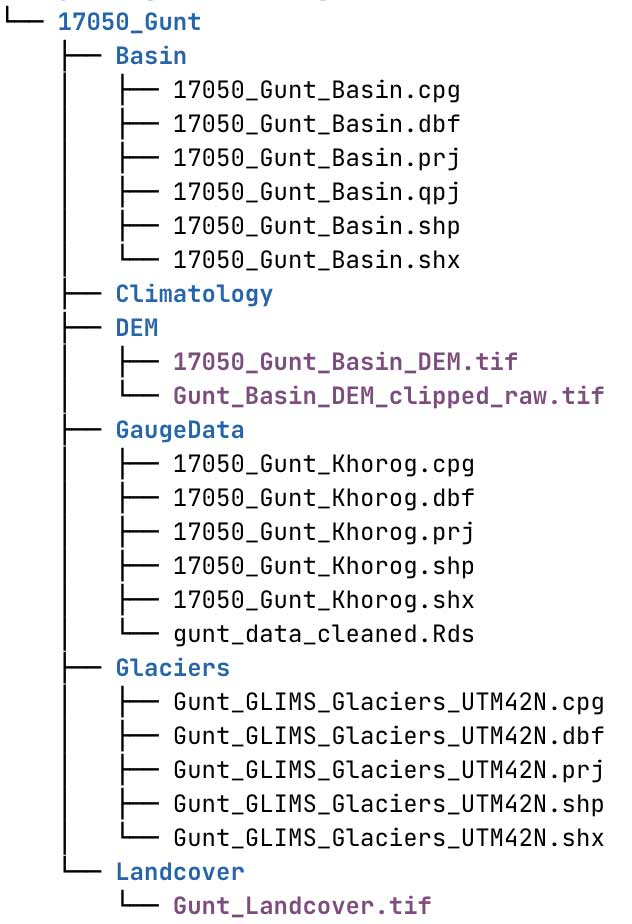
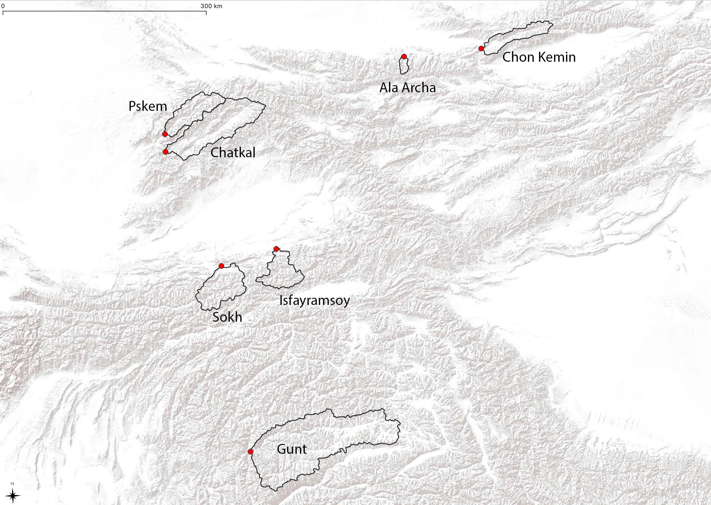
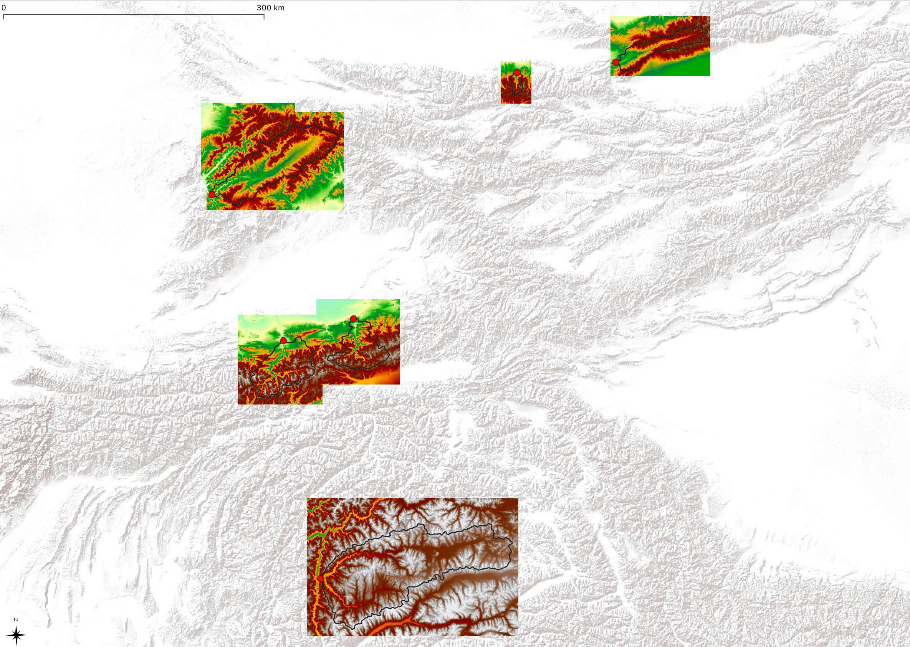
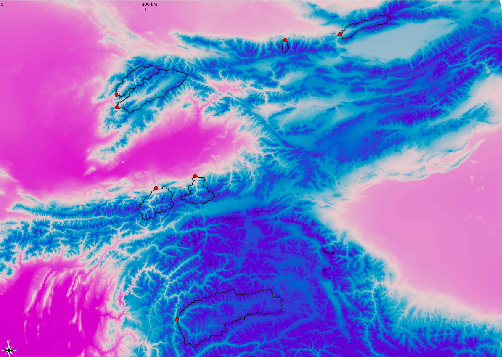
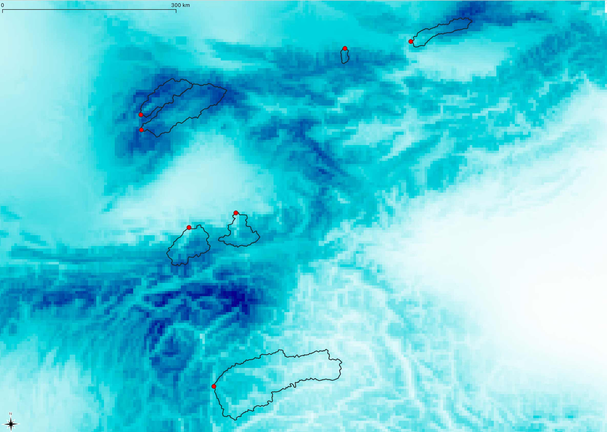
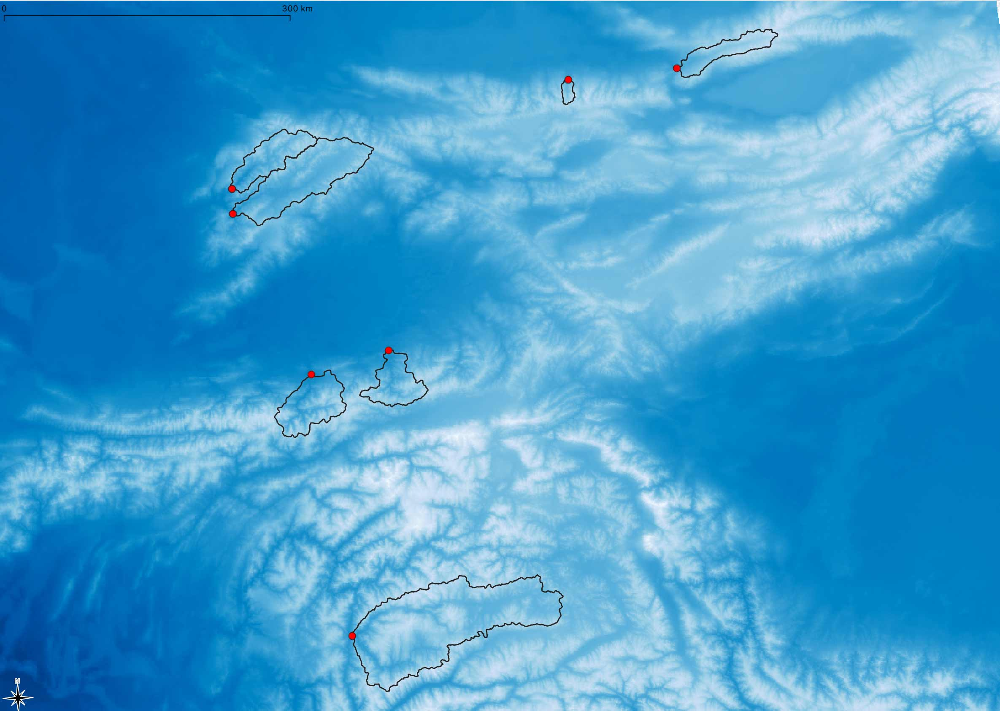

# Foreword {#foreword .unnumbered}

```{r frontFigureForeword, echo = FALSE}
knitr::include_graphics('_bookdown_files/FIG_PREFACE/NearSamarkandOasis.jpeg')
```

**Oasis between Samarkand and Buchara. Source: Tobias Siegfried, hydrosolutions GmbH.**

This is a online book about applied hydrological modeling. It is geared towards students and young professionals in Central Asia who are interested in learning modern modeling approaches. The book teaches by examples and uses two catchments from the Syr Darya and Amu Darya river basins as case studies. While the presented case studies are exclusively from Central Asia, the methods demonstrated can be applied elsewhere.

The book is accompanied by a Study Exercise Pack that encompasses 7 Central Asian catchments which can be used by students for learning and applying their skill to real-world examples in the region. The Pack can accessed and downloaded [here](https://www.dropbox.com/sh/tucg4eno67ndpp0/AADpkSbovUpBx5vhzUJuDquwa?dl=0). Furthermore, a dedicated R Package has been developed which implements many of the data analyses and processing steps shown in this book. More information can be found on Github, where the [package](https://github.com/hydrosolutions/riversCentralAsia) is maintained. R which is a programming language widely used in data analysis and mining [@R-2013].

The course is structured in the following way. First, key hydro-climatological characteristics of the region are presented. This Section draws heavily on Victor Shults' "Rivers of Middle Asia" and presents relevant materials from this famous book in a modern way. Two important basins are further highlighted as in-depth case studies, i.e. the Gunt River in the Amu Darya catchment and the Chirchik river basin. The analyses of these catchments draws on available data from the Central Asian Hydrometeorological Services and on global public hydro-climatological as well as land cover datasets.

A large Chapter on data covers in-situ station data, geospatial data, climate reanalysis and climate projection data. Workflows are presented for the Gunt river basin how to prepare all required data for transient hydrological model at hourly time scales.

Three different types of hydrological modeling approaches are demonstrated and discussed in greater depth. First, long-term water balance modeling using the Budyko framework is introduced to discuss key determinants of the partitioning of precipitation into runoff and evaporation over climatological time scales.

Second, a more detailed modeling approach using semi-distributed, conceptual hydrologic-hydraulic modeling will be used to demonstrate the implementation, calibration and validation of such type of models. Again, working by example, the free modeling software [RS MINERVE](https://www.crealp.ch/down/rsm/install2/archives.html) is used for this purpose.

Third and finally, empirical modeling will be introduced for forecasting. These types of models are currently utilized in the Hydrometeorological Agencies of the region for forecasting discharge at different lead times, ranging from one day ahead up to seasonal forecasts. These models use long term time series to learn relationships between past, observed quantities and future system responses.

With everything that is presented, the focus is on the use of open source and free software. For data preparation and analysis as well as for water balance and empirical modeling, [R](https://www.r-project.org) and [RStudio](https://rstudio.com) are utilized [@R-2013; @RStudio-2020]. For the processing of geographic data, workflows in [QGIS](https://www.qgis.org/en/site/) are demonstrated [@QGIS_software]. For hydrological-hydraulic modeling, the free [RS MINERVE](https://www.crealp.ch/fr/accueil/outils-services/logiciels/rs-minerve.html) is utilized which is a environment for the modeling of free surface runoff flow formation and propagation [@rsminerve_um; @rsminerve_tm]. The reader is expected to have a basic understanding about R and QGIS and how to use these software for data analysis and processing.

The R code to produce figures, conduct analyses as well carry out empirical modeling is deliberately provided throughout the text and embedded there. While this makes the text heavier than necessary, it gives the local target group to reuse code and directly reproduce results while working on their own problems. An attempt has been made to make everything as reproducible as possible.

Feedback is welcome!


# Study Guide & Materials {#study-guide .unnumbered}

This course book has been designed to accompany a 2-week master-level course for aspiring water professionals at the Kazakh-German University in Almaty. At least part of the material can be covered in 10 work days. The workshop participants will be guided through implementing their own hydrological model of a sample catchment of their choice in Central Asia. The readers are recommended to work through the texts in each chapter including the tasks that serve to deepen reflection on the course material and to do their daily homework on the modeling of the sample catchment. The homework will be presented in a final conference and is part of the performance review of the course. This chapter explains how to use this course book.

Hoomework is highlighted with blue boxes:

```{r, eval = "html", label="intro-homework-box", results='asis', echo=FALSE, purl=FALSE}
cat('
<div class = "homework" <div class = "homework" id="h"> 
<h3 class = "right">H1</h3> 
<h3 class= "left">This is a homework box</h3> 
<p>Timely completion of the homework is a course requirement.</p> 
</div>')
```

Exercises that enforce deeper learning of the course material are highlighted in green:

```{r, eval = "html", results='asis', echo=FALSE, purl=FALSE}
cat('
<div class = "exercise" <div class = "task" id="Ex1"> 
<h3 class = "right">Ex1</h3> 
<h3 class= "left">This is an exercise box</h3> 
<p>Exercises encourage students to reflect on the course material and to deepen their knowledge. They are optional but highly recommended.</p> 
</div>')
```

Take home messages or important notes are highlighted in red:

```{r, eval = "html", results='asis', echo=FALSE, purl=FALSE}
cat('
<div class = "note" <div class = "note" id="n1"> 
<h3 class = "right">N1</h3> 
<h3 class= "left">This is a note box</h3> 
<p>Note boxes summarize the most important take home messages.</p> 
</div>')
```

## Study Guide {.unnumbered}

### Prerequisites {.unnumbered}
Make sure the required software for this course is installed on your computer. Section [Open-source resources of the Appendix](#section-appendix-open-source-resources) includes installation instructions and the on-line learning material that can get you started with the software. Below is a quick summary:

-   [QGIS](https://qgis.org/en/site/)\
-   [R](https://cloud.r-project.org/)
-   [RStudio](https://www.rstudio.com/products/rstudio/download/)\
-   [RS Minerve](https://www.crealp.ch/fr/accueil/outils-services/logiciels/rs-minerve/telechargement-rsm.html)

If you have not used the software above before we recommend the following resources to get your started (remember, more detailed instructions are available in the [Appendix](#section-appendix-open-source-resources)):

-   [QGIS training manual](https://docs.qgis.org/3.16/en/docs/training_manual/index.html)\
-   [Modern Dive for getting started with R and RStudio](https://moderndive.com/index.html)\
-   [RS Minerve User Manual](https://www.crealp.ch/fr/accueil/outils-services/logiciels/rs-minerve/telechargement-rsm.html)


### Day 1: Introduction and installation of software {.unnumbered}

This Module introduces the students to the key hydro-climatological characteristics of Central Asia. The main water resources management and planning challenges in the region will be presented and discussed. The question how hydrological models can help to address and resolve these becomes the key course topic.    
Two catchments, i.e. the Chirchik and Gunt river basins, will be highlighted and used as detailed motivational examples. All course examples will build on these two catchments later.\  

**For reading refer to the course Moodle reading folder and literature folder (optional). **

```{r, eval = "html", label="homework1", results='asis', echo=FALSE, purl=FALSE}
cat('
<div class = "homework" <div class = "homework" id="h1"> 
<h3 class = "right">H1</h3> 
<h3 class= "left">Software installation</h3> 
<p>Make sure you have the required software (see prerequisites above) installed and working.</p>
</div>')
```


### Day 2: Hydrological processes & characterization {.unnumbered}

This module will introduce the basic catchment-scale hydrological processes. The concept of the water balance will be introduced and the difference between stocks and flows explained. Steady-state and transient conditions will be discussed. In a second step, the surface energy balance will be introduced to discuss the partitioning of available water into runoff and evaporation. By using parsimonious models, simple water balance calculations will be demonstrated to familiarise the students with the key concepts that provide the foundation for the later hydrological modeling exercises. A special emphasis is on snow- and glacier-melt-driven catchments that are ubiquitous in the region.\  

**T: Please review reading recommendations: Read [Chapter 3](#CaseStudies).**  


```{r, eval = "html", label="homework2", results='asis', echo=FALSE, purl=FALSE}
cat('
<div class = "homework" <div class = "homework" id="h2"> 
<h3 class = "right">H2</h3> 
<h3 class= "left">Catchment characterization (graded)</h3> 
<p>Fill the table using data of your chosen catchment. See Chapter # Case Studies: Gunt River Basin for a finished example.</p>
<style type="text/css">
.tg  {border-collapse:collapse;border-spacing:0;}
.tg td{border-color:black;border-style:solid;border-width:1px;font-family:Arial, sans-serif;font-size:14px;
  overflow:hidden;padding:10px 5px;word-break:normal;}
.tg th{border-color:black;border-style:solid;border-width:1px;font-family:Arial, sans-serif;font-size:14px;
  font-weight:normal;overflow:hidden;padding:10px 5px;word-break:normal;}
.tg .tg-0lax{text-align:left;vertical-align:top}
@media screen and (max-width: 767px) {.tg {width: auto !important;}.tg col {width: auto !important;}.tg-wrap {overflow-x: auto;-webkit-overflow-scrolling: touch;}}</style>
<div class="tg-wrap"><table class="tg">
<thead>
  <tr>
    <th class="tg-0lax">ATTRIBUTE</th>
    <th class="tg-0lax">VALUE</th>
  </tr>
</thead>
<tbody>
  <tr>
    <td class="tg-0lax"><span style="font-weight:bold">Geography</span></td>
    <td class="tg-0lax"></td>
  </tr>
  <tr>
    <td class="tg-0lax">Basin Area</td>
    <td class="tg-0lax"></td>
  </tr>
  <tr>
    <td class="tg-0lax">Min. Elevation</td>
    <td class="tg-0lax"></td>
  </tr>
  <tr>
    <td class="tg-0lax">Max. Elevation</td>
    <td class="tg-0lax"></td>
  </tr>
  <tr>
    <td class="tg-0lax">Mean Elevation</td>
    <td class="tg-0lax"></td>
  </tr>
  <tr>
    <td class="tg-0lax"><span style="font-weight:bold">Hydrology</span></td>
    <td class="tg-0lax"></td>
  </tr>
  <tr>
    <td class="tg-0lax">Norm hydrological year discharge</td>
    <td class="tg-0lax"></td>
  </tr>
  <tr>
    <td class="tg-0lax">Norm cold season discharge</td>
    <td class="tg-0lax"></td>
  </tr>
  <tr>
    <td class="tg-0lax">Norm warm season discharge</td>
    <td class="tg-0lax"></td>
  </tr>
  <tr>
    <td class="tg-0lax">Annual norm discharge volume</td>
    <td class="tg-0lax"></td>
  </tr>
  <tr>
    <td class="tg-0lax">Annual norm specific discharge</td>
    <td class="tg-0lax"></td>
  </tr>
  <tr>
    <td class="tg-0lax"><span style="font-weight:bold">Climate</span></td>
    <td class="tg-0lax"></td>
  </tr>
  <tr>
    <td class="tg-0lax">Mean basin temperature</td>
    <td class="tg-0lax"></td>
  </tr>
  <tr>
    <td class="tg-0lax">Mean basin precipitation</td>
    <td class="tg-0lax"></td>
  </tr>
  <tr>
    <td class="tg-0lax">Potential evaporation</td>
    <td class="tg-0lax"></td>
  </tr>
  <tr>
    <td class="tg-0lax">Aridity Index</td>
    <td class="tg-0lax"></td>
  </tr>
  <tr>
    <td class="tg-0lax"><span style="font-weight:bold">Land Cover</span></td>
    <td class="tg-0lax"></td>
  </tr>
  <tr>
    <td class="tg-0lax">Shrubland</td>
    <td class="tg-0lax"></td>
  </tr>
  <tr>
    <td class="tg-0lax">Herbaceous Vegetation</td>
    <td class="tg-0lax"></td>
  </tr>
  <tr>
    <td class="tg-0lax">Crop Land</td>
    <td class="tg-0lax"></td>
  </tr>
  <tr>
    <td class="tg-0lax">Built up</td>
    <td class="tg-0lax"></td>
  </tr>
  <tr>
    <td class="tg-0lax">Bare / Sparse Vegetation</td>
    <td class="tg-0lax"></td>
  </tr>
  <tr>
    <td class="tg-0lax">Snow and Ice</td>
    <td class="tg-0lax"></td>
  </tr>
  <tr>
    <td class="tg-0lax">Permanent Water Bodies</td>
    <td class="tg-0lax"></td>
  </tr>
  <tr>
    <td class="tg-0lax"><span style="font-weight:bold">Land Ice</span></td>
    <td class="tg-0lax"></td>
  </tr>
  <tr>
    <td class="tg-0lax">Total glacier area</td>
    <td class="tg-0lax"></td>
  </tr>
  <tr>
    <td class="tg-0lax">Total glacier volume</td>
    <td class="tg-0lax"></td>
  </tr>
</tbody>
</table></div>
</div>')
```


### Day 3: Hydrological models & Introduction to RS Minerve {.unnumbered}

**T: Please adapt text to be consistent with Moodle**

Hydrological models require different types of data. Depending on the type of model under consideration, these data include geospatial data, including terrain and land surface data, hydrological station data, and climatological data. For impact studies of climate change, future climate projections are furthermore required.
Using open-source data, it is shown how data can be accessed over the internet, downloaded, and processed for later inclusion in modeling. Using R and the riversCentralAsia R Package, data cleaning, including gap-filling, data analysis, and preparation for hydrological modeling are shown. 

```{r, eval = "html", label="homework3", results='asis', echo=FALSE, purl=FALSE}
cat('
<div class = "homework" <div class = "homework" id="h3"> 
<h3 class = "right">H3</h3> 
<h3 class= "left">Introduction to RS Minerve</h3> 
<p>Read the RS Minerve User Manual and reproduce Example 1 in the RS Minerve User Manual.</p>
</div>')
```


### Day 4: Data for hydrological modeling {.unnumbered}

**T: Please adapt text to be consistent with Moodle**
Different types of hydrological models are introduced, including physical models, conceptual models, and empirical models. Their characteristics and applications are discussed.
The course then further focuses on conceptual models which are at the heart of many real-world river basin planning and water resources management optimization approaches. These models feature a good compromise between black-box models such as some types of machine learning models where real-world processes are not directly represented and the complex and computationally demanding physically-based models which are also difficult to implement.\  
In a seminar, students will derive a conceptual model for their own sample catchment.

```{r, eval = "html", label="homework4", results='asis', echo=FALSE, purl=FALSE}
cat('
<div class = "homework" <div class = "homework" id="h4"> 
<h3 class = "right">H4</h3> 
<h3 class = "left">Discharge characterization (graded)</h3> 
<p>Follow book Chapter 5.1 on Station Data and analyse the discharge of the sample catchment. Use the R code snippets provided in the book chapter.</p>
</div>')
```

### Day 5: The HBV model {.unnumbered}

The HBV model is introduced. It is a widely used conceptual rainfall-runoff model and consists of different routines and simulates catchment discharge based on time series of precipitation and air temperature as well as estimates of monthly long-term potential evaporation rates. The model contains a snow routine with which snow can be accumulated and melted in a snow reservoir, depending on the climate conditions.
Several HBV models can be connected/interlinked which allows for the simulation of more complex catchments with different tributaries that span over a number of elevation zones.
The HBV model implemented in the modeling software RS MINERVE does not represent glaciers. However, where relevant and necessary, HBV models can be combined in RS MINERVE with GSM model which is is a glaciologist-hydrological model. In comparison to the HBV model, the GSM model also contains a glacier submodel that can accommodate processes in the cryosphere. As the HBV model, the GSM model is parsimonious and requires only three input time series, and is suited to be applied in data-scarce environments, like most high-mountain places in the world.\  
 
**T please edit: Read [Chapter 6.5 on the HBV model](#section-hbv-model) and the pre-requisite reading listed therein. It is recommended to do the tasks suggested in the course book to get more familiar with RS Minerve.**\

```{r, eval = "html", label="homework5", results='asis', echo=FALSE, purl=FALSE}
cat('
<div class = "homework" <div class = "homework" id="h4"> 
<h3 class = "right">H4</h3> 
<h3 class = "left">RS Minerve model implementation (graded)</h3> 
<p>Implement your catchment using HBV models based on the activities that you performed in the past week.</p>
</div>')
```

### Day 6: Model calibration and validation {.unnumbered}

**T please add text and edit: Read Chapter [6.6](#section-model-calibration-and-validation) and go through the example of the Nauvalisoy catchment which illustrates the iterative model refinement process.**\

```{r, eval = "html", label="homework6", results='asis', echo=FALSE, purl=FALSE}
cat('
<div class = "homework" <div class = "homework" id="h6"> 
<h3 class = "right">H6</h3> 
<h3 class = "left">Model calibration & validation (graded)</h3> 
<p>Calibrate and validate your RS Minerve model. The finished model will be graded.</p>
</div>')
```

### Day 7: Case studies {.unnumbered}

A case study is presented that discusses climate impacts in the Gunt River. The Gunt River is a large right tributary of the Pandzh river. The Gunt river has a norm discharge of 104 m3/s and is located in the semi-arid to arid Pamirs in Tajikistan. As has been shown in numerous other studies, high-mountain Asia is particularly vulnerable to climatic changes.
It will be shown how a semi-distributed hydrological model together with climate projection data can be utilized to study expected climate impacts in great detail. The same approach can be used for impact studies in other basins in the region and elsewhere.
The material presented here is the result of a previous year MSc study by Mr. Orzu Odinaev.
 

```{r, eval = "html", label="homework7", results='asis', echo=FALSE, purl=FALSE}
cat('
<div class = "homework" <div class = "homework" id="h7"> 
<h3 class = "right">H7</h3> 
<h3 class = "left">Submit an abstract for the final conference</h3> 
<p>Write an abstract about your modeling work for the final conference. Instructions for abstract writing are available <a href="https://github.com/tobiassiegfried/HydrologicalModeling_CentralAsia/blob/master/learningFiles/AbstractSubmissionGuide.pdf">here</a>. The abstract submission deadline is Friday, May 14, 18:00 Almaty time.</p>
</div>')
```

### Day 8: Real-world applications {.unnumbered}

This Course Module will touch upon opportunities and challenges for the operationalization of hydrological models, i.e. of putting them into practice and daily use by relevant organizations. The case studies presented here will draw on real-world examples where new, modern models were deployed in state agencies in Central Asia. Learnings and findings are presented and critically reviewed and factors for the successful deployment highlighted.
Colleagues from the Operational Hydrology Divisions of the Kyrgyz and Uzbek Hydrometeorological Agencies will be joining and talking about their daily work to give the students direct inside insights.

```{r, eval = "html", label="homework8", results='asis', echo=FALSE, purl=FALSE}
cat('
<div class = "homework" <div class = "homework" id="h8"> 
<h3 class = "right">H8</h3> 
<h3 class = "left">Finalize presentation</h3> 
<p>Finalize the presentation of your modelling work during this workshop for the final conference. Each student group will be alloted 15 minutes for their presentation.</p>
<p></p>
<p><strong>Tips for oral presentations</strong> <a href="https://www.agu.org/Fall-Meeting-2020/Pages/Present/Presenter-Guidelines/Oral-Guidelines-During-Meeting">(AGU guidelines for oral presentations)</a></p>
<ul>
  <li>Be considerate of other speakers and the audience by staying within your allotted time for your brief summary. Session chairs will hold you to the allotted time, which is essential to ensure adequate time for questions and discussion with the online audience.</li>
  <li>Take time to rehearse your brief presentation. If your presentation runs longer than your allotted time, eliminate the least essential material and rehearse again.</li>
  <li>Prepare your overview in advance so that your ideas are logically organized and your points are clear.</li>
  <li>Give an opening statement to acquaint the audience with the nature and purpose of the study. Speak slowly and clearly. Word choice should be simple: use active words and short sentences. Some viewers may be using online translation services.</li>
</ul>
</div>')
```

### Day 9: Student presentations and wrap-up of workshop {.unnumbered}

The last day of the workshop is organized as a student conference where students present their modeling work on their respective case study catchment. The groups need to prepare a presentation of 12 minutes duration. Each presentation will be followed by a 3 minutes Q&A session. After all the groups have presented, impressions and feedback will be shared by the teachers followed by a larger group discussion.


## Study Materials {.unnumbered}

The available course study materials are presented here. Groups of two students working jointly on one of the provided basins throughout the course is effective. The data are available for download under this [link](https://www.dropbox.com/sh/tucg4eno67ndpp0/AADpkSbovUpBx5vhzUJuDquwa?dl=0). Please note that the size of the complete case study pack is approx 2 GB. So it might be better to just download the relevant files / folder for the corresponding basin you are working on. The geospatial data layers can be viewed, processed and analyzed in QGIS and/or R, depending on your preference. The discharge data is stored in R `.rds` format and needs to be opened and analyzed in R/RStudio.

The directory tree of an example catchment (Gunt river basin) is shown below. All directory files contain correspondingly similar files[^foreword-1] (see Figure \@ref(fig:sampleDirectoryStructure) for an example). The `./Basin/` subfolder contains the basin shapefile delineating the catchment. The `./Climatology/` is empty to start with and students are asked to extract the relevant data for their catchment. These data include long-term mean temperature 2 meters above surface, total precipitation as well as reference potential evapotranspiration and the aridity index. The regional raster climate data are provided under `./STUDENTS_CaseStudyPacks/CLIMATE` on Dropbox. Data are discussed below below. A QGIS project has been setup for viewing and analyzing these data. It is available under `./STUDENTS_CaseStudyPacks/STUDENTS_CaseStudyProject.qgz`.

[^foreword-1]: You can generate such type of directory tree output in a convenient manner using the `fs::dir_tree(path='...',recurse = TRUE)` function that is provided with the fs package.

```{r sampleDirectoryStructure, echo=FALSE, out.width= "50%", fig.cap="Sample directory structure of the Gunt river basin."}

```

An overview over the available basins in the study pack is shown in Figure \@ref(fig:studyMaterialsBasins). All data can be accessed in the corresponding QGIS project.

```{r studyMaterialsBasins, echo = FALSE, fig.cap="Overview map of the Central Asia region with the 7 study basins. The rivers include the Gunt River in the Amu Darya basin, the Sokh and Isfayramsoy rivers in the Syr Darya basin, the Pskem and Chatkal rivers in the Chirchik river basin and finally, the Ala Archa and Chon Kemin rivers in the Chu river basins. The catchments are delineated with by the black polygons and the location of the individual gauges highlighted with the red circles."}

```

The next Figures shows the distribution of land ice in the Central Asia Region (see Figure \@ref(fig:studyMaterialsBasinsGlaciers)). Land ice data is from [@glims2005] and has been prepared for the Central Asia domain. These data have also been prepared for the individual catchments and are stored in the corresponding `./Glaciers/` folder.

```{r studyMaterialsBasinsGlaciers, echo = FALSE, fig.cap="Distribution of land ice in the Central Asia region. Source Data: GLIMS"}
knitr::include_graphics('./_bookdown_files/FIG_FOREWORD/studyMaterialsBasinsGlaciers')
```

SRTM data for all catchments have been downloaded [@USGS_2020]. Rectangular areas surrounding each catchment are available and provide the basis for further analysis. These data are raw data and not hydrologically corrected. The data are required for basin characterization, i.e. minimum, maximum and mean elevation, the derivation of the hypsometric curve and the preparation of the RS MINERVE modeling input files.

```{r studyMaterialsBasinsDEM, echo = FALSE, fig.cap="SRTM digital elevation models for catchments. Source Data: SRTM [@USGS_2020]"}

```

CHELSA (Climatologies at high resolution for the earth's land surface areas) data of downscaled model output temperature and bias-corrected precipitation estimates of the ERA-Interim climatic reanalysis to a high resolution of 30 arc sec are provided in the `./STUDENTS_CaseStudyPacks/CLIMATE` folder. The data set covers the year 1981 - 2013 and are described in [@Karger_2017] and [@chelsaData_Beck]. More information is also provided in the Chapter \@ref(Chapter-DATA). Figure \@ref(fig:studyMaterialsBasinsT2M) shows the long-term mean 2 meters above surface temperature over the Central Asia domain and Figure \@ref(fig:studyMaterialsBasinsP) the precipitation raster.

```{r studyMaterialsBasinsT2M, echo = FALSE, fig.cap="Long-term mean 2 meter above surface temperature. Source Data: [@Karger_2017]. Pink colors are indicate warm regions, dark blue to purple colors indicate cold regions."}

```

The long-term precipitation norm over the period 1981 - 2013 is shown in Figure \@ref(fig:studyMaterialsBasinsP).

```{r studyMaterialsBasinsP, echo = FALSE, fig.cap="Long-term mean precipitation. Source Data: CHESLA data [@Karger_2017] bias corrected for snow undercatch as described by [@chelsaData_Beck]. Dark blue values in high mountain terrain indicate norm precipitation P > 2'000 mm/a whereas bright blue to white colors indicate arid to hyperarid climate conditions with P < 300 mm/a."}

```

Figure \@ref(fig:studyMaterialsBasinsETpot) shows the norm potential evapotranspiration over the Central Asia domain. Source data are from Global Aridity Index and Potential Evapotranspiration Climate Database v2 available under this [link](https://cgiarcsi.community/2019/01/24/global-aridity-index-and-potential-evapotranspiration-climate-database-v2/) [@Trabucco2019]. Aridity index data is shown in Figure \@ref(fig:studyMaterialsAI). The data are high-resolution (30 arc-seconds) raster climate data for the 1970-2000 period, related to evapotranspiration processes and rainfall deficit for potential vegetative growth, based on the implementation of a Penman-Montieth Reference Evapotranspiration (ET0) equation.

```{r studyMaterialsBasinsETpot, echo = FALSE, fig.cap="Norm potential reference evapotranspiration (ETpot) Dark blue colors are > 2'000 mm/a whereas bright blue to white colors indicate values < 500 mm/a. Source Data: [@Trabucco2019]"}

```

```{r studyMaterialsBasinsAI, echo = FALSE, fig.cap="Aridity Index over Central Asia. Red colors are high aridity index values where as blue colors indicate low index values. Source Data: [@Trabucco2019]"}
knitr::include_graphics('./_bookdown_files/FIG_FOREWORD/AI_CA')
```

Finally, land cover data from 2019 are provided [@CopernicusLandCover]. These are shown in Figure \@ref(fig:studyMaterialsBasinLandCover). The pseudocolors denote the following classification:

-   Red color: Built-up land

-   Pink color: Crop land

-   Yellow color: Herbaceous vegetation

-   Orange Color: Shrubland

-   Blue Color: Permanent water bodies

-   Green color: Forest

-   Grey color: Bare / Sparse Vegetation

-   White color: Snow and ice

```{r studyMaterialsBasinsLandCover, fig.cap=""}
knitr::include_graphics('../HydrologicalModeling_CentralAsia/_bookdown_files/FIG_FOREWORD/landcover_CA')
```

All these data are required data for the course. For the hydrological modeling, further temporal climate data are required (hourly data fields). These and how they can be accessed is described in greater detail in the Chapter \@ref(Chapter-Data) and the corresponding Sections there.
