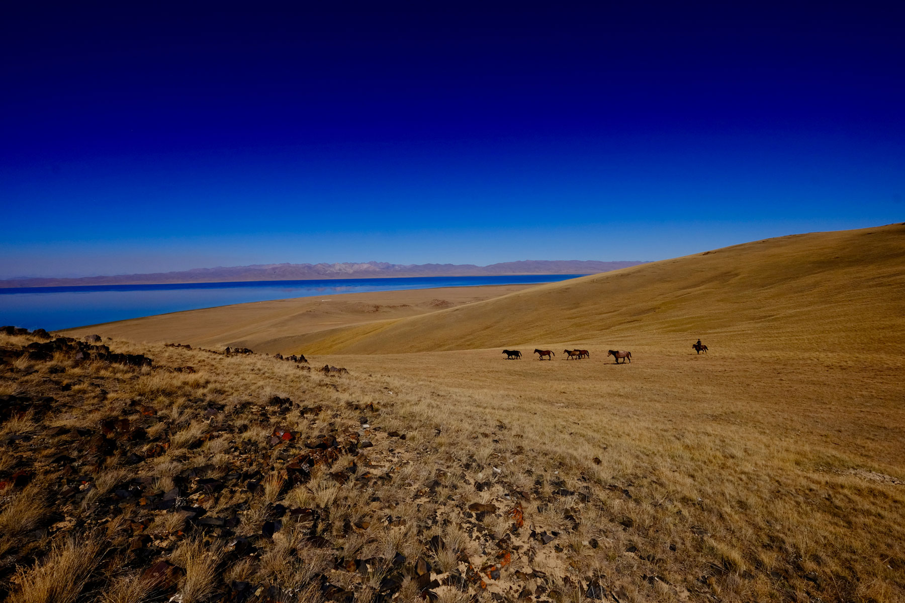

# (PART) Part I Hydrological Systems {#Part1_Hydrological_Systems .unnumbered}

**Caution! - Work in progress.** 

```{r geographyCentralAsia, echo = FALSE, fig.cap = "Naryn catchment, near Song Kul, Kyrgyzstan. SOurce: Tobias Siegfried"}

```


# Introduction {#Introduction}

## The Taming of the Central Asian Rivers {#INTROTamingHydroSystems}

```{r geographyCentralAsia, echo = FALSE, fig.cap = "Geography of the Central Asia Region. Source: Zoï Environment Network."}
knitr::include_graphics('_bookdown_files/Chap1-Introduction-Figures/geography_CentralAsia.jpg')
```

```{r waterFormationUse, echo = FALSE, fig.cap = "Still from a propoganda film documenting the construction of the Big Fergana Canal. The canal was constructed in 1939 constructed over a period of 45 days and a length of approx. 280 km through the use of 180’000 forced labor. Still source: https://youtu.be/kz_zDRi9Vl8."}
knitr::include_graphics('_bookdown_files/Chap1-Introduction-Figures/still_BFC_Construction.jpg')
```


```{r waterFormationUse, echo = FALSE, fig.cap = "Water resources formation and use. The infographics river width is proportional to average discharge at the particular locations. The red arrows indicate water diversion from rivers into irrigation canals. The gray bands around the rivers in the downstream indicate their natural unaltered runoff. Also note the reuse of drainage water in the Syr Darya. Source: Zoï Environment Network."}
knitr::include_graphics('_bookdown_files/Chap1-Introduction-Figures/WaterResourcesFormation&Use.jpg')
```


\newpage

## Post-Transition Development and Challenges {#INTROPostTransitionChallenges}

### Political Changes: Waking up to a new Reality {#INTRONewReality}

### Adverse Developments {#INTROAdverseDevelopments}

