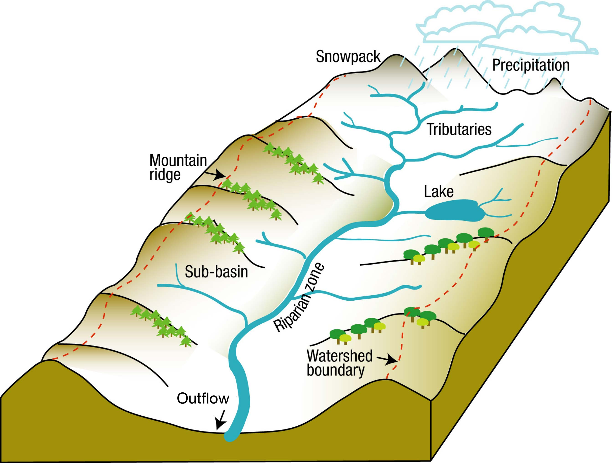

# (PART) Part II Applied Modeling {#Part2-Applied-Modeling .unnumbered}

# Budyko-Type Long-term Water Balance Modeling {#LongTermWaterBalance}

In this Chapter, we are looking at watersheds from a long-term perspective and want to understand the key processes that lead to a partitioning of precipitation into evaporation and runoff.

```{r genericRiverBasin,fig.cap="Conceptualized river basin. The red dashed line along the mountain ridges indicate the watershed boundary.",echo = FALSE}

```

## Derivation of the Budyko Relationship {#DerivationBudykoRelationship}

The general water balance of a catchment can be written as

$$
Q = P - E + \Delta S 
(\#eq:WB1)
$$

where $P$ is precipitation in mm, $E$ is evaporation in mm, $\Delta S$ is net storage in mm and $Q$ is specific discharge in mm. Evaporation is the phenomenon by which a substance is converted from its liquid into its vapor phase, independently of where it lies in nature [@miralles_2020]. This definition of evaporation encompasses evaporation from inside leaves (transpiration), evaporation from bare soils, evaporation from intercepted precipitation (interception loss), evaporation from open water surfaces, and finally, evaporation over ice- and snow-covered surfaces (often referred to as sublimation).

Over the period of hydrological years and longer time scales, we expect $\Delta S$ to be 0 since neither water storage nor destorage happen over these periods. This would of course not be true for catchments where for example man-made storage infrastructure was built over the period under consideration. If $\Delta S = 0$, the above Equation \@ref(eq:WB1) can be rewritten as

$$
Q = P - E 
(\#eq:WB2)
$$

Dividing by $P$, we get

$$
\frac{Q}{P} = 1 - \frac{E}{P} 
(\#eq:WB3)
$$

where $Q/P$ can be called the runoff index and $E/P$ is the evaporation index or evaporative fraction.

For a catchment, annual mean $E$ and $Q$ are governed by total *water supply* $P$ and the total available energy which is normally expressed as potential evaporation $E_{pot}$ and denotes the (atmospheric) *water demand*. If $E_{pot}$ is small, the discharge $Q$ is normally bigger than evaporation $E$. Similarly, if the available radiative energy is very high, the water demand $E_{pot}$ is very large and $Q<<E$ [@ARORA2002164]. $E_{pot}$ and $P$ are thus the key determinants of annual or longer time-scale runoff and evaporation rates. Michael Budyko has termed the ratio $E_{pot} / P$ as aridity index [@budyko_1974].

As explained above, water demand is determined by energy. Solar radiation is the primary energy source for the earth-atmosphere system and the key driver of the hydrological cycle. At the earth's surface, the net radiative flux $R_N$ is the energy that is available for

-   heating and cooling of the soil (ground heat flux),

-   changing the phase of water (latent heat flux), and

-   heating or cooling air in the boundary layer thus causing atmospheric dynamics (sensible heat flux).

This can be formalized with the following relationship

$$
R_{N} = H_{S} + H_{L} + \Delta H_{G} 
(\#eq:EB1)
$$

where $R_{N}$ is the net radiation [in W/m^2^ = kg/s^3^], $H_{S}$ is the upward sensible heat flux, $H_{L}$ is the latent heat flux and $\Delta H_{G}$ the net ground heat flux. The latent heat flux is directly proportional to evaporation. Thus, $H_{L} = L \cdot E$ where $L = 2.5 \cdot 10^{6}$ J/kg [= m^2^/s^2^] is the latent heat of vaporization and $E$ is the actual evaporation in [m/s]. As in the case of the water balance, at the annual or longer time scales, we can neglect the storage effect in the ground and get

$$
R_{N} = H_{S} + L \cdot E
(\#eq:ltEB)
$$

With the Bowen ratio defined as the fraction of the sensible heat flux divided by the latent heat flux, i.e.

$$
\gamma = \frac{H_{S}}{H_{L}} = \frac{H_{S}}{L \cdot E }
(\#eq:bowenRatio)
$$

and by rearranging the terms, the long-term energy balance in Equation \@ref(eq:ltEB) can simply be rewritten as

$$
R_{N} = (1 + \gamma)L E
(\#eq:EB2)
$$

Using the fact that $R_{N} = L E_{pot}$, where $E_{pot}$ is the potential evaporation, and dividing by precipitation, we can rewrite the above Equation \@ref(eq:EB2) as

$$
\frac{E_{pot}}{P} = (1 + \gamma) \frac{E}{P}
(\#eq:aridityIndex)
$$

where the left-hand side is called the aridity index, i.e. $\phi = E_{pot}/P$ and $E/P$ is called the evaporative fraction or evaporation index. With this, Equation \@ref(eq:WB3) from above can be written as a function of the Bowen ratio and the aridity index, i.e.

$$
\frac{E}{P} = 1 - \frac{Q}{P} = \frac{\phi}{(1 + \gamma)}
(\#eq:WBEB1)
$$

$Q/P$ is again the runoff index. Since the Bowen ratio is also water supply and energy demand limited, it too is a function of the aridity index and we can thus rewrite Equation \@ref(eq:WBEB1) to

$$
\frac{E}{P} = 1 - \frac{Q}{P} = F[\phi]
(\#eq:Budyko1)
$$

The Budyko relationship thus allows for a simple parameterization of how the aridity index $\phi$ controls the long-term mean partitioning of precipitation into streamflow and evapotranspiration and it is capable of capturing the behavior of many catchments around the world. This explains its growing popularity over recent years [@berghuijs_2020].

```{r budykoFramework, fig.cap="Basics of the Budyko framework. The x-axis contains the aridity index ($E_{pot}/P$) and the y-axis the evaporative fraction ($E/P$), which often is approximated by one minus the runoff ratio ($E/P = 1-Q/P$) because storage changes are assumed to be negligible at multi-year timescales. Together, these two axes form the two-dimensional Budyko space. Catchments within the space should theoretically fall below the supply limit ($E/P = 1$) and the demand limit ($E/E_{pot} = 1$), but tend to approach these limits under very arid or very wet conditions. Many catchments around the world fall around the Budyko curve (black solid line), including 410 US MOPEX catchments which are indicated by blue markers [@berghuijs_2020]."}
knitr::include_graphics('./_bookdown_files/FIG_WATER_BALANCE/Budyko_Framework_Basics')
```

Following the groundbreaking work by Budyko and others, many expressions have been developed for $F[\phi]$ to describe the long-term catchment water balance (see e.g. [@budyko_1974; @10.3390/w9040236; @choudhury].

Here, we use the Choudhury equation which relates the aridity index $\phi$ to the evaporative fraction $E/P$ in the following way

```{=tex}
\begin{equation}
  \frac{E}{P} = \left[ 1 + \left( \frac{E_{pot}}{P} \right) ^{-n} \right]^{1/n}
  (\#eq:Choudhury1)
\end{equation}
```
where $n$ is a catchment-specific parameter which accounts for factors such as vegetation type and coverage, soil type and topography, etc. (see e.g. [@Zhang2015] for more information).

## Effects of Snow Ratio on Annual Runoff within the Budyko Framework {#SnowEffectsOnAnnualRunoffBudyko}

Source article: [@Zhang2015]

Note that this equation does not distinguish between solid (snow) and liquid (rain) precipitation.

How to adapt this equation to high mountain catchments where a substantial fraction of precipitation falls as snow is discussed in the next Section \@ref(BudykoSnowEffects) below.

## Hydrological Response to a Changing Climate

Source articles: @Ning2018, [@Zhou2016].

## Application to Central Asian River Basins

### Data

### Model

### Conclusions
