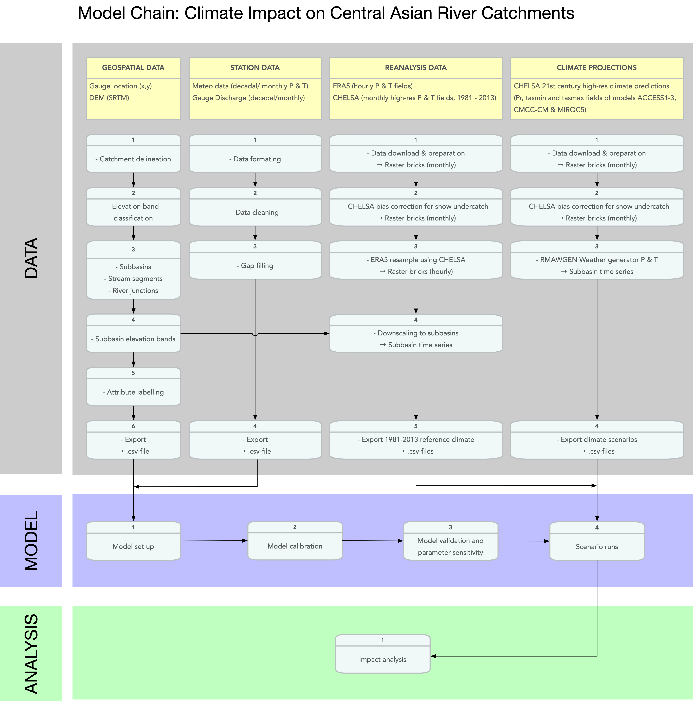
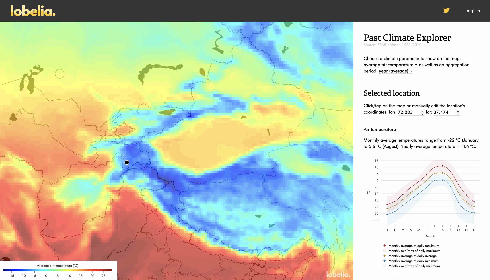
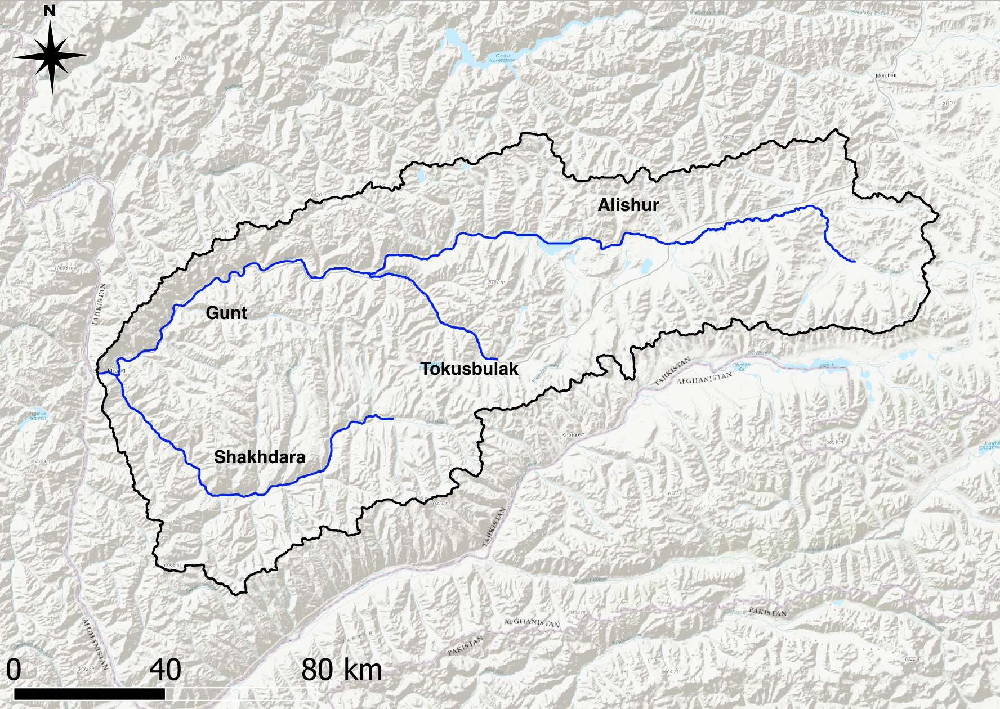
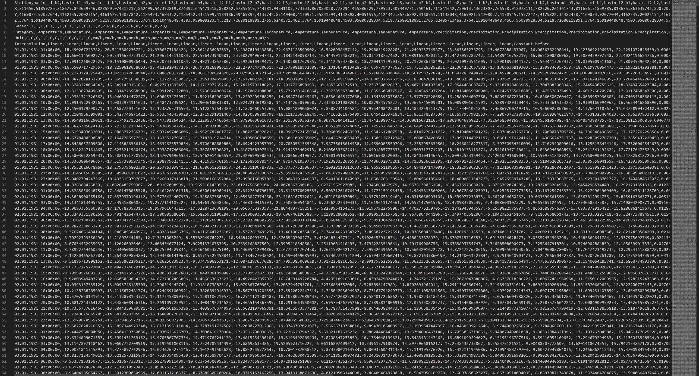
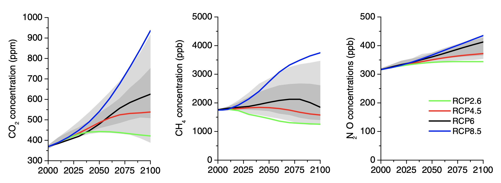
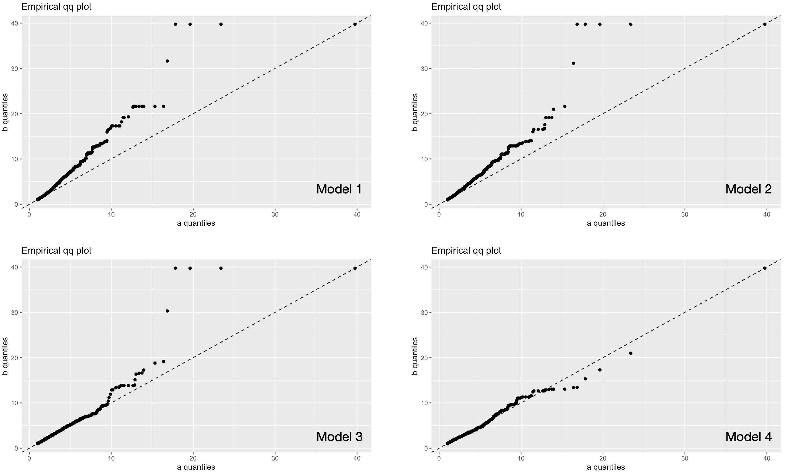
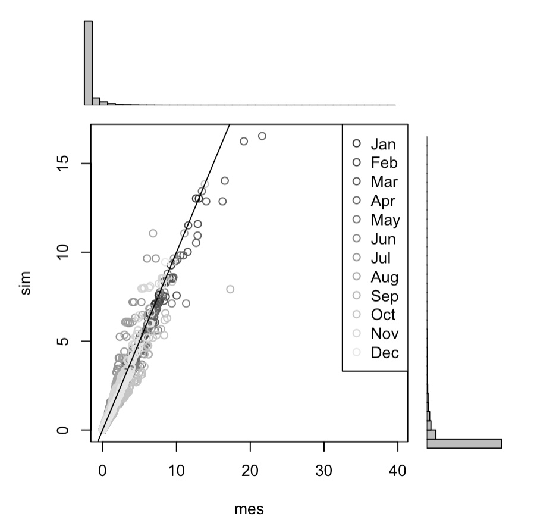

# Data Retrieval, Preparation & Analysis {#Chapter-DATA}

```{r,message=FALSE,echo=FALSE}
# Tidy data wrangling
library(tidyverse)
library(here)
library(timetk)
library(tidymodels)
library(lubridate)
library(timetk)

# ggplot add-on
devtools::install_github("eliocamp/ggnewscale")
library(ggnewscale)
library(ggpubr)
# Covenience library for plotting multi-layer raster 
library(rasterVis)
library(viridis)
library(RColorBrewer)

# Our own package for load and processing local data
#devtools::install_github("hydrosolutions/riversCentralAsia") # ensuring the latest version is installed!
library('riversCentralAsia')

# Spatial data processing
library(ncdf4)
library(raster)
library(rgdal)
library(sf)
library(smoothr) 
library(units)
```

In this Chapter, we will discuss how to retrieve, prepare and process the data that is required for modeling. This includes

-   in-situ station data,
-   geospatial data,
-   climate reanalysis data, and
-   climate projections data.

As will become clear, the preparation of these data requires a substantial amount of work, local storage space and, in some instances, computational power. With a focus on the generation of input files for hydrological-hydraulic modeling with RS Minerve, the flow diagram Figure \@ref(fig:ClimateImpactModelChain) shows the required steps for the individual data types. These steps will be discussed in the individual Sections below in detail.

```{r ClimateImpactModelChain, echo = FALSE}

```

## Station Data {#Data::StationData}

Much of key data visualization techniques have already been presented in the Chapter \@ref(CaseStudies). Here, we are demonstrating important data preparation steps that should always precede modeling. These preparatory steps focus on data cleaning and gap filling.

### Available Data {#AvailableData}

The `riversCentralAsia` Package provides available data of the gauging and meteorological stations in the Chirchik River Basin[^data-1].

[^data-1]: Where other data are used, their source and access options are indicated.

Before starting any type of modeling, it is important to get a good understanding of the data that we are dealing with and whether there exist problems with the raw data that need to be addressed prior to modeling. Problems usually include data gaps and outliers as data records that one obtains are usually ever complete nor clean of errors.

The steps performed here are thus required steps for any type of successful modeling and should be performed with great care prior to starting hydrological modeling. We concentrate our efforts here on discharge records and data from meteorological stations in the Chirchik River Basin. The techniques shown here for decadal (10-days) data naturally extend to monthly data and also, to data from other basins.

### Gap Filling Discharge Data {#StationData::GapFilling}

In the following, we will work with decadal discharge data from the two main tributaries, i.e. the Chatkal and (Gauge 16279) Pskem rivers (Gauge 16290) and the data of the inflow to the Charvak reservoir (Gauge 16924). The goal is to analyze the data and prepare for modeling. First, let us load the relevant discharge data.

```{r}
data <- ChirchikRiverBasin # load data
q_dec_tbl <- data %>% filter(code == '16279' | code == '16290' | code == '16924') # Note for the new name of the object, we choose to add periodicity (_dec_) and data type (_tbl for tibble/dataframe) to the data name. This just helps to stay organized and is good practice in R programming.
q_dec_tbl
```

You can get more information about the available data by typing `?ChirchikRiverBasin`. Note that the original time series data has been packaged in this format by the `riversCentralAsia::loadTabularData()` function which takes a simple .csv file as input.

It is advisable to check at this stage for missing data in time series and to fill gaps where present. Are there missing data? How can these be filled so as to arrive at complete time series that are required for hydrological modeling?

As can be seen in Figure \@ref(fig:dischargeDataFig) , close inspection of the time series indeed reveals some missing data in the 1940ies.

```{r dischargeDataFig,warning=FALSE, fig.cap='Discharge data of selected gauges in the upstream zone of runoff formation in the Chirchik River Basin. Data Source: Uzbek Hydrometeorological Service.'}
q_dec_tbl %>% plot_time_series(date,data,
                               .facet_vars  = code,
                               .smooth      = FALSE,
                               .interactive = TRUE,
                               .x_lab       = "year",
                               .y_lab       = "m^3/s",
                               .title       = ""
                               )
```

Note, Figure \@ref(fig:dischargeDataFig) and the following Figures are interactive, so you can zoom in to regions of interest.

Missing data are also confirmed by the warning that the function `timetk::plot_time_series()` throws (suppressed here). Statistics of the missing data can be easily obtained. As the Table below shows, we can do this analysis for each discharge station separately.

```{r}
q_dec_tbl %>% group_by(code) %>% 
  summarize(n.na = sum(is.na(data)), na.perc = n.na/n()*100)
```

Summarizing the number of observation with missing data reveals 15 data points for station 16279 (0.5 % of total record length) and 39 for station 16290 (1.3 % of total record length). As there are only very few gaps in the existing time series, we use a simple method to fill these. Wherever there is a gap, we fill in the corresponding decadal norm as stored in the *norm* column in the object `q_dec_tbl`. The visualization of the results confirms that our simple gap filling approach is indeed satisfactory (Figure \@ref(fig:gapFilledPskemChatkalFig)).

```{r gapFilledPskemChatkalFig, fig.cap="Gap filled Pskem and Chatkal river discharges."}
q_dec_filled_tbl <- q_dec_tbl

q_dec_filled_tbl$data[is.na(q_dec_filled_tbl$data)] = 
  q_dec_filled_tbl$norm[is.na(q_dec_filled_tbl$data)] # Gap filling step

q_dec_filled_tbl %>% plot_time_series(date, data, 
                                      .facet_vars  = code, 
                                      .smooth      = FALSE,
                                      .interactive = TRUE,
                                      .x_lab       = "year",
                                      .y_lab       = "m^3/s",
                                      .title       = ""
                                      )
```

All missing data are gone now.

```{r}
q_dec_filled_tbl %>% group_by(code) %>% 
  summarize(n.na = sum(is.na(data)), na.perc = n.na/n()*100)
```

A note of caution here. This simple gap filling technique reduces variance in the time series. It should only be used when the percentage of missing data is low. As will be discussed in the next Section \@ref(DataPreparationPT) below, better techniques have to be utilized when there exist substantial gaps and in the case of less regular data.

Finally, we discard the norm data which we used for gap filling of the missing discharge data and convert the data to wide format (see the Table below) to add to it meteorological data in the next Section.

```{r}
q_dec_filled_wide_tbl <- q_dec_filled_tbl %>% # again we use the name convention of objects as introduced above
  mutate(code = paste0('Q',code %>% as.character())) %>% # Since we convert everything to long form, we want to keep information as compact as possible. Hence, we paste the type identifier (Q for discharge here) in from of the 5 digit station code.
  dplyr::select(date,data,code) %>% # ... and then ditch all the remainder information
  pivot_wider(names_from = "code",values_from = "data") # in order to pivot to the long format, we need to make a small detour via the wide format.

q_dec_filled_long_tbl <- q_dec_filled_wide_tbl %>% pivot_longer(-date) # and then pivot back
q_dec_filled_wide_tbl
```

As a result, we now have a complete record of decadal discharge data for the two main tributaries of the Chirchik river and the inflow time series to Charvak Reservoir from the beginning of 1932 until and including 2015, i.e. 84 years. The same type of preparatory analysis will now be carried out for the meteorological data.

### Gap Filling Meteorological Data {#DataPreparationPT}

Here, we use precipitation and temperature data from Pskem (38462), Chatkal (38471) and Charvak Reservoir (38464) Meteorological Stations (see Chapter \@ref(CaseStudyChirchikRiver) for more information on these stations). We also have data from Oygaing station (Station Code 38339) but the record only starts in 1962 and the time resolution is monthly. Therefore, we do not take this station into account here for the time being.

We start with precipitation and plot the available data.

```{r rawDataP, fig.cap = "Raw decadal precipitation data from Pskem (38462), Charvak Reservoir (38471) and Chatkal Meteo Station (38471)."}
p_dec_tbl <- data %>% filter(type=="P" & code!="38339") 
p_dec_tbl %>% plot_time_series(date,data,
                               .facet_vars  = code,
                               .interactive = TRUE,
                               .smooth      = FALSE,
                               .title       = "",
                               .y_lab       = "mm/decade",
                               .x_lab       = "year"
                               )
```

The precipitation data from these 3 stations shows some significant data gaps. The Chatkal Meteorological Station that is located in Kyrgyzstan apparently did not work in the post-transition years and continuous measurements were only resumed there in 1998.

Let us see what happens if we were to use the same simple gap filling technique that we introduced above for discharge.

```{r rawDataPnormFill, fig.cap="Precipitation Data gap-filled with norms. The filled values from 1990 - 2000 in the case of the Station 38471 indicate that the norm-filling technique is not good."}
p_dec_filled_tbl <- p_dec_tbl
p_dec_filled_tbl$data[is.na(p_dec_filled_tbl$data)] = p_dec_filled_tbl$norm[is.na(p_dec_filled_tbl$data)]
p_dec_filled_tbl %>% plot_time_series(date,data,
                                      .facet_vars  = code,
                                      .interactive = TRUE,
                                      .smooth      = FALSE,
                                      .title       = "",
                                      .y_lab       = "mm/decade",
                                      .x_lab       = "year"
                                      )
```

Closely inspect the significant data gap in the 1990ies at Station 38741 (tip: play around and zoom into the time series in the 1990ies in Figure \@ref(fig:rawDataP) and comparing it with the resulting gap-filled timeseries in Figure \@ref(fig:rawDataPnormfill). We see that our technique of gap filling with long-term norms is not suitable for this type of data and the significant gap size. The effect of variance reduction is also clearly visible.

Hence, we resort to a more powerful gap filling technique that uses a (regression) model to impute the missing values from existing ones at the neighboring stations, i.e. Stations 38462 and 38464. To do so, we utilize the `simputation` R package that is tightly integrated in the `tidyverse`[^data-2].

[^data-2]: Please note that if you do not have the required package installed locally, you should install it prior to its use with the following command `install.packages('simputation')`

```{r rawDataPrlm,message=FALSE,warning=FALSE,fig.cap="Precipitation Data gap filled with a robust linear regression modeling approach"}
library(simputation)
# First, we bring the data into the suitable format. 
p_dec_wide_tbl <- p_dec_tbl %>% 
  mutate(code = paste0('P',code %>% as.character())) %>% 
  dplyr::select(date,data,code) %>% 
  pivot_wider(names_from = "code",values_from = "data")

# Second, we impute missing values.
p_dec_filled_wide_tbl <- p_dec_wide_tbl  %>% 
  impute_rlm(P38471 ~ P38462 + P38464) %>% # Imputing precipitation at station 38471 using a robust linear regression model
  impute_rlm(P38462 ~ P38471 + P38464) %>% # Imputing precipitation at station 38462 using a robust linear regression model
  impute_rlm(P38464 ~ P38462 + P38471) # Imputing precipitation at station 38464 using a robust linear regression model

p_dec_filled_long_tbl <- p_dec_filled_wide_tbl %>% pivot_longer(c('P38462','P38464','P38471')) 

p_dec_filled_long_tbl%>% plot_time_series(date,value,
                                          .facet_vars  = name,
                                          .interactive = TRUE,
                                          .smooth      = FALSE,
                                          .title       = '',
                                          .y_lab       = "mm/decade",
                                          .x_lab       = "year"
                                          )
```

As you can see, we use simple linear regression models to impute missing value in the target time series using observations from the neighboring stations.

Through simple visual inspection, it becomes clear that this type of regression model for gap filling is better suited than the previous approach chosen. Let us check whether we could successfully fill all gaps with this robust linear regression approach.

```{r,message=FALSE}
p_dec_filled_long_tbl %>% group_by(name) %>% summarize(n.na = sum(is.na(value)), n.na.perc = n.na/n()*100)
```

It turns out that we still have very few gaps to deal with. We can see them by simply visualizing the wide tibble. The problem persisted at times when two or more values were missing across the available stations at the same time and where thus the linear regression could not be carried out.

```{r}
p_dec_filled_wide_tbl %>% head(10)
```

```{r}
p_dec_filled_wide_tbl %>% tail()
```

We can solve the issues related to the missing values at the start of the observation record by using the same technique as above and by only regressing P38462 and P38464 on P38471.

```{r}
p_dec_filled_wide_tbl <- p_dec_filled_wide_tbl  %>% 
  impute_rlm(P38462 ~ P38471) %>% # Imputing precipitation at station 38462 using a robust linear regression model
  impute_rlm(P38464 ~ P38471) # Imputing precipitation at station 38464 using a robust linear regression model
p_dec_filled_wide_tbl %>% head(10)
```

Converse to this, the complete set of observations is missing for December 2015. We will thus remove these non-observations from our tibble.

```{r}
p_dec_filled_wide_tbl <- p_dec_filled_wide_tbl %>% na.omit()
p_dec_filled_wide_tbl %>% tail()

p_dec_filled_long_tbl <-  p_dec_filled_wide_tbl %>% pivot_longer(-date)
```

Inspecting the temperature data, we see similar data issues as in the precipitation data set.

```{r rawData_T,warning=FALSE,fig.cap="Raw temperature data from the meteorological stations Pskem (38462) and Chatkal (38471)"}
t_dec_tbl <- data %>% filter(type=="T") 
t_dec_tbl %>% plot_time_series(date,data,
                               .facet_vars  = code,
                               .interactive = TRUE,
                               .smooth      = FALSE,
                               .title       = '',
                               .y_lab       = "deg. Celsius",
                               .x_lab       = "year"
                               )
```

```{r rawData_T_rlm,warning=FALSE,message=FALSE,fig.cap="Temperature data gap filled with robust linear regression modeling."}
# First, we bring the data into the suitable format. 
t_dec_wide_tbl <- t_dec_tbl %>% 
  mutate(code = paste0('T',code %>% as.character())) %>% 
  dplyr::select(date,data,code) %>% 
  pivot_wider(names_from = "code",values_from = "data")

# Second, we impute missing values.
t_dec_filled_wide_tbl <- t_dec_wide_tbl  %>% 
  impute_rlm(T38471 ~ T38462) %>% # Imputing precipitation at station 38471 using a robust linear regression model
  impute_rlm(T38462 ~ T38471) # Imputing precipitation at station 38462 using a robust linear regression model

t_dec_filled_long_tbl <- t_dec_filled_wide_tbl %>% 
  pivot_longer(c('T38462','T38471')) 

t_dec_filled_long_tbl%>% 
  plot_time_series(date,value,
                   .facet_vars  = name,
                   .interactive = TRUE,
                   .smooth      = FALSE,
                   .title       = '',
                   .y_lab       = "deg. Celsius",
                   .x_lab       = "year"
                   )
```

There are some irregularities in the temperature time series of Chatkal Meteorological Station in the first decade of the 20th century (tip: zoom in to see these more clearly). Note that these were not introduced by the gap filling technique that we used but are most likely wrong temperature readings. We will return to these in the outlier analysis below in Section \@ref(AnomaliesOutliers).

```{r,message=FALSE}
t_dec_filled_long_tbl %>% 
  group_by(name) %>% 
  summarize(n.na = sum(is.na(value)), n.na.perc = n.na/n()*100)
```

To see where the missing value are, we find them easily again by looking at the head and tail of the tibble.

```{r}
t_dec_filled_wide_tbl %>% head()
```

```{r}
t_dec_filled_wide_tbl %>% tail()
```

Finally, we remove the non observations again as above with the function `na.omit`.

```{r}
t_dec_filled_wide_tbl <- t_dec_filled_wide_tbl %>% na.omit()
t_dec_filled_long_tbl <- t_dec_filled_wide_tbl %>% pivot_longer(-date)
```

To deal with the missing values at the end of the observational record, we could also have used any other technique. Using the norm values however would have artificially reduced the variance in both cases as explained above. Furthermore and at least in the case of temperature, it is also questionable to what extent a norm calculated over the last 84 years is still representative given global warming. We will look in this important and interesting topic in the next section.

### Anomalies and Outliers {#AnomaliesOutliers}

We use the function `timetk::plot_anomaly_diagnostics` to investigate anomalies in the time series. For discharge, we first log-transform the raw data with the following transformation to reduce the variance of the original data.

$$
\hat{q}(t) = log(q(t) + 1) 
$$ where $\hat{q}(t)$ denotes the transformed discharge. Prior to the log transformation, 1 is added so as to avoid cases where discharge would be 0 and the logarithmic transform thus undefined. The transformation can easily be done with the `log1p()` function in R. Backtransformation via the function `expm1()` simply involves taking the exponent and subtracting 1 from the result. Figure \@ref(anomaliesQ) shows the result.

The exceptionally wet year 19169 shows up as anomalous in the Chatkal River Basin and at the downstream Charvak Reservoir inflow gauge.

, \@ref(anomaliesP) and \@ref(anomaliesT) show anomalies diagnostics of the available data.

```{r anomaliesQ,message=FALSE, fig.cap="Anomaly diagnostics of discharge data. The transparent grey band shows the width of the normal range. The highly anomalous wet year of 1969 is clearly visible in the discharge record of the Chatkal river basin (Station 16279)."}
q_dec_filled_long_tbl %>% 
  plot_anomaly_diagnostics(date,
                           value %>% log1p(),
                           .facet_vars  = name,
                           .frequency = 36,
                           .interactive = TRUE,
                           .title = "")
```

The investigation of precipitation anomalies shows a succession of regular anomalous wet events over time. It is interesting to see that the winter 1968/69 regularly anomalous at all three stations (Figure \@ref(fig:anomaliesP), zoom in to investigate).

```{r anomaliesP,message=FALSE,fig.cap="Anomaly diagnostics of precipitation data."}
p_dec_filled_long_tbl %>% 
  plot_anomaly_diagnostics(date,
                           value,
                           .facet_vars  = name,
                           .interactive = TRUE,
                           .title = "")
```

While intuitively, we would have expected an eceptionally mild winter in 1968/69 due to the precipitation excess, the corresponding anomaly does not show up in the temperature record (Figure \@ref(fig:anomaliesT)).

```{r anomaliesT, message=FALSE, fig.cap="Anomaly diagnostics of temperature data."}
t_dec_filled_long_tbl %>%  
  plot_anomaly_diagnostics(date,value,
                           .facet_vars  = name,
                           .interactive = TRUE,
                           .title = "")
```

Apart from the identification of extremal periods since as the 1969 discharge year in the Chatkal river basin, the diagnostics of anomalies also helps to identify likely erroneous data records. In Figure \@ref(anomalies_T) for example, when we zoom into the data of the series T38471 in the first decade of the 21st century, problems in relation to positive anomalies during the winter are visible in 4 instances. One explanation would be that in at least some instances, the data are erroneously recorded as positive values when in fact they were negative (see dates '2002-01-31', '2005-01-10' and '2007-02-28', Chatkal Station 38471).

### Putting it all together {#FinalData}

Finally, we are now in the position to assemble all data that we will use for empirical modeling. The data is stored in long and wide form and used accordingly where required. For example, in Section \@ref{TimeSeriesReg}, we are working with the wide data format to investigate model features in linear regression. Note that we also add a column with a decade identifier. Its use will become apparent in the Section \@ref(Chap9FeatureEngineering) below.

```{r,message=FALSE}
# Final concatenation
data_wide_tbl <- right_join(q_dec_filled_wide_tbl,p_dec_filled_wide_tbl,by='date')
data_wide_tbl <- right_join(data_wide_tbl,t_dec_filled_wide_tbl,by='date')
# Add period identifiers (decades in this case)
s <- data_wide_tbl$date %>% first()
e <- data_wide_tbl$date %>% last()
decs <- decadeMaker(s,e,'end')
decs <- decs %>% rename(per=dec)
data_wide_tbl <- data_wide_tbl %>% left_join(decs,by='date')
# Creating long form
data_long_tbl <- data_wide_tbl %>% 
  pivot_longer(-date)
# Cross checking completeness of record
data_long_tbl %>% 
  group_by(name) %>% 
  summarize(n.na = sum(is.na(value)), n.na.perc = n.na/n()*100)
```

A consistent data record from 1933 until and including November 2015 is now prepared\^Please note that by using `left_join` above, we have cut off discharge data from the year 1932 since we do not have meteorological data there.\^. Let us analyze these data now.

## Geospatial Data {#Data::GeospatialData}

This Section follows the steps shown in Figure \@ref(fig:ClimateImpactModelChain) and explains in a hands-on manner how to arrive at and process the required geospatial data for later inclusion in the hydrological-hydraulic model RS MINVERVE. Links to detailed descriptions of the individual tasks allow even beginners of QGIS to follow the procedure.

### Setting up QGIS {#section-steps-setting-up}

Open and save a new QGIS project ([How to for absolute beginners](#section-saving-a-new-qgis-project)). Make sure that the maps projection is in UTM ([How to change the projection of a project](#section-change-project-projection-qgis)). The needed plugins are: qProf or profile tool ([How to install and activate a plugin](#section-install-and-activate-plugins-in-QGIS3)). The optional plugins are: SRTM plugin (requires a login to USGS Earth Explorer [How to register](#section-register-with-earth-explorer)). Note, SAGA routines must be installed and correctly configured in QGIS.

### Load DEM

We use the SRTM 1 arc-second global DEM ([Data description](https://www.usgs.gov/centers/eros/science/usgs-eros-archive-digital-elevation-shuttle-radar-topography-mission-srtm-1-arc?qt-science_center_objects=0#qt-science_center_objects)). The DEM tiles are downloaded directly in QGIS3 (SRTM plugin, [How to](#section-srtm-plugin)) or via the USGS Earth Explorer ([How to](#section-earth-explorer-download-srtm)) and merged to a single GIS layer ([How to](#section-merge-srtm-tiles)). In any case you will need to register for an Earth Explorer account [How to register](#section-register-with-earth-explorer).

### Derive the boundaries of your catchment {#section-steps-derive-catchment-boundaries}

If you already have a shapefile for the boundaries of your catchment. Load it into QGIS [How to add a vector layer](#section-add-vector-layer-to-qgis). Otherwise, follow this [tutorial on youtube](https://www.youtube.com/watch?v=xwiHQlmEEjw) to derive the boundaries of your catchment.

### Run through the process model

A process model is available that generates the raw GIS layers for RS Minerve. Navigate to *Processing* and open the *Graphical Modeller...*. The *Model Designer* window opens. Open the model [Link to Model]() (\@ref(fig:qgis-graphical-model-designer)).

```{r qgis-graphical-model-designer, echo=FALSE, out.width="100%", fig.align="center", fig.cap="The process of deriving the GIS layers for RS Minerve is simplified through the process model."}
knitr::include_graphics("_bookdown_files/FIG_DATA/fig500_GraphicalModelDesigner.png")  
```

\*TODO: Make file available for download.

Prior to running the model, read through the following brief notes.

#### Input files

-   A shape file of the basin outline in UTM 42 N ([How to derive the basin outline](#section-steps-derive-catchment-boundaries)).
-   The extent of the DEM needs to be larger than the boundaries of your catchment. You can use your raw SRTM DEM projected to UTM42N.

#### Model output

Besides the 3 layers required (Basins, rivers, junctions, \@ref(fig:layers-minerve) in the Introduction), the model produces a number of additional output files which can be used for verifying the parameterisation which is described in more detail in the next section.

#### Parameterization of the model

-   BasinShapeBuffer_meters is a buffer around the basin outline to which the DEM is cut. The DEM needs to be slightly larger than the shape line. The default value of 1000 m is sufficient. *Can this parameter be internalised?*\
-   River Network Level is a parameters for the resolution of the river network. Values of 7 and 8 have shown good results for smaller and medium sized catchments (\@ref(fig:qgis-river-network-level)).\

```{r qgis-river-network-level, echo=FALSE, out.width="50%", fig.show='hold', fig.align="center", fig.cap="Comparison of River Network Level = 7 (left) and River Network Level = 8 (rigth) for the example of the Pskem river catchment."}
knitr::include_graphics(c("_bookdown_files/FIG_DATA/fig501_RiverNetworkLevel7.png", "_bookdown_files/FIG_DATA/fig502_RiverNetworkLevel8.png"))
```

-   The Channel Network Cutoff Value is a parameter required for the partitioning of the catchment into sub-catchments. Values between 2e8 and 5e8 have been found to work well for smaller and medium sized catchments. The model is sensitive to this parameter and might throw an error if the cutoff value is not appropriate.
-   The Elevation Bands Table holds the altitude boundaries and class IDs for the elevation bands in the catchment. After a first test run, edit according to your needs.

The model is sensitive to these parameters. Play around with them until you are satisfied with the resulting GIS layers.

If you get an error message running Fix geometries that POLYGONS.shp was not found, try reducing the Channel Network Cutoff Value by 50-70%. You can still inspect the other layers and change other parameters as well.\
- Make sure that all input layers are projected to UTM 42 N.\
- Run the model through once, inspect the output and play with the input parameters:\
- Min and Max elevations on the smoothed DEM and the shape, number and spacing of elevation bands (edit the table for the elevation bands accordingly),\
- Location and shape of river reaches and the location of junctions (vary the threshold).

### Manually edit the GIS Layers for import in RS MINERVE

-   Review \@ref(fig:layers-minerve)
-   Elevation bands per sub-basin need to be in one Multi-Polygon layer.

We need junctions only at the confluences of sub-basins (and river reaches).

We only need river reaches where we need to do routing. The sub-basins at the upper-most reaches do not need river reaches.

#### Edit Junctions layer

Select the Junctions layer and toggle manual editing by clicking on the yellow pen (\@ref(fig:qgis-edit-junctions-1)).

```{r qgis-edit-junctions-1, echo=FALSE, out.width="50%", fig.align="center", fig.cap="Manually edit the layer with the river junctions, step 1: Toggle layer editing."}
knitr::include_graphics("_bookdown_files/FIG_DATA/fig026_ManualEditJunctions1.png")
```

When in editing mode, the yellow pen will appear in the *Layers* window next to the name of the layer being edited. The edit mode will also activate a button for adding points (i.e. junctions, we don't need that now) and the vertex tool. Click on the vertex tool icon. It is active when a a boundary appears around the icon and the Vertex Editor windows opens (\@ref(fig:qgis-edit-junctions-2)).

```{r qgis-edit-junctions-2, echo=FALSE, out.width="50%", fig.align="center", fig.cap="Manually edit the layer with the river junctions, step 2: Activate the vertex tool."}
knitr::include_graphics("_bookdown_files/FIG_DATA/fig027_ManualEditJunctions2.png")
```

Right-click on a junction point you would like to delete to activate it (\@ref(fig:qgis-edit-junctions-3)).

```{r qgis-edit-junctions-3, echo=FALSE, out.width="50%", fig.align="center", fig.cap="Manually edit the layer with the river junctions, step 3: Activate a junction node for editing."}
knitr::include_graphics("_bookdown_files/FIG_DATA/fig028_ManualEditJunctions3.png")
```

Select the activated point by drawing a rectangle over the point with your mouse. The point will appear blue (\@ref(fig:qgis-edit-junctions-4)).

```{r qgis-edit-junctions-4, echo=FALSE, out.width="50%", fig.align="center", fig.cap="Manually edit the layer with the river junctions, step 3: Select the activated junction node."}
knitr::include_graphics("_bookdown_files/FIG_DATA/fig029_ManualEditJunctions4.png")
```

Delete the point with the delete key on your keyboard. You can save your edits by pressing the blue-white Save Layer Edits button that is decorated with an orange pen (\@ref(fig:qgis-edit-junctions-5)). This saves your changes without exiting the edit mode.

```{r qgis-edit-junctions-5, echo=FALSE, out.width="20%", fig.align="center", fig.cap="Manually edit the layer with the river junctions, step 3: Save edits."}
knitr::include_graphics("_bookdown_files/FIG_DATA/fig030_ManualEditJunctions5.png")
```

If you have many points to remove, as in our case, it may be faster to identify the IDs of the features you want to keep, select these and delete all others. To start, you activate the *Identify Features* mode by clicking on the icon with the white *i* on the blue circle (\@ref(fig:qgis-edit-junctions-fast-1)).

```{r qgis-edit-junctions-fast-1, echo=FALSE, out.width="20%", fig.align="center", fig.cap="Alternative method to manually edit junctions if many nodes need to be deleted. Step 1: Get ID of features to keep, part 1."}
knitr::include_graphics("_bookdown_files/FIG_DATA/fig031_ManualEditJunctionsFast1.png")
```

A black *i* will appear next to your cursor. You then click on the first of your nodes that you want to keep. This will highlight it in red and a list with information on the selected feature appears on the right in the Identify Results window. You will see the attribute NODE_ID with value 1 for the outflow node (\@ref(fig:qgis-edit-junctions-fast-2)). Note down the ID of the feature.

```{r qgis-edit-junctions-fast-2, echo=FALSE, out.width="100%", fig.align="center", fig.cap="Alternative method to manually edit junctions if many nodes need to be deleted. Step 1: Get ID of features to keep, part 2."}
knitr::include_graphics("_bookdown_files/FIG_DATA/fig032_ManualEditJunctionsFast2.png")
```

You then press on the node at the confluence of the two tributaries in the center of the catchment. The Identify Results window shows 2 results, that means, that two junction nodes are close to each other (\@ref(fig:qgis-edit-junctions-fast-3)).

```{r qgis-edit-junctions-fast-3, echo=FALSE, out.width="80%", fig.align="center", fig.cap="Alternative method to manually edit junctions if many nodes need to be deleted. Step 1: Get ID of features to keep, part 3."}
knitr::include_graphics("_bookdown_files/FIG_DATA/fig033_ManualEditJunctionsFast3.png")
```

Zoom in in your map window with your mouse to see the two nodes (\@ref(fig:qgis-edit-junctions-fast-4)).

```{r qgis-edit-junctions-fast-4, echo=FALSE, out.width="80%", fig.align="center", fig.cap="Alternative method to manually edit junctions if many nodes need to be deleted. Step 1: Get ID of features to keep, part 4."}
knitr::include_graphics("_bookdown_files/FIG_DATA/fig034_ManualEditJunctionsFast4.png")
```

Select the node that should be kept and not the ID of the node (NODE_ID 11), (\@ref(fig:qgis-edit-junctions-fast-5)).

```{r qgis-edit-junctions-fast-5, echo=FALSE, out.width="80%", fig.align="center", fig.cap="Alternative method to manually edit junctions if many nodes need to be deleted. Step 1: Get ID of features to keep, part 5."}
knitr::include_graphics("_bookdown_files/FIG_DATA/fig035_ManualEditJunctionsFast5.png")
```

Zoom back to the entire Junctions layer (see \@ref(fig:qgis-zoom-to-layer)). and go to Select Features by Values... in the toolbar (\@ref(fig:qgis-edit-junctions-fast-6)).

```{r qgis-edit-junctions-fast-6, echo=FALSE, out.width="40%", fig.align="center", fig.cap="Alternative method to manually edit junctions if many nodes need to be deleted. Step 2: Select features to delete, part 1"}
knitr::include_graphics("_bookdown_files/FIG_DATA/fig036_ManualEditJunctionsFast6.png")
```

Add NODE_ID 1 to your selection as demonstrated in (\@ref(fig:qgis-edit-junctions-fast-7)).

```{r qgis-edit-junctions-fast-7, echo=FALSE, out.width="60%", fig.align="center", fig.cap="Alternative method to manually edit junctions if many nodes need to be deleted. Step 2: Select features to delete, part 2"}
knitr::include_graphics("_bookdown_files/FIG_DATA/fig037_ManualEditJunctionsFast7.png")
```

The outflow node with ID 1 will change color in your map (\@ref(fig:qgis-edit-junctions-fast-8)).

```{r qgis-edit-junctions-fast-8, echo=FALSE, out.width="20%", fig.align="center", fig.cap="Alternative method to manually edit junctions if many nodes need to be deleted. Step 2: Select features to delete, part 3"}
knitr::include_graphics("_bookdown_files/FIG_DATA/fig038_ManualEditJunctionsFast8.png")
```

Add node 11 to your selection in the same way and close the Select Node by Value window. Invert the feature selection as shown in (\@ref(fig:qgis-edit-junctions-fast-9)).

```{r qgis-edit-junctions-fast-9, echo=FALSE, out.width="80%", fig.align="center", fig.cap="Alternative method to manually edit junctions if many nodes need to be deleted. Step 2: Select features to delete, part 4"}
knitr::include_graphics("_bookdown_files/FIG_DATA/fig039_ManualEditJunctionsFast9.png")
```

All other nodes will now be yellow and the ones to keep will appear in the layer color (\@ref(fig:qgis-edit-junctions-fast-10)).

```{r qgis-edit-junctions-fast-10, echo=FALSE, out.width="80%", fig.align="center", fig.cap="Alternative method to manually edit junctions if many nodes need to be deleted. Step 2: Select features to delete, part 5"}
knitr::include_graphics("_bookdown_files/FIG_DATA/fig040_ManualEditJunctionsFast10.png")
```

Delete the features (nodes) by pressing the Delete Selected button in the edit features toolbar (\@ref(fig:qgis-edit-junctions-fast-11)).

```{r qgis-edit-junctions-fast-11, echo=FALSE, out.width="40%", fig.align="center", fig.cap="Alternative method to manually edit junctions if many nodes need to be deleted. Step 2: Select features to delete, part 6"}
knitr::include_graphics("_bookdown_files/FIG_DATA/fig041_ManualEditJunctionsFast11.png")
```

Save your edits (\@ref(fig:qgis-edit-junctions-5)). To verify that, indeed, all superfluous nodes are deleted from the Junctions file, open the Attribute table (\@ref(fig:qgis-edit-junctions-at-1)).

```{r qgis-edit-junctions-at-1, echo=FALSE, out.width="5%", fig.align="center", fig.cap="Edit Attribute table. Step 1: Open the attribute table with a click on the Attribute Table icon in the QGIS toolbar."}
knitr::include_graphics("_bookdown_files/FIG_DATA/fig042_EditJunctionsAttributeTable1.png")
```

Only 2 features should be listed under each attribute. We will now edit the attribute table to prepare it for the RS Minerve model (see \@ref(fig:layers-minerve)). RS Minerve needs an identifyer to differentiate between the junctions. We can use the attribute *TYPE* to uniquely identify the two junctions needed. RS Minerve further needs the ID of the downstream river. Add a collumn to the attribute table by pressing the Add Field button (\@ref(fig:qgis-edit-junctions-at-2)).

```{r qgis-edit-junctions-at-2, echo=FALSE, out.width="60%", fig.align="center", fig.cap="Edit Attribute table. Step 2: Add a column to the attribute table manually, part 1."}
knitr::include_graphics("_bookdown_files/FIG_DATA/fig043_EditJunctionsAttributeTable2.png")
```

Define a name for the attribute, a type and admissible length of each entry in the Add Field window. In our case, we choose a string (a word) as ID and allow it to be 20 characters long (\@ref(fig:qgis-edit-junctions-at-3)).

```{r qgis-edit-junctions-at-3, echo=FALSE, out.width="30%", fig.align="center", fig.cap="Edit Attribute table. Step 2: Add a column to the attribute table manually, part 2."}
knitr::include_graphics("_bookdown_files/FIG_DATA/fig044_EditJunctionsAttributeTable3.png")
```

Close the window by pressing OK. By clicking in the newly created NULL fields, you can now type names for the downstream rivers and save your edits by pressing the save edits icon (3rd from the left in the toolbar of the attribute table window). As the outlet of the catchment goes directly into Charvak reservoir, we can type Charvak as the downstream river ID. The river stretch between junction and outlet is called Pskem (\@ref(fig:qgis-edit-junctions-at-4)).

```{r qgis-edit-junctions-at-4, echo=FALSE, out.width="60%", fig.align="center", fig.cap="Edit Attribute table. Step 2: Add a column to the attribute table manually, part 3."}
knitr::include_graphics("_bookdown_files/FIG_DATA/fig045_EditJunctionsAttributeTable4.png")
```

We are done editing the Junctions layer. Deactivate the edit mode by clickig on the yellow pen in the attribute table window (\@ref(fig:qgis-edit-junctions-at-5)) and close the window.

```{r qgis-edit-junctions-at-5, echo=FALSE, out.width="60%", fig.align="center", fig.cap="Save your edits."}
knitr::include_graphics("_bookdown_files/FIG_DATA/fig046_EditJunctionsAttributeTable5.png")
```

Now save the Junctions layer in an appropriate place on your drive and save your project.

#### Edit Channels layer

Proceed in the same way as for the junctions: Delete channel sections that are not needed in the Minerve model.

## Climate Reanalysis Data {#Data::ClimateReanalysisData}

Information about the spatio-temporal distribution of precipitation (P) and temperature (T) is vital for water balance studies, including for modeling. Poorly gauged basins do not have dense enough ground-based monitoring network that would allow to obtain reliable meteorological fields that can be used to drive hydrological models. Station data are especially poor in complex and remote mountain catchments in developing and transition countries. The Central Asian river basins are examples of such basins. Global reanalysis data can help to cover these existing gaps. In this Chapter, we show how this can be achieved.

We use ERA5 global reanalysis data to obtain temperature at 2 meters above ground and total precipitation fields on an hourly base from 1981-01-01 through 2020-12-31. ERA5 data comes with a 30km grid cell size resolution and is thus quite course. This is relevant for complex mountain terrains which feature highly variable climate over very short distances, sometimes from one valley to the next. To address this problem, a bias correct version of the monthly CHELSA high resolution climatology product is used to arrive at high resolution hourly climatology fields (the CHELSA dataset is described in [@Karger_2017] and the bias correction of it in [@beck2020a]. Like this, high-resolution hourly data from 1981-01-01 through 2013-12-31, i.e. the period for which the CHELSA dataset is available, could be derived. These data are then used for model calibration and validation and for the computation of the reference hydro-climatological situation from 1981 through 2013. More details can be found in Chapter \@ref(RSMinerveMODELS).

The analysis present here is for the Gunt river catchment. The approach and methods we have developed are universally applicable for other catchments.

### CHELSA V1.2.1 Data and Bias Correction {#Data::CHELSA}

The CHELSA V1.2.1 data covers the period 1981-01-01 until 2013-12-31. This period is considered to be the base climate period where 1981-01-01 until 1993-12-31 will be used as the parameter calibration period for the hydrological model. The model validation period is from 1994-01-01 until 2013-12-31. This period will constitute the baseline period in relation to which climatic changes in the mid 21st as well as end of 21st century will be assessed.

Mean monthly temperature and total monthly precipitation between 1981-01-01 and 2013-01-01 can be accessed and downloaded for the Central Asia domain from the following [online repository](https://www.dropbox.com/sh/zfwfhw6rnq04k0l/AABuhwT5clmV_vprEoXWPp-pa?dl=0)[^data-3]. Mean monthly temperatures are stored in the `./t2m/` folder and precipitation in the `./pr/` folder there.

[^data-3]: Please note that the total size of this repository is 2 GB, approximately. Prior to downloading these data, you should ensure that you have enough storage space on your local machine. Furthermore, it is advised that you create the directory structure in the following way:

    **FILES/PROJECT**\
    -**Code**\
    ---yourRProject.Rproj\
    ---code1.R\
    ---...\
    -**HydrologicalModeling_CentralAsia_Data**\
    ---\

    where FILES/PROJECT is the folder where you keep your documents on your computer and project denotes the folder name of your project, Code is the folder where all your code lives and HydrologicalModeling_CentralAsia_Data is the folder where you store all the accompanying data that can downloaded.

Note that the Central Asia domain is defined as test

```{r}
aoi_CentralAsia_LatLon <- extent(c(65,80.05,35.95,44.05)) # this is a raster::extent() object. For more information, type ?extent into the console.
```

The CHELSA data are downscaled ERA-INTERIM model outputs for temperature and precipitation with a resolution of 30 arc seconds [@Karger_2017]. Temperature fields are statistically downscaled ERA-INTERIM temperatures whereas for precipitation downscaling, several orographic predictors are taken into account, including for example wind fields, valley exposition, height of the atmospheric boundary layer, etc.

Because of its highly resolved climatologies, the CHELSA data has been shown to be particularly useful for studies in regions with complex topography. However, it has also been shown that the original CHELSA precipitation data is underestimating high mountain precipitation. This can be explained by the phenomenon of snow undercatch which explains measured precipitation deficits by sublimation and blowing snow transport at high altitude meteorological stations.

An example of this is shown in Figure \@ref(fig:snowUndercatchExampleSpain) for high elevation gauges in Spain. In a recent intercomparison project carried out in Spain, it has been shown that undercatch poses significant problems in accurately measuring solid precipitation [@Buis_n_2017] in mountainous regions. Both, ERA-INTERIM and CHELSA themselves assimilate station data in their models and hence are affected by these *erroneous* measurements.

```{r snowUndercatchExampleSpain, echo = FALSE, fig.cap="Measured snow undercatch values in high-mountain stations in Spain. The values were determined within the World Meteorological Organization Solid Precipitation Intercomparison Experiment (WMO-SPICE). See text for more information and reference."}
knitr::include_graphics('_bookdown_files/FIG_DATA/snowUndercatch_Spain.jpg')

```

@beck2020 has recognized this and released monthly correction factors for the CHELSA data (see Figure \@ref(fig:CHELSABiasCorrectionFactors)).

```{r CHELSABiasCorrectionFactors, echo=FALSE, fig.cap="Figure from [@beck2020], Supplementary Material. Plate d): Best estimate of global bias correction factors. Plate e): Lower bound estimate of global bias correction factors. Plate f): Upper bound of global bias correction factors. As is clearly visible, bias correction factors in high-mountain Asia, including the parts of Central Asia are significant."}
knitr::include_graphics('_bookdown_files/FIG_DATA/Beck_BiasCorrectionFactors.jpg')
```

The bias corrected CHELSA precipitation (tp) raster data is available via this Dropbox [link](https://www.dropbox.com/s/zysif93xbbay2tp/CHELSA_V12.nc?dl=0). Using these temperature as well bias-corrected precipitation data, we can easily compute and display the monthly norm climatology fields over the Central Asia domain[^data-4]. Here, we just load them and visualize the mean monthly patterns for a consistency check.

[^data-4]: The code for the computation of the CHELSA long-term monthly mean temperature and precipitation climatologies is provided in the Appendix C in the corresponding Sect.

```{r meanMonthlyTemperatureClimatology, warning=FALSE, fig.cap="CHELSA v1.2.1 mean monthly temperature climatology is shown."}
t2m_meanMonthlyClimate_CHELSA <- 
  raster::brick('./data/CentralAsiaDomain/CHELSA_V1.2.1/t2m_climatology/t2m_climatology_CA.tif')

names(t2m_meanMonthlyClimate_CHELSA) <- month.abb
t2m_meanMonthlyClimate_CHELSA <- t2m_meanMonthlyClimate_CHELSA / 10 - 273.15 # now, the CHELSA data is in deg. C

temperature_colors <- brewer.pal(9, "RdYlBu") %>% colorRampPalette()

gplot(t2m_meanMonthlyClimate_CHELSA) + 
  geom_tile(aes(fill = value)) +
  facet_wrap(~ variable) +
  scale_fill_gradientn(colours = rev(temperature_colors(5))) +
  coord_equal() +
  guides(fill=guide_colorbar(title='T [deg. C.]')) 
```

In a similar way, the bias corrected precipitation climatology can be plotted. Figure \@ref(fig:meanMonthlyPrecipitationClimatology) nicely shows the main precipitation months of the key mountain ranges in the region. The Figure shows that March and April are normally the main precipitation months.

```{r meanMonthlyPrecipitationClimatology, warning=FALSE, fig.cap="CHELSA v1.2.1 mean monthly precipitation climatology is shown."}
# Load file
pbcorr_pr_meanMonthlyClimate_CHELSA <- 
  raster::brick('./data/CentralAsiaDomain/CHELSA_V1.2.1/pr_climatology/pr_climatology_CA.nc')
# Layer names
names(pbcorr_pr_meanMonthlyClimate_CHELSA) <- month.abb
# Color palette
precipitation_colors <- brewer.pal(9, "YlGnBu") %>% colorRampPalette()
# Plot
gplot(pbcorr_pr_meanMonthlyClimate_CHELSA) + 
  geom_tile(aes(fill = value)) +
  facet_wrap(~ variable) +
  scale_fill_gradientn(colours = precipitation_colors(500)) +
  coord_equal() +
  guides(fill=guide_colorbar(title='P [mm/yr]')) 
```

How can the quality of the CHELSA data in the complex Central Asia domain be assessed? We explore this question the validity of the CHELSA dataset to be able to adequately represent the high-mountain climate in the Pamirs. The key questions here to be answered are

-   does the magnitude of the precipitation yield physically meaningful results, and

-   does the climatology adequately reproduce the seasonal cycle observed one at the stations?

Let us address the first question investigating bias corrected precipitation values and comparing these discharge for the Gunt river basin. If $P >Q$ where $P$ is the long-term mean precipitation and $Q$ is the long-term mean discharge, we can confidently say that the bias corrected CHELSA precipitation product is meaningful from a water balance perspective (see also Chapter \@ref(LongTermWaterBalance) for more information).

```{r guntCHELSAPreciptiation, warning = F,message = F, fig.cap = "Long-term mean precipitation climatology of the Gunt river basin in the Pamir mountains. The catchment is delineated by the black polygon. The mean long-term precipitation in the catchment is 349 mm/year."}
# Load catchment shp
gunt_Shapefile <- st_read('./data/AmuDarya/Gunt/GeospatialData/Gunt_Basin_poly.shp',quiet = TRUE)
gunt_Shapefile <- gunt_Shapefile %>% subset(fid==2)
gunt_Shapefile_LatLon <- st_transform(gunt_Shapefile,crs = st_crs(4326))
areaGunt <- gunt_Shapefile %>% st_area() %>% as.numeric()

# Areas of Interest
aoi_CentralAsia_LatLon <- extent(c(65,80.05,35.95,44.05)) # in lat/lon
aoi_Basin_LatLon <- gunt_Shapefile_LatLon %>% extent() # GUNT
aoi_Basin_UTM <- gunt_Shapefile %>% extent() # GUNT, in UTM

fLoc <- './data/AmuDarya/Gunt/ReanalysisData/tp_bcorr_NORM_CHELSA_Gunt.nc'
chelsaP_GUNT_corr_raster <- brick(fLoc, varname="corr_P_annual")

chelsaP_GUNT_corr__spdf <- as(chelsaP_GUNT_corr_raster, "SpatialPixelsDataFrame")
chelsaP_GUNT_corr__df <- as.data.frame(chelsaP_GUNT_corr__spdf)
colnames(chelsaP_GUNT_corr__df) <- c("value", "x", "y")

# Plot the raster for inspection and analysis
ggplot() +
  geom_tile(data=chelsaP_GUNT_corr__df, aes(x=x, y=y, fill=value), alpha=0.8)+
  geom_sf(data=gunt_Shapefile,color="black",fill=NA) +
  scale_fill_gradientn(colours = precipitation_colors(5)) + 
  xlab("Longitude") + ylab("Latitude") + 
  guides(fill=guide_colorbar(title="P Norm [mm]")) + 
  ggtitle("Bias Corrected CHELSA v1.2.1 Norm Precipitation, Gunt River Basin")

# Extract raster values inside basin polygon and convert to equivalent water height
rasterRes <- chelsaP_GUNT_corr_raster %>% res()
rasterCellArea <- rasterRes[1] * rasterRes[2] # in m^2
basin_P <- raster::extract(chelsaP_GUNT_corr_raster,gunt_Shapefile)[[1]] * rasterCellArea / 1000
basin_P <- basin_P %>% sum() / areaGunt * 1000 # now in mm
#print(paste0("The bias corrected CHELSA v.1.2 norm precipitation in Gunt River Basin is ", basin_P %>% round(0), ' mm'))
```

From the perspective of the water balance, the basin-wide long-term mean precipitation estimate passes the test since P (353 mm) \> Q (234 mm) where the latter is the long-term discharge norm at the Khorog gauging station at the outlet of the basin (see also Chapter \@ref(CaseStudies) for more information on Gunt river basin). The water balance components are also discussed in Chapter \@ref(LongTermWaterBalance).

As an aside, the bias corrected precipitation climatology shows an interesting feature of the Gunt river basin (see Figure \@ref(fig:guntCHELSAPreciptiation)). Namely, there is a stark precipitation gradient between the western part of the basin where the bulk of the precipitation is observed and the hyper-arid Pamir plateau region to the east, where annual precipitation is around or below 200 mm.

What about the seasonality of the CHELSA product? Can it adequately reproduce the observed precipitation seasonality? If this would not be the case, we would have to reject the validity of the product and explore other high-resolution climatologies such as WorldClim V2 or CHPClim V1 (see [@beck2020b] for more information on these products). Lets explore again for Gunt river basin.

First, we load and prepare all the required station precipitation and geospatial data. Then, we compute the monthly norms of these data for the period 1981-01-01 through 2013-12-31.

```{r precipitationNorms, fig.cap="Monthly precipitation norms of the bias corrected CHELSA v1.2.1 dataset and the mean monthly precipitation averaged over the four meteorological stations in the Gunt river basin."}
# Get data (this time, we access the monthly norm data through the specification of the variable name, that we want to load, i.e. varname="corr_P_monthly") 
fLoc <- './data/AmuDarya/Gunt/ReanalysisData/tp_bcorr_monthly_CHELSA_Gunt.nc'
chelsaP_GUNT_monthly_corr_raster_proj <- brick(fLoc, varname="corr_P_monthly")

# Extract Gunt river basin cells and compute monthly totals
chelsa_monthly_norm_P <- extract(chelsaP_GUNT_monthly_corr_raster_proj,gunt_Shapefile)[[1]] * rasterCellArea / 1000
chelsa_monthly_norm_P <- (chelsa_monthly_norm_P %>% colSums() / areaGunt * 1000) %>% unname() # now in mm
chelsa_monthly_norm_P <- chelsa_monthly_norm_P %>% as_tibble() %>% rename(CHELSA_norm_P=value)

# Load Gunt Station Data record
fPath = './data/AmuDarya/Gunt/StationData/gunt_data_cleaned.Rds'
data <- read_rds(fPath)

# Prepare the station data precipitation record
P_38950 <- data %>% filter(type=="P" & code==38950) %>% dplyr::select(date,data) %>% rename(P_38950=data)
P_38953 <- data %>% filter(type=="P" & code==38953) %>% dplyr::select(date,data) %>% rename(P_38953=data)
P_38954 <- data %>% filter(type=="P" & code==38954) %>% dplyr::select(date,data) %>% rename(P_38954=data)
P_38956 <- data %>% filter(type=="P" & code==38956) %>% dplyr::select(date,data) %>% rename(P_38956=data)

P <- full_join(P_38950,P_38953,by="date")
P <- full_join(P,P_38954,by="date")
P <- full_join(P,P_38956,by="date")

# add a month identifier
P <- P %>% filter(date>=as.Date("1981-01-01") & date<=as.Date("2013-12-31")) %>% mutate(mon = month(date)) %>% 
  dplyr::select(-date)
P <- P %>% pivot_longer(-mon) %>% group_by(mon)

# Now, make a nice plot which compares with the monthly means average over all stations in the catchment.
station_monthly_norm_P <- P %>% summarise(Station_norm_P = mean(value,na.rm=TRUE)) %>% dplyr::select(-mon) 

# Join data
norm_P_data <- chelsa_monthly_norm_P %>% add_column(mon=seq(1,12,1),station_monthly_norm_P,.before = 1)
# Prepare for plotting
norm_P_data_long <- norm_P_data %>% pivot_longer(-mon)
# Plot
ggplot(norm_P_data_long,aes(x=mon,y=value,color = name)) + geom_line() + 
  xlab("Month") + ylab("mm/month")
```

The seasonality of the precipitation is in excellent agreement between the observed data and the bias corrected CHELSA precipitation product. One should not be misled by the offset in absolute terms between the two datasets since since one is data derived from stations at particular locations and the other is average high-resolution gridded data.

A better way to plot the comparison of the seasonality of the two products would be to center and standardize the two datasets. This can be achieved the following way.

```{r precipitationNormsZscore,fig.cap="Centered and standardized precipitation norms for the comparison of the seasonality of the two products.The bias corrected CHELSA product reproduces the precipitation seasonlity in an excellent manner. Note that the values on the y-axis do not have any units as a result of the standarization."}
norm_P_data_zscore <- 
  norm_P_data %>% mutate(Station_norm_P_zscore = (Station_norm_P - mean(Station_norm_P))/ sd(Station_norm_P)) %>% 
  mutate(CHELSA_norm_P_zscore = (CHELSA_norm_P - mean(CHELSA_norm_P)) / sd(CHELSA_norm_P))
norm_P_data_zscore_long <- norm_P_data_zscore %>% dplyr::select(-Station_norm_P,-CHELSA_norm_P) %>% pivot_longer(-mon)
ggplot(norm_P_data_zscore_long,aes(x=mon,y=value,color = name)) + geom_line() + 
  xlab("Month") + ylab("[-]")
```

To summarize, with the CHELSA v1.2.1 dataset, we have downloaded and prepared a high spatial resolution climatology for the Central Asia domain. As this product is derived from reanalysis data that mixes station data with climate model output, the precipitation product was bias corrected for snow undercatch that causes the original reanalysis data to greatly underestimate high-elevation precipitation data. As show for Gunt river basin in the Pamirs, the resulting temperature and precipitation climatologies compare in an excellent manner with seasonalities observed at local meteorological stations.

For hydrological modeling, however, we need not only high spatial resolution data but also high temporal resolution data, ideally at hourly time-steps, to drive the hydrological model. In the next Section \@ref(<Data::ERA5>), we show how hourly ERA5 reanalysis data fields can be resampled and rescaled so that mean or total monthly values match CHELSA v.1.2.1 at particular raster cells. Like this, we will arrive at a dataset with high temporal and spatial resolution.

### ERA5 Download and Data Resampling with PBCORR CHELSA {#Data::ERA5}

#### ERA5 Background

ERA5 data from 1981-01-01 through 2013-12-31 for the Central Asia domain is available for download under this [link](https://www.dropbox.com/sh/5ce1kuque45njav/AABz97dPaA12qamuXQIdjSFEa?dl=0). Hourly temperature 2 meters above the surface (t2m) and hourly precipitation (tp) totals can be downloaded there[^data-5]. More information about ERA5 data can be found on the official [website](https://www.ecmwf.int/en/forecasts/datasets/reanalysis-datasets/era5) of the European Center of Medium Weather Forecast.

[^data-5]: Please note that one raster brick that encompasses the data for one year is approx 333 MB to download!

With the [Lobelia Past Climate Explorer](https://era5.lobelia.earth/en/?utm_source=lobelia&utm_medium=web&utm_campaign=project-button), one can easily get key statistics of any of the ERA5 raster cells globally. Try it! Go to the Central Asia domain, search for your place of interest (i.e. your home, the Gunt river basin, Chirchik river basin, etc.) and click on the point where you would like to see the statistics. See also Figure \@ref(fig:lobeliaERA5)

```{r lobeliaERA5,echo=FALSE,fig.cap="Screenshot from the Lovelia ERA5 website with the ERA5 temperature statistics of Khorog selected.  "}

```

[ERA5 data](https://cds.climate.copernicus.eu/#!/search?text=ERA5&type=dataset) can be downloaded from the Copernicus Climate Change Service (C3S) Climate Data Store. We use the ERA5-Land hourly data from 1981 product. Note that if you want to download the data yourself from the Data Store, you need to register there.

```{r CDStoreERA5, echo=FALSE,fig.cap="Screenshot from the Copernicus Climate Data Store. One needs to register first if you want to download data yourself from the Climate Data Store (click on Login/register button. The product which we download is highlighted. If you click on it, then the detailed data page comes up."}
knitr::include_graphics('_bookdown_files/FIG_DATA/CDStore_ERA5.jpg')
```

As per the ECMWF description, "ERA5-Land is a reanalysis dataset providing a consistent view of the evolution of land variables over several decades at an enhanced resolution compared to ERA5. ERA5-Land has been produced by replaying the land component of the ECMWF ERA5 climate reanalysis. Reanalysis combines model data with observations from across the world into a globally complete and consistent dataset using the laws of physics. Reanalysis produces data that goes several decades back in time, providing an accurate description of the climate of the past." For more information, please visit the detailed data description [webpage](https://cds.climate.copernicus.eu/cdsapp#!/dataset/reanalysis-era5-land?tab=overview).

The variables t2m and tp which you can access via this [link](https://www.dropbox.com/sh/5ce1kuque45njav/AABz97dPaA12qamuXQIdjSFEa?dl=0) are described described in greater detail on the site. For reference, these data specifications are copied in the Table below.

+--------------------------+-------+------------------------------------------------------------------------------------------------------------------------------------------------------------------------------------------------------------------------------------------------------------------------------------------------------------------------------------------------------------------------------------------------------------------------------------------------------------------------------------------------------------------------------------------------------------------------------------------------------------------------------------------------------------------------------------------------------------------------------------------------------------------------------------------------------------------------------------------------------------------------------------------------------------------------------------------------------------------------------------------------------------------------------------------------------------+
| Name                     | Units | Description                                                                                                                                                                                                                                                                                                                                                                                                                                                                                                                                                                                                                                                                                                                                                                                                                                                                                                                                                                                                                                                |
+==========================+=======+============================================================================================================================================================================================================================================================================================================================================================================================================================================================================================================================================================================================================================================================================================================================================================================================================================================================================================================================================================================================================================================================+
| 2m temperature (t2m)     | K     | Temperature of air at 2m above the surface of land, sea or in-land waters. 2m temperature is calculated by interpolating between the lowest model level and the Earth's surface, taking account of the atmospheric conditions. Temperature measured in kelvin can be converted to degrees Celsius (°C) by subtracting 273.15.                                                                                                                                                                                                                                                                                                                                                                                                                                                                                                                                                                                                                                                                                                                              |
+--------------------------+-------+------------------------------------------------------------------------------------------------------------------------------------------------------------------------------------------------------------------------------------------------------------------------------------------------------------------------------------------------------------------------------------------------------------------------------------------------------------------------------------------------------------------------------------------------------------------------------------------------------------------------------------------------------------------------------------------------------------------------------------------------------------------------------------------------------------------------------------------------------------------------------------------------------------------------------------------------------------------------------------------------------------------------------------------------------------+
| Total precipitation (tp) | m     | Accumulated liquid and frozen water, including rain and snow, that falls to the Earth's surface. It is the sum of large-scale precipitation (that precipitation which is generated by large-scale weather patterns, such as troughs and cold fronts) and convective precipitation (generated by convection which occurs when air at lower levels in the atmosphere is warmer and less dense than the air above, so it rises). Precipitation variables do not include fog, dew or the precipitation that evaporates in the atmosphere before it lands at the surface of the Earth. This variable is accumulated from the beginning of the forecast time to the end of the forecast step. The units of precipitation are depth in meters. It is the depth the water would have if it were spread evenly over the grid box. Care should be taken when comparing model variables with observations, because observations are often local to a particular point in space and time, rather than representing averages over a model grid box and model time step. |
+--------------------------+-------+------------------------------------------------------------------------------------------------------------------------------------------------------------------------------------------------------------------------------------------------------------------------------------------------------------------------------------------------------------------------------------------------------------------------------------------------------------------------------------------------------------------------------------------------------------------------------------------------------------------------------------------------------------------------------------------------------------------------------------------------------------------------------------------------------------------------------------------------------------------------------------------------------------------------------------------------------------------------------------------------------------------------------------------------------------+

: ERA5-Land t2m and pr variables descriptions.

#### ERA5-Land Download

Note: This Section just demonstrates how you can order data from Copernicus Climate Data Store. It is not required for you to carry this out in order to access the Central Asia 2m temperature and total precipitation data that has been prepared for this course and is available for download [here](https://www.dropbox.com/sh/5ce1kuque45njav/AABz97dPaA12qamuXQIdjSFEa?dl=0).

The manual data download from the Climate Data Store is tedious. We show here how, with an R-script, you can place a data order and then, once the data is prepared, download it from the Data Store.

The following code segments show to download daily ERA5 t2m and tp data that is segmented into yearly netCDF-files. Like this, these become manageable for later processing. Note that the two code segments start the scripts on the side of the Climate Data Store data service. Following the submission of jobs and after a wait of a couple of hours, the data can then be downloaded at <https://cds.climate.copernicus.eu/cdsapp#!/yourrequests> manually and stored in the relevant location. Note that for these scripts to run, you need to give your own credentials that you obtain after login in the Climate Data Store.

Under the assumption that you have typed in your credentials (user name, ID and key), 2 meter temperature data can be downloaded in the following way.

```{r ERA5CDSt2m, eval=FALSE}
# Required library
library(ecmwfr)
# Prepare data download of ERA5 by adding login credentials to the keychain.
wf_set_key(user = '<Your user name>',
           key = "Your key",
           service = "webapi")


downloadList_t2m <- 1981:2013 # The years for which CHELSA v1.2.1 is available are chosen for download. These will be used for the calibration and vaildation of the hydrological model and constitute the reference hydrological period. 

for (yr in downloadList_t2m){
  CentralAsia_ERA5_hourly_request <- list(
    format = "netcdf",
    variable = c("2m_temperature"),
    year = as.character(yr),
    month = c("01", "02", "03", "04", "05", "06", "07", "08", "09", "10", "11", "12"),
    day = c("01", "02", "03", "04", "05", "06", "07", "08", "09", "10", "11", "12", "13", "14", "15", "16", "17", "18", "19", "20", "21", "22", "23", "24", "25", "26", "27", "28", "29", "30", "31"),
    time = c("00:00", "01:00", "02:00", "03:00", "04:00", "05:00", "06:00", "07:00", "08:00", "09:00", "10:00", "11:00", "12:00", "13:00", "14:00", "15:00", "16:00", "17:00", "18:00", "19:00", "20:00", "21:00", "22:00", "23:00"),
    area = c(45, 64, 34, 81),
    dataset_short_name = "reanalysis-era5-land",
    target = paste0("CentralAsia_ERA5_hourly_",as.character(yr),'.nc'))
  
  file <- wf_request(user     = "Your User ID",   # user ID (for authentication)
                     request  = CentralAsia_ERA5_hourly_request,  # the request name (can be anything)
                     transfer = FALSE,     # put it in the queue and download manually from the website
                     path     = ".",
                     job_name = paste0("t2m_CentralAsia_ERA5_hourly_",as.character(yr),'.nc'))  
}
```

Similarly, total precipitation is downloaded with the following code.

```{r ERA5CDStp, eval=FALSE}
downloadList_tp <- 1981:2013

for (yr in downloadList_tp){
  CentralAsia_ERA5_hourly_request <- list(
    format = "netcdf",
    variable = c("total_precipitation"),
    year = as.character(yr),
    month = c("01", "02", "03", "04", "05", "06", "07", "08", "09", "10", "11", "12"),
    day = c("01", "02", "03", "04", "05", "06", "07", "08", "09", "10", "11", "12", "13", "14", "15", "16", "17", "18", "19", "20", "21", "22", "23", "24", "25", "26", "27", "28", "29", "30", "31"),
    time = c("00:00", "01:00", "02:00", "03:00", "04:00", "05:00", "06:00", "07:00", "08:00", "09:00", "10:00", "11:00", "12:00", "13:00", "14:00", "15:00", "16:00", "17:00", "18:00", "19:00", "20:00", "21:00", "22:00", "23:00"),
    area = c(45, 64, 34, 81),
    dataset_short_name = "reanalysis-era5-land",
    target = paste0("CentralAsia_ERA5_hourly_",as.character(yr),'.nc'))
  
  file <- wf_request(user     = "11732",   # user ID (for authentication)
                     request  = CentralAsia_ERA5_hourly_request,  # the request
                     transfer = FALSE,     # put it in the queue and download manually from the website
                     path     = ".",
                     job_name = paste0("tp_CentralAsia_ERA5_hourly_",as.character(yr),'.nc'))  
}
```

#### Rescaling ERA5 to monthly CHELSA values

ERA5 original data can easily be rescaled (bias corrected) to CHELSA data values for any river basin in the Central Asia domain using the convenience function `riversCentralAsia::biasCorrect_ERA5_CHELSA()`. Type `?biasCorrect_ERA5_CHELSA` to get more information about the function and its arguments. The code block below shows how to rescale (bias correct) total precipitation. It assumes that the ERA5 directory contains two subfolders `ERA5/tp/` and `ERA5/t2m` where the corresponding data are stored.

```{r,eval=FALSE}
# Specify biasCorrect_ERA5_CHELSA() function arguments
basinName <- 'Gunt'
dataType_ERA5 <- 'tp' # note that ERA5 tp units are in m!
## Directories of relevant climate files  - function arguments
dir_ERA5_hourly <- '../HydrologicalModeling_CentralAsia_Data/CentralAsiaDomain/ERA5/'
dir_CHELSA <- '../HydrologicalModeling_CentralAsia_Data/CentralAsiaDomain/CHELSA_V1.2.1/'
# start and end times - function arguments
startY <- 1981
endY <- 2013

biasCorrect_ERA5_CHELSA(dir_ERA5_hourly,dataType_ERA5,dir_CHELSA,startY,endY,basinName,gunt_Shapefile_LatLon)
```

By simply switching the data type (effectively, it just looks for the files in the corresponding directory), temperature can be rescaled to the CHELSA field values for each month.

```{r, eval=FALSE}
# Specify biasCorrect_ERA5_CHELSA() function arguments
basinName <- 'Gunt'
dataType_ERA5 <- 't2m' # note that ERA5 tp units are in m!
## Directories of relevant climate files  - function arguments
dir_ERA5_hourly <- '../HydrologicalModeling_CentralAsia_Data/CentralAsiaDomain/ERA5/'
dir_CHELSA <- '../HydrologicalModeling_CentralAsia_Data/CentralAsiaDomain/CHELSA_V1.2.1/'
# start and end times - function arguments
startY <- 1981
endY <- 2013

biasCorrect_ERA5_CHELSA(dir_ERA5_hourly,dataType_ERA5,dir_CHELSA,startY,endY,basinName,gunt_Shapefile_LatLon)
```

In order to understand if the rescaling of the ERA5 data lead to meaningful results, we can compare monthly precipitation totals from the final ERA5 data to monthly station values, average over the four meteorological stations that we have.

```{r,eval=FALSE}
basinName <- 'Gunt'
dataType_ERA5 <- 'tp' # note that ERA5 tp units are in m!
## Directories of relevant climate files  - function arguments
dir_ERA5 <- '../HydrologicalModeling_CentralAsia_Data/CentralAsiaDomain/ERA5/' # Note: ERA5 data in m
# basin
basin_shp_latlon <- gunt_Shapefile_LatLon
# start and end times - function arguments
startY <- 1981
endY <- 2013
# Date sequence
sTime <- paste0(startY,'-01-01 01:00:00')
eTime <- paste0(endY,'-12-31 23:00:00')
dateSeq_ERA <- seq(as.POSIXct(sTime), as.POSIXct(eTime), by="hour")
dateSeq_ERA <- tibble(date=dateSeq_ERA, data=NA)
dateSeq_ERA <- dateSeq_ERA %>% mutate(month = month(date)) %>% mutate(year = year(date))
# Create Basin subdirectory (if not already existing) to store dedicated annual files there
mainDir <- paste0(dir_ERA5,dataType_ERA5,'/',basinName,'/')
# Start data fetching
for (yr in startY:endY){
  # progress indicator
  print(paste0('PROCESSING YEAR ',yr))
  # file handling
  file2Process_ERA <- paste0(dataType_ERA5,'_ERA5_hourly_',basinName,'_bcorr_',yr,'.nc')
  era_data<- brick(paste0(mainDir,file2Process_ERA))
  # extract the data over the basin
  dateSeq_ERA$data[dateSeq_ERA$year==yr] <- raster::extract(era_data,basin_shp_latlon,fun=mean)
}

dateSeq_ERA_mon <- dateSeq_ERA %>% dplyr::select(date,data) 

if (dataType_ERA5=='t2m'){
  era5_data_mon <- dateSeq_ERA_mon %>% timetk::summarize_by_time(.date_var = date,.by = 'month',era5_data_mon = mean(data),.type = 'ceiling')
  station_data_mon <- data %>% filter(type=='mean(T)' & resolution=='mon') %>%
    dplyr::select(date,data,code) %>%
    filter(date>=(dateSeq_ERA_mon$date %>% first())) %>% 
    filter(date<=(dateSeq_ERA_mon$date %>% last())) %>% 
    pivot_wider(names_from = 'code',values_from = data) %>% 
    mutate(station_data_mon = rowMeans(dplyr::select(.,-date),na.rm=TRUE)) %>% 
    dplyr::select(date,station_data_mon)
} else {
  era5_data_mon <- dateSeq_ERA_mon %>% timetk::summarize_by_time(.date_var = date,.by = 'month',era5_data_mon = sum(data),.type = 'ceiling')
  era5_data_mon$era5_data_mon <- era5_data_mon$era5_data_mon * 1000 # in mm now
  station_data_mon <- data %>% filter(type=='P' & resolution=='mon') %>%
    dplyr::select(date,data,code) %>%
    filter(date>=(dateSeq_ERA_mon$date %>% first())) %>% 
    filter(date<=(dateSeq_ERA_mon$date %>% last())) %>% 
    pivot_wider(names_from = 'code',values_from = data) %>% 
    mutate(station_data_mon = rowMeans(dplyr::select(.,-date),na.rm=TRUE)) %>% 
    dplyr::select(date,station_data_mon)
  
}
era5_data_mon$date <- (era5_data_mon$date - 3600) %>% as.Date()
data_validation <- full_join(era5_data_mon,station_data_mon,by='date')
data_validation %>% pivot_longer(-date) %>% 
  plot_time_series(.date_var = date,.value = value,.smooth = FALSE,
                   .color_var = name,.title = "",.x_lab = "Year",.y_lab = "mm/month",.interactive = FALSE)
```

```{r ComparionERA5rescaledStationTP,echo=FALSE,fig.cap="Comparison of mean monthly precipitation values of the Gunt meteorlogical Stations with the rescaled ERA5 data in the basin. The timeseries compare favorably, both in terms of seasonality and interannual variability."}
knitr::include_graphics('_bookdown_files/FIG_DATA/Comparison_ERA5rescaled_Station_tp_monthly.jpg')
```

#### Downscaling ERA5 to Basin Elevation Bands and Data Export to RS MINERVE Database file {#era5DownscalingDataExportRSMINERVE}

The next and last step for the preparation of the input data required for hydrological modeling in RS MINVERVE involves the downscaling of the prepared hourly ERA5 data to the individual subbasins and elevation bands inside a catchment. The process of generating the input files is shown by using data from the Gunt river basin.

The Gunt river basin outline is shown in Figure \@ref(fig:guntOutline). We want to downscale the prepared hourly ERA5 climate fields over the domain of the Gunt river basin to the individual subbasins and the elevation bands of these subbasins (see Figures \@ref(fig:guntOutline) to \@ref(fig:guntSubbasinsElevationBands) below). In other words, we want to generate hourly climate timeseries of mean temperature and precipitation levels for each subbasin and all of the elevation bands in each subbasin. The hydrological processes of each of these subbasin elevation bands will then be modeled with a separate model. All these individual hydrological models will be interconnected according to the existing flow topology in the basin. Like this, we arrive at a lumped (lumped over the subbasin-specific elevation bands), semi-distributed (distributed between the subbasins and elevation bands) hydrological model of the entire catchment.

```{r guntOutline, echo=FALSE,fig.cap='The outline of the Gunt river catchment is shown with the key river sections of all tributariies from the corresponding subbasins.'}

```

```{r guntSubbasins, echo=FALSE,fig.cap='Gunt river catchment with the individual subbasins is shown. These subbasins are further divided into elevation band zones and the mean climate finally extracted over these subbasin-specfic elevation bands (see Figure @ref(fig:guntSubasinsElevationBands)).'}
knitr::include_graphics("_bookdown_files/FIG_DATA/Gunt_Subbasins.jpg")
```

```{r guntSubasinsElevationBands, echo=FALSE,fig.cap="The Gunt river catchment elevation bands are shown in red color. The entire catchment was divided into 4 altitude zones with an interval spacing of 1'000 meters. In real world climate impact studies, elevation bands are normally generated with an interval spacing of 200 - 500 meters."}
knitr::include_graphics("_bookdown_files/FIG_DATA/Gunt_Subbasins_ElevationBands.jpg")
```

```{r guntSubbasinsNamingConvention, echo=FALSE,fig.cap='The naming concention of the subbasins is shown. For each subbasin, the bands are identified with a suffix .._b1 for elevation band 1, .._b2 for elevation band 2 and so on.'}
knitr::include_graphics('_bookdown_files/FIG_DATA/Gunt_Topology.jpg')
```

```{r bandAttributeTable, echo=FALSE,fig.cap="Subbasin elevation band attribute table. In total there are 14 elevation bands and for each elevation band, a climate time series is created with the function `riversCentralAsia::generate_ERA5_Subbasins_CSV()`. The Z field is important and specifies the average elevation of the corresponding elevation band for each subbasin."}
knitr::include_graphics('_bookdown_files/FIG_DATA/Gunt_ElevationBands_AttributeTable.jpg')
```

The code block assumes that the previously described steps have been carried and that the corresponding files are stored in the correct relative path locations. First, ERA5 precipitation is downscaled with `generate_ERA5_Subbasin_CSV(...)` with `dataType='tp'` set. Second, `dataType='t2m'` for the downscaling of the 2 meter above surface ERA5 temperature. In a third step, we add the discharge data to the resulting data frame in the last column. Finally, the observed discharge data is added. Note here that we add the gap filled time series of the observational record. The process of gap filling discharge data is described in Section \@ref(StationData::GapFilling) above.

```{r, eval=FALSE}
# Housekeeping
dir_ERA5 <- '../HydrologicalModeling_CentralAsia_Data/CentralAsiaDomain/ERA5/'
catchmentName <- 'Gunt'
elBands_shp <- st_read('../HydrologicalModeling_CentralAsia_Data/AmuDarya/Gunt/GeospatialData/Gunt_ElevationBands_Subbasins_RSMinerve.shp')

startY <- 1981
endY <- 2013

# 1. Downscaling precipitation
dataType <- 'tp' # Precipitation
gunt_db_tp <- generate_ERA5_Subbasin_CSV(dir_ERA5_hourly,catchmentName,dataType,elBands_shp,startY,endY)
# 2. Downscaling temperature
dataType <- 't2m' # Temperature
gunt_db_t2m <- generate_ERA5_Subbasin_CSV(dir_ERA5_hourly,catchmentName,dataType,elBands_shp,startY,endY)
# 3. Joining the two data frames.
gunt_db <- gunt_db_t2m %>% add_column(gunt_db_tp %>% dplyr::select(-Station),.name_repair = 'unique') 
# 4. Adding the observed discharge data in the required format to the data frame
gunt_db_Q <- q_17050_mon_filled %>% dplyr::select(date,data) 
gunt_db_Q$date <- gunt_db_Q$date %>% as.POSIXct() + 22 * 60 * 60 # just adding time so that we are indeed at the end of the month 
datesChar_Q <- posixct2rsminerveChar(gunt_db_Q$date) %>% rename(Station=value)
datesChar_Q <- datesChar_Q %>% add_column(Q_17050 = (gunt_db_Q$data %>% as.character))

gunt_db_Q <- full_join(gunt_db,datesChar_Q,by='Station') # this works well
# now finish off by giving the required attributes in the table for the discharge station
gunt_db_Q$Q_17050[1] = 'Q_17050'
gunt_db_Q$Q_17050[2] = meteoStations$utm.x[2]
gunt_db_Q$Q_17050[3] = meteoStations$utm.y[2]
gunt_db_Q$Q_17050[4] = meteoStations$masl[2]
gunt_db_Q$Q_17050[5] = 'Q'
gunt_db_Q$Q_17050[6] = 'Flow'
gunt_db_Q$Q_17050[7] = 'm3/s'
gunt_db_Q$Q_17050[8] = 'Constant before'
```

The resulting data frame can be stored with `write.table(..,..,sep=',',row.names = FALSE,col.names=FALSE,quote=FALSE)` as a csv-file and the read into RS MINERVE later. A screenshot of the csv-file is below in Figure \@ref(fig:guntCSVFile). Elevation band-specific temperature (T) and precipitation (P) data are stored in columns. The last column contains the discharge data Q. If more than one observation station are available, more discharge columns would correspondingly need to be added.

In row 1 - 8, elevation band specific information is stored. More specifically, the following information is contained:

-   Row 1: Name of elevation band and discharge station(s)

-   Row 2: Longitude of centroid of elevation band and location of gauging station(s) (in meters, UTM)

-   Row 3: Latitude of centroid of elevation band and location of gauging station(s) (in meters, UTM)

-   Row 4: Mean elevation across elevation band and elevation of gauging station(s)

-   Row 5: Observation type indicator (T: temperature, P: precipitation and Q: discharge)

-   Row 6: Category

-   Row 7: Measurement units

-   Row 8: Interpolation method for downsampling course resolution time series[^data-6]

[^data-6]: This is for example used to downsample monthly discharge as provided by the hydrometeorological agency to hourly discharge (we use hourly simulation time steps in the hydrological model).

```{r guntCSVFile, echo=FALSE,fig.cap='Screenshot of the resulting large csv file that can be read into RS MINERVE. '}

```

From rows 9 onward, the actual data are stored where a time stamp in the first column corresponds to the corresponding observation data and time.

## Data on Climate Projections

In order to look into the future with a hydrological model for exploring climate scenarios, it needs to be fed with those scenarios. The production of these scenarios in a way resembles the steps described for the reanalysis data but also differs in some marked way. Let us outline them first before diving into the details.

First, the period of interest for the investigation of climate impacts needs to be defined. Future climate scenarios need then need to be identified that cover the area and period of interest. The future climate scenarios are outputs from global climate models (GCMs). These GCMs normally generate monthly data as a function of representative concentration pathways (called RCPs). They describe possible futures as a function of different atmospheric CO~2~-concentration scenarios. We focus the discussion here on the RCP 4.5 and RCP 8.5 concentration scenarios. According to the IPCC, RCP 4.5 is an intermediate scenario where CO~2~ emissions peak around 2040, then decline. Compared to this RCP 8.5 is generally considered to be a worst case climate change scenario. Very detailed information regarding these scenarios, their underlying assumptions and assumptions can be found on the dedicated website served by the Intergovernmental Panel for Climate Change (IPCC). See the link [here](https://ar5-syr.ipcc.ch/topic_futurechanges.php).

```{r rcpGGConcetrationLevels, echo=FALSE,fig.cap='The development of greenhouse gas concentrations during the 21st century as a function of the corresponding scenario. We focus here on RCP4.5 and RCP8.5. Source: [@van_Vuuren_2011]'}

```

### High Res. Monthly Climate Time Series for 2006 - 2100 {#CHELSA21Century}

The recently released high-resolution climate scenario datasets described by [@Karger_2020] are utilized here to study climate impacts in river basins in the Central Asia region. The authors of the aforementioned paper present GCMs output for monthly precipitation, mean minimum as well as maximum monthly temperatures that has been downscaled using the CHELSA algorithm. The data can be found here <https://www.envidat.ch/#/metadata/chelsa_cmip5_ts>.

We download data from 3 out of the 4 available downscaled GCM runs for further analysis and processing. These are outputs from the Coupled Model Intercomparison Project phase 5 ([CMIP5](https://www.wcrp-climate.org/wgcm-cmip/wgcm-cmip5)) and are gridded monthly time series from the years 2006 through 2100 with a spatial resolution of 0.049 degrees (see again [@Karger_2020] for all the details). The three models from which data were taken are: CMCC-CM run by the Centro Euro-Mediterraneo per I Cambiamenti Climatici (CMCC); MIROC5 run by the University of Tokyo; and ACCESS1-3 run by the Commonwealth Scientific and Industrial Research Organization (CSIRO) and Bureau of Meteorology (BOM), Australia [@Karger_2020].

First, the data is downloaded and stored locally for RCP 4.5 and RCP 8.5. Then, as in the case of the original CHELSA data, the monthly gridded precipitation time series are bias corrected using the monthly correction factors as report by [@beck2020c] and finally, mean monthly temperature fields are generated from the minimum and maximum monthly temperatures. The resulting data available for the Central Asia domain are available for download via this [link](https://www.dropbox.com/sh/xs870upjjvg9ovv/AABkniqG4f6XFzDkwZqhurcta?dl=0)[^data-7].

[^data-7]: If you download these data, it is advisable to maintain the directory structure as given via the Dropbox link. Please note that the entire directory is 4.79 GB of data.

As in the case of the ERA5 data, these GCM data need to be made available for all the elevation bands. By providing a proper shapefile that contains sub-basin specific elevation bands of a catchment, the function `riversCentralAsia::downscale_ClimPred_monthly_BasinElBands()` can be used to compute this. This function processes the climate projection raster bricks with precipitation_flux and air_temperature (tasmin, tasmean and tasmax) and computes elevation band statistics. The next code block provides sample code on how to use `riversCentralAsia::downscale_ClimPred_monthly_BasinElBands()`. If you want to try this locally on your computer, it is required that you download the entire high resolution climate scenarios for the Central Asia on your local machine. The data are available under this [link](https://www.dropbox.com/sh/xs870upjjvg9ovv/AABkniqG4f6XFzDkwZqhurcta?dl=0). The whole process is shown here using a shapefile of the Gunt river basin that explicitly includes Lake Yashikul in the upstream of the basin. In lieu of this example, your own catchment subbasins file can easily be loaded and provided.

It is important to mention that precipitation is stored in units of kg/m^2^/s in these climate projection data. How do we arrive at mm/month in order to make these data compatible withe the ERA5 data? To answer this question, let us make a little though experiment. What happens when you pour 1 kg of water on a 1 m^2^ big patch? I 1kg corresponds to 1 liter that corresponds to 10^-3^ m^3^. So, very simply, this amount of water poured on such a patch generates a water height of exactly 1 mm. Using this equivalence, we can rewrite the unit kg/m2/s to mm/s. Finally, in order to arrive at mm/day, for example, we just multiply the data by 60x60x24 = 86'400 which are the number of seconds in a day. Since the climate model output is in monthly time intervals, we need mm/month and hence would also need to multiply by the number of days in the corresponding month.

```{r,eval=FALSE}
# Data
climScen_Path <- '../HydrologicalModeling_CentralAsia_Data/CentralAsiaDomain/PROJECTIONS/' # This Path would need to be adjusted for in case the directory with the climate projections is stored elsewhere.
rcp <- c('rcp45','rcp85')
cModelList <- c('ACCESS1-3','CMCC-CM','MIROC5')
# Catchment Shapefile
elBands_shp <- st_read('./data/AmuDarya/GuntYashikul/GeospatialData/subbasins_Z.shp')
# Ensure Projection is latlon
elBands_shp_latlon <- sf::st_transform(elBands_shp,crs = sf::st_crs(4326))
# Unused catchments in RSMinerve? Preprocess Shapefile: This is specific for the Gunt-Yashikul model and can be removed if not required or change accordingly.
elBands_shp_latlon <- elBands_shp_latlon %>% dplyr::slice(-1:-3)

# Fancy trick to generate an empty dataframe with column names from a vector of characters.
namesElBands <- elBands_shp_latlon$name
dataElBands_df <- namesElBands %>% purrr::map_dfc(setNames, object = base::list(base::logical())) 

# Start and end years of climate projections
startY <- 2006
endY <- 2100

# Search pattern for file list
fileListSearchPattern <- "2006-2100"

# Generate downscaled climate scenario files and store files in corresponding directory
# RCP45
pathN <- paste0(climScen_Path,'rcp45','/','ACCESS1-3','/')
downscaled_ClimPred_rcp45_ACCESS1_3 <-downscale_ClimPred_monthly_BasinElBands(pathN,fileListSearchPattern,
                                                                              startY,endY,elBands_shp_latlon)

pathN <- paste0(climScen_Path,'rcp45','/','CMCC-CM','/')
downscaled_ClimPred_rcp45_CMCC_CM <- downscale_ClimPred_monthly_BasinElBands(pathN,fileListSearchPattern,
                                                                              startY,endY,elBands_shp_latlon)
pathN <- paste0(climScen_Path,'rcp45','/','MIROC5','/')
downscaled_ClimPred_rcp45_MIROC5 <- downscale_ClimPred_monthly_BasinElBands(pathN,fileListSearchPattern,
                                                                              startY,endY,elBands_shp_latlon)

# RCP85
pathN <- paste0(climScen_Path,'rcp85','/','ACCESS1-3','/')
downscaled_ClimPred_rcp85_ACCESS1_3 <-downscale_ClimPred_monthly_BasinElBands(pathN,fileListSearchPattern,
                                                                              startY,endY,elBands_shp_latlon)
pathN <- paste0(climScen_Path,'rcp85','/','CMCC-CM','/')
downscaled_ClimPred_rcp85_CMCC_CM <- downscale_ClimPred_monthly_BasinElBands(pathN,fileListSearchPattern,
                                                                              startY,endY,elBands_shp_latlon)
pathN <- paste0(climScen_Path,'rcp85','/','MIROC5','/')
downscaled_ClimPred_rcp85_MIROC5 <- downscale_ClimPred_monthly_BasinElBands(pathN,fileListSearchPattern,
                                                                              startY,endY,elBands_shp_latlon)

# Store files (if required, in the corresponding catchment-specific folder)
# basin_climScen_Path <- './data/AmuDarya/GuntYashikul/ClimateProjections/'
#  
# climScen_fileList <- c('downscaled_ClimPred_rcp45_ACCESS1_3', 'downscaled_ClimPred_rcp45_CMCC_CM',
#                'downscaled_ClimPred_rcp45_MIROC5','downscaled_ClimPred_rcp85_ACCESS1_3',
#                'downscaled_ClimPred_rcp85_CMCC_CM','downscaled_ClimPred_rcp85_MIROC5')
#  
# save(climScen_fileList,list = climScen_fileList,file = paste0(basin_climScen_Path,'climScen_monthly','.rda'))
```

As discussed, these GCM data are high resolution monthly future climate fields which we downscaled on the corresponding catchment shapefile with its subbasins and elevation bands. All good.

But how do we arrive at climate fields that have a high hourly temporal resolution at the same time so that we can drive the RS MINERVE hydrological model with the required input data? The solution is shown in the next section.

### Using a Weather Generator to Simulate Daily Future Climate

#### Background and Input File Generation

Stochastic weather generators are probabilistic models that are used to simulate weather data at a specific site or region by analyzing historical weather data and then generating a time-series of weather variables with statistical properties identical to the historical data [@BIRT20101252]. We demonstrate the use of RMAWGEN, a stochastic weather generator available for the `R` environment. Further information on RMAWGEN can be found here <https://github.com/ecor/RMAWGEN> and under the links provided via this GitHub link. While the weather generator is relatively poorly documented, a useful albeit very technical presentation of the tool is available [here](https://docs.google.com/file/d/0B66otCUk3Bv6V3RPbm1mUG4zVHc/edit). Furthermore, the functions are documented well in the latest development version of the package. The package can be installed in the following way directly from GitHub:

```{r, eval=FALSE,message=FALSE}
# Install GitHub version
library(devtools)
install_github("ecor/RMAWGEN")
library(RMAWGEN)
```

RMAWGEN allows for the generation of daily temperature and precipitation scenarios that are conditioned on monthly totals as given by the GCM model outputs. This is the key idea. In order to arrive at the final hourly data, we then simply distribute the daily data evenly over the hours of that particular day.

Using again an example of the Gunt-Yashikul river basin, the following code block shows how to use the function `prepare_RMAWGEN_input_data()` for the preparation of the relevant RMAWGEN input data files.

```{r, eval = FALSE}
# Load and process RS MINERVE csv database file
filePath <- './data/AmuDarya/GuntYashikul/RSMinerve/'
fileName <- 'Gunt_Yashikul_1981_2013_db.csv'
era5_gunt_yashikul <- read.table(paste0(filePath,fileName),sep=',') %>% as_tibble()

# Deleting unused catchments in the tibble. These catchments are not modeled later in RS MINERVE, so we can safely delete them here. Note that this operation is specific to the Gunt-Yashikul model and does not generalize to other catchments.
idx2del <- (era5_gunt_yashikul[1,]=='Gunt_DS_1')|(era5_gunt_yashikul[1,]=='Gunt_DS_2')|(era5_gunt_yashikul[1,]=='Gunt_DS_3')
era5_gunt_yashikul <- era5_gunt_yashikul %>% dplyr::select(which(!idx2del))

# Generate the input files for the stochastic weather generator.
station_data <- prepare_RMAWGEN_input_data(era5_gunt_yashikul)
# In case variables in station_data list should not be made available directly on the workspace, on can comment out the following line of code.
station_data %>% list2env(.,envir = .GlobalEnv) # Send list variables to global environment.
```

The function returns a list `rmawgen_input_files` with all key information that can be unlisted using `rmawgen_input_files %>% list2env(.,envir = .GlobalEnv)`. Data returned are:

-   STATION_NAMES: Character vector of station names (effectively, these are just the subbasin names extracted from the RS MINERVE input file).

-   ELEVATION: Mean elevation of the stations

-   STATION_LATLON: Matrix with station names, latitude and longitude

-   LOCATION: Same as the station name, used above.

-   PRECIPITATION: Tibble containing daily precipitation for each station

-   TEMPERATURE_MIN: Minimum daily temperature (calculated from the ERA5 hourly data stored in the RS MINERVE csv file)

-   TEMPERATURE_MAX: Maximum daily temperature (ditto)

A weather generator is a type of model that uses input data to simulate output variables. Exactly like for example a hydrological runoff model, it depends on input parameters and different input parameter configuration lead to different model performance / outcomes. Hence, before generating future climate scenarios for which we do not have a validation set available to assess the performance of different parameter configurations of the weather generator, we assess model performance by using ERA5 data for calibration and model validation. The simple question to be answered here is whether or not the model is able to reproduce the statistical characteristics of the ERA5 dataset in the region of interest. If yes, we can safely assume that the weather generator can in a more or less realistic manner generate stochastic future climate scenarios that are conditioned on monthly GCM temperature and precipitation fields.

A typical parameter set of RMAWGEN for testing different models can be specified in the following way.

```{r,eval=FALSE}
# Housekeeping
set.seed(123456) # Random generator seed is set to make results reproducible.

# Monthly climate is calculated if it is set to NULL.
PREC_CLIMATE <- NULL

# Calibration Period
year_min <- 1981
year_max <- 2013
origin <- "1981-1-1" # This is the starting date for which we have data available.

# n GPCA iterations for variable and VAR residuals
n_GPCA_iter <- 5
n_GPCA_iteration_residuals <- 5

# Autoregression orders (p) and exogenous vars
p_test <- 1
p_prec <- 3
exogen <- NULL
exogen_sim <- exogen

# number of weather realizations
nscenario <- 1

# Simulation period
year_min_sim <-  year_min # we are not yet simulating future climate but use the available data for model assessment, hence year_min_sim = year_min
year_max_sim <-  year_max # we are not yet simulating future climate but use the available data for model assessment, hence year_max_sim = year_max

# Minimum Precipitation value below which no precip is considered
valmin <- 1.0
```

#### Model Calibration & Validation for Model Selection

Different parameter combinations can now be tested and the model performance assessed as a function of these configurations. We show the process by generating 4 stochastic precipitation climate realizations and then compare these with the observed ERA5 data over the 1981 - 2013 period to select a particularly suitable weather generator model for the Gunt river basin[^data-8].

[^data-8]: Detailed information about the core functions of RMAWGEN can be obtained by consulting their help, i.e. by for example typing `?ComprehensivePrecipitationGenerator`.

```{r,eval=FALSE,message=FALSE}
# P03GPCA_prec
model1 <- ComprehensivePrecipitationGenerator(
  station = STATION_NAMES,
  prec_all = PRECIPITATION,
  year_min = year_min,
  year_max = year_max,
  p = p_prec,
  n_GPCA_iteration = n_GPCA_iter,
  n_GPCA_iteration_residuals = n_GPCA_iteration_residuals, 
  exogen = exogen,
  exogen_sim = exogen_sim, 
  sample = "monthly",
  mean_climate_prec = PREC_CLIMATE,
  no_spline = FALSE,
  year_max_sim = year_max_sim,
  year_min_sim = year_min_sim
  )

# P01GPCA
model2 <- ComprehensivePrecipitationGenerator(
  station = STATION_NAMES,
  prec_all = PRECIPITATION,
  year_min = year_min,
  year_max = year_max,
  p = p_test,
  n_GPCA_iteration = n_GPCA_iter,
  n_GPCA_iteration_residuals = n_GPCA_iteration_residuals, 
  exogen = exogen,
  exogen_sim = exogen_sim, 
  sample = "monthly",
  mean_climate_prec = PREC_CLIMATE,
  no_spline = FALSE,
  year_max_sim = year_max_sim,
  year_min_sim = year_min_sim
  )

# P03
model3 <- ComprehensivePrecipitationGenerator(
  station = STATION_NAMES,
  prec_all = PRECIPITATION,
  year_min = year_min,
  year_max = year_max,
  p = p_prec,
  n_GPCA_iteration = 0,
  n_GPCA_iteration_residuals = 0, 
  exogen = exogen,
  exogen_sim = exogen_sim, 
  sample = "monthly",
  mean_climate_prec = PREC_CLIMATE,
  no_spline = FALSE,
  year_max_sim = year_max_sim,
  year_min_sim = year_min_sim
  )

# P01
model4 <- ComprehensivePrecipitationGenerator(
  station = STATION_NAMES,
  prec_all = PRECIPITATION,
  year_min = year_min,
  year_max = year_max,
  p = p_test,
  n_GPCA_iteration = 0,
  n_GPCA_iteration_residuals = 0, 
  exogen = exogen,
  exogen_sim = exogen_sim, 
  sample = "monthly",
  mean_climate_prec = PREC_CLIMATE,
  no_spline = FALSE,
  year_max_sim = year_max_sim,
  year_min_sim = year_min_sim
  )
```

The performance of the 4 models can be assessed with statistical tests and graphically, with qq-plots and through the comparison of simulated versus observed monthly precipitation totals. Results are shown in the Figures below.

```{r rmawgenMonthlyTotals, echo=FALSE,fig.cap="The comparison of the 4 stochastic weather generator models in terms of their abilities to reproduce monthly precipitation totals is shown for one station (elevation band) in the Gunt river basin. Results indicate that precipitation totals from the models 1 and 2 are overestimated. In comparison, models 3 and 4 are more balanced and not biased."}
knitr::include_graphics("./_bookdown_files/FIG_DATA/RMAWGEN_Models_monthlyTotalsComparison.jpg")
```

```{r rmawgenQQPlot, echo=FALSE,fig.cap="Q-Plots of the four model results. If data plots along the diagonal line, it is an indication that the probability distribution of the simluated precipptation (y-axis) is the same as the probability distribution of the observed ERA5 precipitation (x-axis). QQ-plots of models 1 and 2 show a heavy bias whereas model 4 shows an overal satisfactory fit and thus performance. "}

```

All four models pass the multivariate Portmanteau and Breusch-Godfrey (Lagrange Multiplier) tests, which verify the absence of time-autocorrelation of the VAR(p) residuals in the modeled precipitation time series (seriality test). Furthermore, all models pass the Jarque-Bera multivariate skewness and kurtosis test, which validate the multivariate Gaussian probability distribution of the VAR(p) residuals (normality test). See [@Pfaff_2008] for more information.

Figure \@ref(fig:rmawgenMonthlyTotals) and Figure \@ref(fig:rmawgenQQPlot) show that the Model 4 provides an overall well-balanced performance. We will thus us this models to generate the future climate fields in the Gunt river basin.

Temperature is not independent of precipitation and vice versa. The two climate state variables and their changes are interlinked. Simply put, in the warm season over continents, higher temperatures accompany lower precipitation amounts and vice versa. Hence, over land, strong negative correlations dominate, as dry conditions favor more sunshine and less evaporative cooling, while wet summers are cool (see e.g. IPCC Fourth Assessment Report: Climate Change 2007, Working Group I, The Physical Science Basis, Section 3.3.5, available [here](https://archive.ipcc.ch/publications_and_data/ar4/wg1/en/ch3s3-3-5.html)). This needs to be taken into account when simulating weather.

To account for this, we will use the `model4` configuration to produce simulated weather over the calibration and validation period. First, we will generate multi-site synthetic future precipitation time series. Second, we use precipitation as exogenous predictors in the temperature generation step (tasmin and tasmax). If the results are satisfactory, we proceed with this stochastic weather model to produce future simulated weather runs that are conditioned on GCM output for the mid-21st and end of 21st century.

#### Coupling Precipitation Realizations with Temperature

For initiating and running the weather generator the `riversCentralAsia::wgen_daily_PT()` function can be used. It is a wrapper function that minimizes code reuse and allows to easily run RMAWGEN for the baseline calibration and validation periods or for the future target period of the climate scenario under consideration. The use of the function is demonstrated below for a subset of all 17 stations in the Gunt-Yashikul catchment.

```{r, eval=FALSE, message=FALSE}
# 1. Station Data
## Load and process RS MINERVE csv database file
filePath <- './data/AmuDarya/GuntYashikul/RSMinerve/'
fileName <- 'Gunt_Yashikul_1981_2013_db.csv'
era5_gunt_yashikul <- read.table(paste0(filePath,fileName),sep=',') %>% as_tibble()

## Delete unused catchments in the Gunt-Yashikul hydrological model (this is specific to the model and does not need to be carried out normally)
idx2del <- (era5_gunt_yashikul[1,]=='Gunt_DS_1') | (era5_gunt_yashikul[1,]=='Gunt_DS_2') | 
  (era5_gunt_yashikul[1,]=='Gunt_DS_3')
era5_gunt_yashikul <- era5_gunt_yashikul %>% dplyr::select(which(!idx2del))

## Generate list containing all station data (this is an input to the wgen_daily_PT() function)
station_data <- prepare_RMAWGEN_input_data(era5_gunt_yashikul)

# 2. RMAWGEN PARAMETERS
## Note: all parameteres are stored in the param list
param <- list()
## Random generator seed
param$seed <- 123456
## Monthly climate is calculated if it is set to NULL
param$PREC_CLIMATE <- NULL
## Calibration Period
param$year_min <- 1981
param$year_max <- 2013
param$origin <- "1981-1-1"
## n GPCA iterations for variable and VAR residuals
param$n_GPCA_iter <- 0
param$n_GPCA_iteration_residuals <- 0
param$n_GPCA_iter_prec <- 0
param$n_GPCA_iteration_residuals_prec <- 0
## Autoregressive order (p)
param$p <- 1
# number of weather realizations
param$nscenario <- 1
# Multi-site stations
param$station <- station_data$STATION_NAMES
# Minimum precipitation cutoff value, i.e. threshold value below which a no precipitation event is recorded [in mm/day]
param$valmin <- 1.0

# 3. Compute stochastic weather for a subset of 2 sample stations for the calibration period 1981 - 2013
clim_scen <- NULL # We not yet simulate future climate. This follows in the next Subsection below.
station_subset <- station_data$STATION_NAMES[1:2] # Selecting 2 example stations, i.e. Alishur_2 and Alishur_3. Normally, one wants to run the function for all stations.

# Return VAR model? If we set this parameter to false, the output size of the PT_sim variable will be greatly reduced. 
param$returnVARModel = FALSE
# Fire up the stochastic VAR machine
PT_sim <- wgen_daily_PT(param,station_data,station_subset,clim_scen,param$returnVARModel)
```

The output of `RMAWGEN::ComprehensivePrecipitationGenerator()` and `RMAWGEN::ComprehensivePrecipitationGenerator()` are stored in the PT_sim list. Summary statistics of the resulting simulated climate can be obtained by using the `riversCentralAsia::wgen_daily_summaryStats()` function. For this, the period of interest for comparison needs to be specified by setting `param$year_min_Baseline` and `param$year_max_Baseline` as shown below. For each station in the station subset, summary statistics can be shown.

<!--# Housekeeping -->

<!--# SAVING the PT_sim file for later processing -->

```{r, message=FALSE,echo=FALSE, eval=FALSE}
pathF <- './data/AmuDarya/GuntYashikul/ClimateProjections/'
save(PT_sim,list = 'PT_sim',file = paste0(pathF,'PT_sim','.rda'))
save(param,list = 'param',file = paste0(pathF,'param','.rda'))
save(station_data,list = 'station_data',file = paste0(pathF,'station_data','.rda'))
save(station_subset,list = 'station_subset',file = paste0(pathF,'station_subset','.rda'))
```

<!--# LOADING the PT_sim file for later processing -->

```{r, message = FALSE, echo=FALSE}
pathF <- './data/AmuDarya/GuntYashikul/ClimateProjections/'
load(paste0(pathF,'PT_sim.rda'))
load(paste0(pathF,'param.rda'))
load(paste0(pathF,'station_data.rda'))
load(paste0(pathF,'station_subset.rda'))
```

<!--# END HOUSEKEEPING -->

```{r}
param$year_min_Baseline <- 2004
param$year_max_Baseline <- 2013

clim_scen <- NULL

# Computing the baseline statistics and comparing it with simulated weather over the same period.
summaryStats <- wgen_daily_summaryStats(PT_sim, param, station_data, station_subset,clim_scen)
# Summary statistics for the station (i.e. elevation band) Alishur_2 
summaryStats$Alishur_2
```

The `…_obs` identifier refers to the baseline period statistics of the observations (ERA5 data in our case). ON the contrary, the `…_sim` identifier refers to the statistics of generated synthetic climate variable time series using `RMAWGEN`. The variable `clim_scen` is set to `NULL` since we are not (yet) comparing baseline observed climate with future climate scenarios (see Section \@ref(FutureDailyClimateSim)).

A graphical comparison of observed monthly versus simulated monthly precipitation values is shown below in Figure \@ref(fig:rmawgenMonthlyTotals) for one elevation band, i.e. the Alishur_2 station. The scatter plot comparing monthly total observed versus simulated precipitation totals does not show a systematic bias. Furthermore, the seriality and normality tests are both passed. We thus consider the simulation results of the weather generator adequately represent local climate conditions.

```{r rmawgenMonthlyTotalsCoupledModel, echo=FALSE, fig.cap = "Comparison of monthly observed (ERA5) precipitation values with simulated ones. No systematic bias is visible."}

```

#### Simulating Future Daily Climate {#FutureDailyClimateSim}

Using the insights gained so far, we can now generate future daily weather conditioned on the high resolution GCM output as described in the Section \@ref(CHELSA21Century) above. For demonstration purposes, we generate a 10-year mid 21st century run from 2051 - 2060 and an end of 21st century run (2091 - 2100) for both, the RCP 4.5 and RCP 8.5 concentration pathways. The climate scenarios will be compared to a baseline climate period. Here, we choose the 10-year period from 2004 through 2013. These periods are specified in the following way.

```{r}
# Simulation periods
param$year_min_Baseline <- 2004
param$year_max_Baseline <- 2013
param$year_min_sim_Period1 <-  2051
param$year_max_sim_Period1 <-  2060
param$year_min_sim_Period2 <-  2091
param$year_max_sim_Period2 <-  2100
```

Then, we are ready to prepare the climate scenarios[^data-9]. The function `riversCentralAsia::climateScenarioPreparation_RMAWGEN()` computes 2 climate scenarios between the years 2006 - 2100 as per the users choice of the target periods. Here, we want to investigate the 2 scenarios for the mid-21st century and the end of the century as defined above with the `param$year_min_sim_Periodx` and `param$year_min_sim_Periodx` parameters.

[^data-9]: The prepared monthly climate scenarios of this RS MINVERVE model can be found in this directory `'./data/AmuDarya/GuntYashikul/ClimateProjections/'`. Since RMAWGEN requires precipitation, mean minimum and mean maximum temperature on a monthly basis, these data are prepared using the function `riversCentralAsia::climateScenarioPreparation_RMAWGEN()` for the periods of interest in the future.

```{r}
basin_climScen_Path <- './data/AmuDarya/GuntYashikul/ClimateProjections/'
basin_climScen_File <- 'climScen_monthly'

clim_scen <- climateScenarioPreparation_RMAWGEN(basin_climScen_Path,basin_climScen_File,param)
```

We have now computed the 12 precipitation and temperature scenarios, i.e. 2 for each RCP, 3 for each climate model and 2 for each of the periods of interest, 2051 - 2060 and 2091-2100 and can rerun the stochastic weather generator while conditioning the scenarios on the mean future weather states.

```{r, eval = FALSE}
# Compute for all stations
station_subset <- NULL # We compute climate projections for all subasin elevation bands.

# Return VAR model?
param$returnVARModel = FALSE

# Fire up the stochastic weather generator for all climate scenarios
PT_sim_all <- list()
# Loop through all climate scenarios and run models
for (idx in 1:length(clim_scen)){
  PT_sim_all[[idx]] <- wgen_daily_PT(param,station_data,station_subset,clim_scen[[idx]],param$returnVARModel)
}

names(PT_sim_all) <- names(clim_scen)
```

<!--# HOUSEKEEPING -->

<!--# SAVING FILES -->

```{r, message=FALSE, echo=FALSE, eval=FALSE}
# Making simulation results available for loading without recomputing.
pathF <- './data/AmuDarya/GuntYashikul/ClimateProjections/'
save(PT_sim_all,list = 'PT_sim_all',file = paste0(pathF,'PT_sim_all','.rda'))
save(param,list = 'param',file = paste0(pathF,'param_sim_all','.rda'))
```

<!--# LOADING FILES -->

```{r, message=FALSE, echo=FALSE}
# Making simulation results available for loading without recomputing.
pathF <- './data/AmuDarya/GuntYashikul/ClimateProjections/'
load(paste0(pathF,'PT_sim_all.rda'))
load(paste0(pathF,'param_sim_all.rda'))
```

<!--# END HOUSEKEEPING -->

The `PT_sim_all` list contains the simulated daily minimum and maximum temperatures as well as precipitation values for the future periods of interest. In our case, these are the 10-year periods from 2051-2060 and 2091-2100 for all 3 available GCM models and the two RCPs. Summary statistics can be obtained for all scenarios and all stations with the `riversCentralAsia::wgen_daily_summaryStats()` function. Different types of analyses can be carried out like this to get a good understanding of the future climate in the basin under consideration as a function of the target period and the GCM as well as the RCP. We show a couple of these analyses here.

First, all summary statistics are produced.

```{r}
PT_sim_stats <- list()
for (idx in 1:length(clim_scen)){
  PT_sim_stats[[idx]] <- 
    riversCentralAsia::wgen_daily_summaryStats(PT_sim_all[[idx]],param,station_data,station_subset,clim_scen[[idx]])
}
names(PT_sim_stats) <- names(clim_scen)
```

Now, we can quickly do some analysis. Remember, we use the following definitions: - Baseline Period: 2004 - 2013 - Future Period 1: 2051 - 2060 - Future Period 2: 2091 - 2100

For example, for the station/elevation band Alishur_2 we get the following statistics of the daily climate projections under the GCM MIROC5 and RCP 45:

```{r}
PT_sim_stats$rcp45_MIROC5_Period1$Alishur_2
```

When comparing precipitation for the baseline period and the 2051 - 2060 period, the model suggests a drying in the Eastern Pamirs with a reduction of mean precipitation values of almost 70 % relative to the baseline period. Please note that the precipitation values are in mm/day. At the same time, minimum mean temperatures are increasing from -10.89 degrees Celsius to -7.15 degrees Celsius, i.e. and increase of a remarkable 3.74 degrees. Our gut feeling tells us that this increase will be even more pronounced at the end of the 21st century and under RCP85. If this intuition is correct can easily be checked.

First, we display the summary statistics for Alishur_2 of the GCM MIROC5 and the RCP45 for Period 2.

```{r}
PT_sim_stats$rcp45_MIROC5_Period2$Alishur_2
```

Finally, we do the same for this station/elevation band using the GCM MIROC5 and the RCP85 for Period 2.

```{r}
PT_sim_stats$rcp85_MIROC5_Period2$Alishur_2
```

It can easily be seen that our intution is correct and that the modeling results for example suggest a 7.71 degrees warming of the minimum mean temperatures over this period. At the same time, the model suggests that mean precipitation is markedly increasing from approx. 245 mm/year to 907 mm/year. With a projected mean precipitation of 1'012 mm/year, the GCM ACCESS1_3 shows a similar increase in precipitation for Alishur_2 under the RCP85 for the period 2091-2100. The GCM CMCC_CM shows suggests a more moderate increase in precipitation to a mean value of 726 mm/year. While precipitation projections of GCMs are notoriously uncertain, this consistency in trends across models nevertheless is interesting and warrants serious investigation. All these findings now require us to study with great care implications on the hydrology of the river basins in the region.

```{r}
PT_sim_stats$rcp85_ACCESS1_3_Period2$Alishur_2
PT_sim_stats$rcp85_CMCC_CM_Period2$Alishur_2
```

For this purpose, we convert these daily climatologies into hourly ones and export them as scenario files that can be read into RS MINERVE where we can perform hydrological scenario analysis. The downscaling to hourly values as well as the exporting is shown in the Section below.

#### Exporting Climate Scenarios as .csv-files for import in RS MINERVE

For exporting to RS MINERVE, a .csv file needs to be generated very much alike the one described in Section \@ref(era5DownscalingDataExportRSMINERVE). Prior to exporting, we need to generate hourly timeseries. 

```{r}
# Establishing workflow (one climate scenario)
dateVec_period1 <- generateSeqDates(param$year_min_sim_Period1,param$year_max_sim_Period1,"day")
dateVec_period1 <- (dateVec_period1$date - lubridate::hours(1)) %>% as_tibble() %>% rename(date=value)
dateVec_period2 <- generateSeqDates(param$year_min_sim_Period2,param$year_max_sim_Period2,"day")
dateVec_period2 <- (dateVec_period2$date - lubridate::hours(1)) %>% as_tibble() %>% rename(date=value)

## PRECIPITATION
P_hourly_wide_climScen <- list()

for (idx in 1:length(PT_sim_all)){
  # Date vector preps
  P_daily <- dateVec_period1 %>% 
    add_column(PT_sim_all$rcp45_MIROC5_Period1$P_gen$prec_gen %>% as_tibble())
  P_daily_long <- P_daily %>% pivot_longer(-date)
  ### That is it: linear interpolation. 
  P_hourly_long <- P_daily_long %>% group_by(name) %>% 
    pad_by_time(.date_var = date,.by = "hour") %>% 
    mutate_at(vars(value), .funs = ts_impute_vec, period = 1)
  ### Pivot wider
  P_hourly_wide_climScen[[idx]] <- P_hourly_long %>% pivot_wider(names_from = name, values_from = value)
}

# This was easy.
names(P_hourly_wide_climScen) <- names(clim_scen)

## TEMPERATURE
# Temperature is less easy as it requires us to somehow respect the diurnal cycle of the climate variation. How to do that. For each day in the year, we could look up typical diurnal temperature variations and just have them repeat again in the future scenarios
# ERA5 data
filePath <- './data/AmuDarya/GuntYashikul/RSMinerve/'
fileName <- 'Gunt_Yashikul_1981_2013_db.csv'
era5_gunt_yashikul <- read.table(paste0(filePath,fileName),sep=',') %>% as_tibble()

# Deleting unused catchments in the tibble. These catchments are not modeled later in RS MINERVE, so we can safely delete them here. Note that this operation is specific to the Gunt-Yashikul model and does not generalize to other catchments.
idx2del <- (era5_gunt_yashikul[1,]=='Gunt_DS_1')|(era5_gunt_yashikul[1,]=='Gunt_DS_2')|(era5_gunt_yashikul[1,]=='Gunt_DS_3')
era5_gunt_yashikul <- era5_gunt_yashikul %>% dplyr::select(which(!idx2del))

era5_gunt_yashikul_T <- era5_gunt_yashikul %>% dplyr::select(which(era5_gunt_yashikul[5,]=='T'))
era5_gunt_yashikul_date <-  generateSeqDates(param$year_min,param$year_max,"hour")
#era5_gunt_yashikul_T <- era5_gunt_yashikul_date %>% era5_gunt_yashikul_T
```


## Snow Cover Data {#section-data-snow-cover}


Section is work in progress! Stay tuned.
