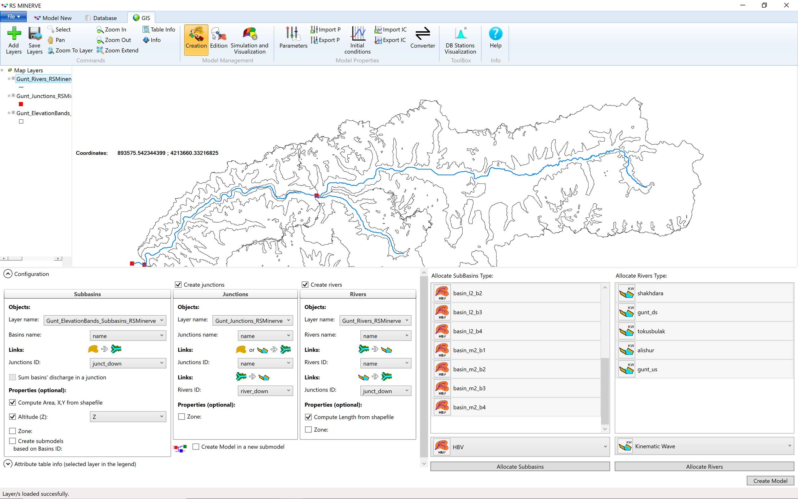
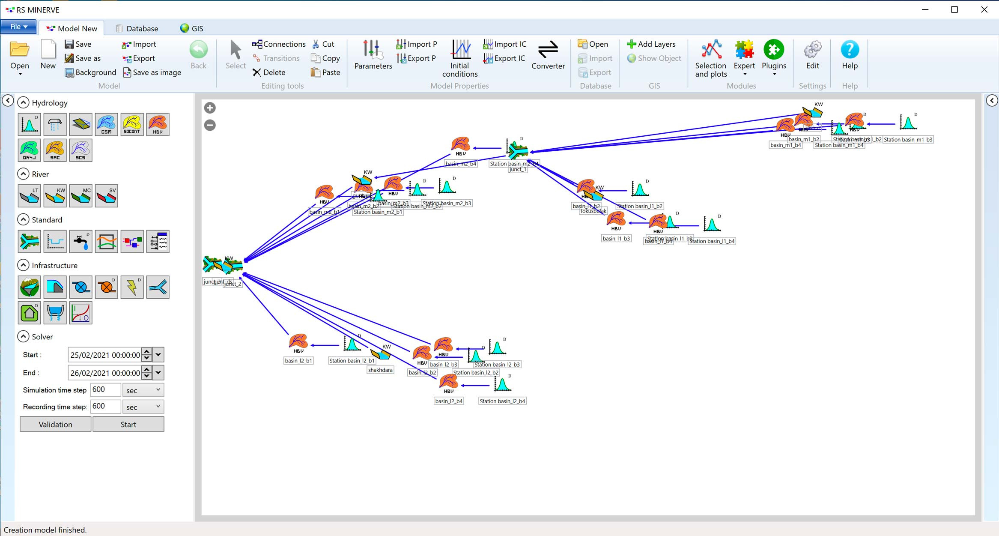

# Hydrological-Hydraulic Modeling {#RSMinerveMODELS}

Hydrological-hydraulic models are used for different purposes, including for the design of basin plans while taking into consideration different development options, for the study of effective water resources management schemes while taking into consideration the different types of sectoral users and uses of water in a basin (ideally also including minimal environmental flows), and for the detailed study of basin-scale climate impacts and their repercussions.

This Chapter introduces combined hydrologic and hydraulic modeling using the freely available graphical modeling environment RSMinerve [@rsminerve_software; @rsminerve_um; @rsminerve_tm][^rs_minerve-1]. Figure \@ref(fig:rsminerveModelPreview) shows a screen shot of a model of the Gunt river basin setup in RSMinerve as a teaser.

[^rs_minerve-1]: The reader is advised to consult the user manual and familiarizes himself or herself with the walk through examples that are discussed and presented there. They give a solid first hands-on introduction about the basic functionalities of the modeling environment.

```{r rsminerveModelPreview,echo = FALSE, fig.cap = 'Screenshot of an RSMinerve model setup for Gunt river basin.'}
knitr::include_graphics('_bookdown_files/FIG_RS_MINERVE/rsminerveModelPreview_lr.png')
```

It should be noted that other modeling packages exist for hydrological-hydraulic modeling. Among others, these include

-   [WEAP: Water Evaluation and Planning System](https://www.weap21.org){target="_blank"},
-   [SWAT: Soil & Water Assessment Tool](https://swat.tamu.edu){target="_blank"}, and
-   [Mike Hydro Basin](https://www.mikepoweredbydhi.com/products/mike-hydro-basin){target="_blank"}

As some if not most of these modeling packages are license-based, the advantage of using the combination of [QGIS](https://www.qgis.org/en/site/), [R](https://www.r-project.org) and [RSMinerve](https://www.crealp.ch/fr/accueil/outils-services/logiciels/rs-minerve.html) is that this is a completely free software suit for any user and use scenario.

Departing from catchment GIS data, RS Minerve allows to quickly develop, test and calibrate different types of lumped conceptual precipitation runoff models while taking into account the evolution of water balances in glacier, snow, surface and subsurface compartments over time and in different sections in the catchment under consideration. This is demonstrated here for the Gunt River Basin in the Pamirs (see Chapter \@ref(GuntRB) for more information).

The main goal in this Chapter is to familiarize the student on how to setup such model, calibrate and validate it for past and current climate conditions and then to **study climate change impacts in the basin**.


## Prerequisites {#section-rsminerve-prerequisites}
Before delving into this section of the course material, you should have at least:   

* RS Minerve installed [How to install RS Minerve](#section-quickguides-how-to-download-and-install-rsminerve). This tutorial was written using RS Minerve 2.9.1.0. 
* Read chapters 1 and 2 from the RS Minerve user manual [@rsminerve_um] (the manual can be downloaded from the CREALP website, see Section [How to install RS Minerve](#section-quickguides-how-to-download-and-install-rsminerve)).    
* Familiarize yourself with RS Minerve by following Example 1 in the RS Minerve user manual.  
* Read the HBV model description in the RS Minerve technical manual (Chapter 2.7) [@rsminerve_tm].   

You may have to dig deeper into the user manual and the technical manual within the frame of the course but the above points are the minimum requirement to get started.   
If you fulfill the prerequisites, you should be able to do the tutorial with the minimal description in the modeling section. However, detailed step-by-step descriptions are linked for each task. 


## Recap: Hydrological response {#section-rsminerve-why-model-introduction}
Why do we do hydrological modeling? Typically we want to know how much river flow we can expect at a given time in the future so we can plan our water consumption ahead, harness against floods or implement measures against droughts. So how can we forecast river discharge? For example, one could use the long term seasonal average discharge as the likely future discharge. However, in some years we have high discharge and in some years we have low discharge (Figure \@ref(fig:fig-discharge-nauvalisoy)). How to tell when you have which discharge?

```{r fig-discharge-nauvalisoy, echo=FALSE, message=FALSE, warning=FALSE, error=FALSE, fig.cap="Discharge of the Nauvalisoy river."}
library(tidyverse)
library(lubridate)
library(tsibble)
library(riversCentralAsia)
seasonal_discharge <- ChirchikRiverBasin %>%
  dplyr::filter(code == "16298", 
                year(date) > 1984, 
                year(date) < 1993) %>%
  mutate(yearmonth = yearmonth(date)) %>%
  group_by(yearmonth) %>%
  summarize(`Q [m3/s]` = mean(data))
ggplot(seasonal_discharge) + 
  geom_line(aes(yearmonth, `Q [m3/s]`)) + 
  labs(x = "") + 
  theme_bw()
```

Let's go back to the water balance: Where does the water in the river come from? Precipitation. When we compare precipitation and discharge time series we see that the two are related (Figure \@ref(fig:fig-precipitation-nauvalisoy)).    
```{r fig-precipitation-nauvalisoy, echo=FALSE, message=FALSE, warning=FALSE, error=FALSE, fig.cap="Discharge (red) and precipitation (grey) in the Nauvalisoy catchment."}
climate <- load_minerve_input_csv("./data/SyrDarya/Chirchiq/RSMinerve/ERA5_Nauvalisoy_1981_2013.csv")
seasonal_precipitation <- mutate(climate, yearmonth = yearmonth(date)) %>%
 dplyr::filter(type == "P") %>%
 group_by(yearmonth) %>%
 summarize(`P [mm]` = sum(value)) %>%
 dplyr::filter(year(yearmonth) > 1984,
               year(yearmonth) < 1993)
ggplot(seasonal_precipitation) +
 geom_col(aes(yearmonth, `P [mm]`)) +
 geom_line(data = seasonal_discharge,
           aes(yearmonth, `Q [m3/s]` * 60*60*24*365*10^(-6)),
           colour = "red") +
 labs(x = "", y = "P [mm], Q [10^6 m3/a]") +
 theme_bw()
```

Higher precipitation in the catchment is positively correlated with higher discharge in the river with a delay. Or in other words: The discharge is the catchments hydrological response to precipitation. The relationship can be described as follows: 

$$
Q \propto P \cdot K
$$    

In words this reads: Discharge (Q) is proportional to precipitation (P) times a transfer function (K) that defines the delay of the signal. The transfer function K describes how precipitation becomes river discharge and depends on the catchment characteristics, importantly on the storage capacity of the catchment. In reality, the transformation of precipitation to discharge is quite complex but we can simplify the reality and come up with a basic conceptual model of our river catchment: a large bath tube with the area of the catchment and an outlet at the bottom called the *linear reservoir model* (Figure \@ref(fig:fig-from-catchment-to-bucket)).  

```{r fig-from-catchment-to-bucket, echo=FALSE, fig.show = "hold", out.width="90%", fig.align="center", fig.cap="From the real-life system (left) to a linear reservoir (right)."}
knitr::include_graphics("_bookdown_files/FIG_RS_MINERVE/fig_fromCatchmentToBucket.png")
```

The linear reservoir model describes the discharge from the reservoir as linearly proportional to the storage in the reservoir:   

$$
Q(t) = 1/k \cdot S(t)
$$

Where Q is discharge, S is the storage and k is a constant called storage coefficient depending on the storage capacity of the reservoir. If k is small, the stored water will run out quickly, if k is large, the stored water will run out slowly. (t) indicate time dependent variables, i.e. variables that change over time.   
Substitute the linear reservoir equation into the water balance:  

$$
P = Q + dS/dt \Leftrightarrow P = Q + k \cdot dQ/dt
$$

Where P is the *excess* precipitation, i.e. the precipitation that is not intercepted by plants or ponds but contributes to discharge. The above is a differential equation and can be re-arranged:  

$$(P-Q) \cdot dt = k \cdot dQ$$

and integrated and solved for Q(t) (dig out your mathematics!). In the example in the box below we discredited the water balance with the linear relationship between discharge and storage change in the reservoir:

$$\frac{P_{t_1}+P_{t_1}}{2} - \frac{Q_{t1}+Q_{t_2}}{2} = \frac{k}{t_2-t_1} \cdot (Q_{t_2}-Q_{t_1})$$
and solved the equation for $Q_{t_2}$ (Inspiration from [@Pedersen1980].   
We assume that at the beginning of our experiment, we don't have a discharge as the bucket is empty.   

$$Q(t) = P(t) \cdot (1-e^{(-t/k)})$$

This is the equation for the rising discharge curve. Once you turn off the recharge of the reservoir (once you stop pouring water into the bucket), the discharge from the bucket can be described as:  

$$Q(t) = Q^* \cdot e^{-\tau/k}$$

Which describes the receding limb of the hydrograph ([What is a hydrograph](#section-quickguides-what-is-a-hydrograph)) with $\tau$ being the time since the recharge stopped. 

Understanding the linear reservoir model is a prerequisite for hydrological modeling. That is why we propose the following exercise for you to do at home as a preparation for class.   


:::: {.exercisebox exercise-rsminerve-linres-1=""}
::: {.center exercise-rsminerve-linres-1=""}
**Task 1: Exerimental setup**
:::
To understand the flow of water through a reservoir, you will build a bucket model yourself at home from materials that you have at hand and measure recharge as well as discharge from the bucket. You will then make a numerical model of your real bucket model and simulate discharge. Think through the experiment and answer the following questions:   

* What will determine the flow through your bucket?  
* What do you need to measure?   
* How can you measure it?   
* What materials you will need to set up the experiment?   
* Where will you get the water from and can you re-use it after the experiment?    

[Solution to task 1](#solution-task1-experimental-setup)

::: {.center exercise-rsminerve-linres-2=""}
**Task 2: Perform the experiment**
:::
Set up the experiment and pour water into your improvised reservoir. Take care to pour with a continuous speed over a short time period. You may have to repeat the experiment a few times (see also notes on measurement accuracy in the [Solutions of task 1](#solution-task1-experimental-setup)). The outcome of the experiment is a time series of discharge measurements.   
You can watch a video of the experiment [here](#solution-task2-perform-experiment) if you cannot perform the experiment yourself.  

::: {.center exercise-rsminerve-linres-3=""}
**Task 3: Simulate the experiment**
:::
The figure below shows the measured discharge from the experimental data shown in the table above. We have implemented a discretized version of a linear reservoir model for you which shows the simulated discharge (grey bars) of a recharge event (blue bars). Play with the storage parameter by moving the slider and see how the simulated discharge changes based on the storage parameter of the simulated catchment. Can you reproduce the measured discharge? If you cannot find a perfect match between measurements and simulation results: What could be the reasons? (If you see an empty window below this text, go to the [web app](http://34.251.168.23:3838/linearReservoirExampleApp/) directly to do the exercise).  
```{r, echo=FALSE}
knitr::include_app("http://34.251.168.23:3838/linearReservoirExampleApp/", 
                   height = "800px")
```

[Solution to task 3](#solution-task3-simulate)

::: {.center exercise-rsminerve-linres-4=""}
**Task 4: The non-linear reservoir**
:::
* What happens to the discharge curve if the outlet of the reservoir is not at the bottom but somewhere in the middle of the receptacle wall? 
* What happens if the receptacle is filled with sand?
* What happens if you add another linear reservoir to the outlet of the first one, i.e. make a cascade of linear reservoirs?

[Solution](#solution-task4-think)
::::


## Data Preparation and Setup

The data used in this Chapter can be accessed on the public GitHub repository [Applied Modeling of Hydrological Systems in Central Asia](https://github.com/tobiassiegfried/HydrologicalModeling_CentralAsia) and the ./data/AmuDarya/Gunt/ folder in there. It is advisable that the user downloads the data and sets up a similar data directory structure on their local machines.

### Examining and Understanding the GIS Data

As demonstrated in the Examples of the User Manual, RS Minerve does not necessarily require GIS input files for setting up models. These can also be setup and wired by hand. However, individual subbasins that contribute to flow in a larger catchment have different characteristics that need to be derived from spatial data, i.e. GIS files. For example, subbasin areas, river stretch lengths, terrain slopes, etc., are all required data in an RS Minerve model. These data could either be typed in by hand for each subbasin or automatically inserted via the GIS Import option. The latter method is much more convenient and is demonstrated here[^rs_minerve-2].

[^rs_minerve-2]: We assume that the basic steps of GIS basin delineation have been carried out as described in Chapter \@ref(Chapter-RetrievalAnalysisHydroData) and the Section \@ref(GeospatialData) there. We thus depart here assuming that the basin outlet (i.e. the location of the discharge gauge), the basin shape file as well as the digital elevation model are available.

First, we load the required packages in `R`.

```{r message=FALSE}
# Loading required packages
## Tidy data wrangling
library(tidyverse)
library(here)
library(timetk)
library(tidymodels)
library(lubridate)
library(timetk)
## riversCentralAsia Package
library('riversCentralAsia')
## Spatial data processing
library(raster)
library(sf)
```

Now, we can visualize the GIS files that are required in RS Minerve in the following Figure \@ref(fig:GuntGISRSMinerve).

```{r GuntGISRSMinerve, fig.cap = "Gunt river basin overview, showing the digital elevation model, the 4 subcatchments, the elevation bands with 1'000 meters intervals, the main tributary rivers and the corresponding junctions.", message=FALSE, warning=FALSE}
# Load data
fPath <- './data/AmuDarya/Gunt'
gunt_DEM <- raster(paste0(fPath,'/GeospatialData/17050_Gund_Basin_DEM.tif'))
gunt_elBands_shp_utm <- st_read(paste0(fPath,'/GeospatialData/Gunt_ElevationBands_Subbasins_RSMinerve.shp'),quiet=TRUE)
gunt_subbasins_shp_utm <- st_read(paste0(fPath,'/GeospatialData/Gunt_Subbasins_RSMinerve.shp'),quiet=TRUE)
gunt_subbasin_junctions_shp_utm <- st_read(paste0(fPath,'/GeospatialData/Gunt_Junctions_RSMinerve.shp'),quiet=TRUE)
gunt_rivers_shp_utm <- st_read(paste0(fPath,'/GeospatialData/Gunt_Rivers_RSMinerve.shp'),quiet=TRUE)

# Downsample DEM and create hillshade
gunt_DEM_lr <- raster::aggregate(gunt_DEM,fact=10) # this is in UTM 42N
gunt_slope <- terrain(gunt_DEM_lr, opt='slope')
gunt_aspect <- terrain(gunt_DEM_lr, opt='aspect')
gunt_DEM_hillshade <- hillShade(gunt_slope, gunt_aspect, 40, 270)

# Convert to dataframe for ggplotting
gunt_DEM_spdf <- as(gunt_DEM_lr, "SpatialPixelsDataFrame")
gunt_DEM_df <- as.data.frame(gunt_DEM_spdf)
colnames(gunt_DEM_df) <- c("value", "x", "y")
hillshade_Gunt_spdf <- as(gunt_DEM_hillshade, "SpatialPixelsDataFrame")
hillshade_Gunt_df <- as.data.frame(hillshade_Gunt_spdf)
colnames(hillshade_Gunt_df) <- c("value", "x", "y")

# Used for subbasins naming
subbasins <- # just put everything in a regular dataframe
  tibble(basin=c("Shakhdara","Gunt","Tokusbulak","Alishur"),
         lat   = c(37.4,37.75,37.6,37.65),
         lon   = c(72.0,71.8,72.6,73.25))
subbasins_coord_latlon = SpatialPoints(cbind(subbasins$lon, subbasins$lat), proj4string=CRS("+proj=longlat"))
subbasins_coord_UTM <- spTransform(subbasins_coord_latlon, CRS("+init=epsg:32642")) %>% 
  coordinates() %>% as_tibble() %>% 
  rename(x=coords.x1,y=coords.x2)
subbasins <- bind_cols(subbasins,subbasins_coord_UTM)
# Plotting
ggplot() +
  geom_tile(data=gunt_DEM_df, aes(x=x, y=y, fill=value), alpha=0.8) +
  geom_sf(data=gunt_subbasins_shp_utm,color="black",fill=NA,linetype="11",size=0.25) +
  geom_sf(data=gunt_rivers_shp_utm,color="blue",fill=NA) + 
  geom_sf(data=gunt_elBands_shp_utm,color="black",fill=NA,linetype="11",size=.2) +
  geom_sf(data=gunt_subbasin_junctions_shp_utm,color="red",fill="red") + 
  scale_fill_gradientn(colours = terrain.colors(100)) + 
  xlab("Longitude") + ylab("Latitude") + 
  guides(fill=guide_legend(title="Alt. [masl]")) + 
  ggtitle("Gunt catchment and subbasins") +
  geom_label(data = subbasins,aes(x = x, y = y, label = basin),vjust = 0,hjust = 0)
```

Figure \@ref(fig:GuntGISRSMinerve) shows the four subbasins. After the confluence with Tokusbulak river, Alishur river becomes Gunt river in Junction 1 (called junct_1 in the corresponding shapefile below). The confluence is noted by the corresponding red dot. Further downstream, approximately 5 km before the Gunt-Khorog gauging station (Hydromet Code 17050), indicated by the leftmost outlet point (red dot, called junct_2 in the junct_down attribute field of the shapefile), Shakhdara river feeds into Gunt. The subbasin-specific elevation bands are indicated by dotted lines.

As described in the RS Minerve User Manual in Chapter 5 [@rsminerve_um], the following three shapefiles need to be prepared for later loading into RS Minerve: subbasins.shp, junctions.shp and rivers.shp (see Figure \@ref(fig:requiredGISInputFiles)).

```{r requiredGISInputFiles,echo = FALSE, fig.cap = 'Required GIS input files for RS Minerve. See corresponding user manual for more information.'}
knitr::include_graphics('_bookdown_files/FIG_RS_MINERVE/required_GIS_Input_Files.png')
```

The shapefile attributes that you downloaded of the required data can easily be displayed. First, we analyze the subbasins \`gunt_elBands_shp_utm\` file. The file contains the following attributes as per the requirements specified in Figure \@ref(fig:requiredGISInputFiles): name and junct_down. The attributes Z, ModelGuid and *geometry* are additional fields. The field *Z* that contains information of the mean elevation of the subbasin. Note that the shapefile is does not only contain the shape of the four subbasins Alishu, Tokusbulak, Gunt and Shakdara but also the elevation bands of each subbasin.

```{r}
# view meta data summary of the subbasins file
gunt_elBands_shp_utm <- sf::st_read(paste0(fPath,'/GeospatialData/Gunt_ElevationBands_Subbasins_RSMinerve.shp'),quiet=TRUE)
gunt_elBands_shp_utm
```

This is because in RS Minerve, we will model each elevation zone of each subbasin with a separate rainfall-runoff model. These are then linked to each other via the topological ordering that is given by the rivers and junctions. The naming of the subbasins is somewhat arbitrary and tailored to the particular catchment under consideration. The prefix 'basin\_' is everywhere the same. The basic idea is to identify a main river stem (denoted with mX) where the X is a number that increases from 1 towards the downstream after each confluence with a right or left tributary. In our case, Alishur river is denoted with m1. Gunt river, which emerges after the confluence with Tokusbulak (see Figure \@ref(fig:GuntGISRSMinerve)), is denoted with m2. Finally, Gunt river after the confluence with Shakhdara is m3. Each left tributary is denoted with lX and each right tributary with rX, where X is again a number starting from 1 and gradually increasing. In our case, Tokusbulak thus is l1 (the first left tributary joining the main river). Finally, Shakhdara is l2. Note, in the Gunt river basin, we do not have major right tributaries.

'm1_b2' the refers to the main upstream river, Alishur in this case, and its elevation band 2. m1_b3 would then be the third elevation band accordingly and so on. Why is there no m1_b1 feature? This is simple to understand. Since the entire basin is subdivided into n equally spaced elevation zones, the higher lying subbasins might no longer contain all elevation bands. For both, Alishur (main m1) and Tokusbulak (l1) this is the case where band b1 is simply not represented because of the high elevations of the subbasins.

```{r}
#  view meta data summary of the junctions file
gunt_subbasin_junctions_shp_utm <- sf::st_read(paste0(fPath,'/GeospatialData/Gunt_Junctions_RSMinerve.shp'),quiet=TRUE)
gunt_subbasin_junctions_shp_utm
```

```{r,echo=FALSE}
# this is just to correct the shapefile and store it. the block can be deleted later.
# gunt_subbasin_junctions_shp_utm_corr <- gunt_subbasin_junctions_shp_utm %>% dplyr::select(-ModelGuid)
# gunt_subbasin_junctions_shp_utm_corr$name[1] <- 'junct_2'
# gunt_subbasin_junctions_shp_utm_corr$name[2] <- 'junct_3'
# gunt_subbasin_junctions_shp_utm_corr$name[3] <- 'junct_1'
# gunt_subbasin_junctions_shp_utm_corr$river_down[1] <- 'gunt_ds'
# gunt_subbasin_junctions_shp_utm_corr$river_down[3] <- 'gunt_us'
# gunt_subbasin_junctions_shp_utm_corr
# sf::st_write(gunt_subbasin_junctions_shp_utm_corr,paste0(fPath,'/GIS/Gunt_Junctions_RSMinerve.shp'),append=FALSE)
```

For the junctions shapefile, we define their names as well the field river_down, i.e. the name of the river downstream of the junction. Finally, for the rivers shapefile, we define the rivers name and the downstream junction junct_down. The terminal junction corresponds to the outlet of the model. It can be easily seen that junct_3 is the outlet since there is no more downstream river, i.e. \<NA\>.

```{r}
# view meta data summary of the rivers file
gunt_rivers_shp_utm <- st_read(paste0(fPath,'/GeospatialData/Gunt_Rivers_RSMinerve.shp'),quiet=TRUE)
gunt_rivers_shp_utm
```

```{r,echo=FALSE}
# this is just to correct the shapefile and store it. the block can be deleted later.
# gunt_rivers_shp_utm_cor <- gunt_rivers_shp_utm %>% dplyr::select(-ModelGuid)
# gunt_rivers_shp_utm_cor$name[1] <- 'shakhdara'
# gunt_rivers_shp_utm_cor$name[2] <- 'gunt_ds'
# gunt_rivers_shp_utm_cor$name[3] <- 'tokusbulak'
# gunt_rivers_shp_utm_cor$name[4] <- 'alishur'
# gunt_rivers_shp_utm_cor$name[5] <- 'gunt_us'
# gunt_rivers_shp_utm_cor
# sf::st_write(gunt_rivers_shp_utm_cor,paste0(fPath,'/GIS/Gunt_Rivers_RSMinerve.shp'),append=FALSE)
```

### Loading GIS Data and Model Creation

As described in the RSMinerve user manual in Chapter 5 there, these three shapefiles can then be loaded into RSMinerve and automatically translated into an RSMinerve model via the `Creation` option [@rsminerve_um]. In Figure \@ref(fig:RSMinerveGuntModelCreation), a screen shot is shown where in a somewhat arbitrary manner, all subbasins got assigned individual HBV models. Note the highlighted `Creation` button.

```{r RSMinerveGuntModelCreation,echo = FALSE,fig.cap = 'Using the `Creation` Menu, the information from the shapefiles gets translated into a number of interlinked subcatchment and elevation band-specific models.'}

```

Since the shapefile containing the elevation bands for each subbasin also contains mean subbasin elevation, we can extract the Altitude (Z) from the corresponding feature. Similarly, the area of the subbasins and the length of the rivers can all be computed from the shapefiles. The corresponding boxes should be ticked.

After these steps, the student can click the `Create Model` button in the lower left corner of the window and then switch to the `Model New` tab to examine the resulting model. A screen shot showing the results is shown in Figure \@ref(fig:RSMinerveGuntModelCreationResult).

```{r RSMinerveGuntModelCreationResult,echo = FALSE,fig.cap = 'The result of the GIS-based creation of the Gunt river basin model in RSMinerve. Note that even without proper arrangement of the individual model elements, the subbasins and their models are already visible.'}

```

After rearranging the individual model elements and loading a background .jpeg-image (see Figure \@ref(fig:rsminerveModelPreview), the setup step has been completed.

### Climate Data

RSMinerve simulates discharge in response to climate forcing.


## The HBV model {#section-hbv-model}
The HBV (Hydrologiska Byråns Vattenavdelning) model is a conceptual rainfall-runoff model which is suitable for many snow-fed river catchments [@bergstrom_development_1976; @lindstrom_development_1997]. You have studied the short description of the HBV model in the RS Minerve technical manual [@rsminerve_tm]. A brief reminder of the HBV model implemented in RS Minerve is given in Figure \@ref(fig:fig-overview-hbv-model). The model consists of a snow function which separates precipitation into solid and liquid parts and manages melting of snow and 3 storage reservoirs similar to the linear reservoir we saw in the [recap section](#section-rsminerve-why-model-introduction).      

```{r fig-overview-hbv-model, echo=FALSE, out.width="55%", fig.align="center", fig.cap="The HBV model concept (source: RS MINERVE Technical Manual)."}
knitr::include_graphics("_bookdown_files/FIG_RS_MINERVE/fig_HBVconceptualModel.png")
```

:::: {.exercisebox exercise-rsminerve-hbv-1=""}
::: {.center exercise-rsminerve-hbv-1=""}
**Exercise: Model understanding - Drivers**
:::
What are the model drivers (i.e. what input data do you need to provide)?   

Hint: Study Figure \@ref(fig:fig-overview-hbv-model).   
[Solution](#section-appendix-solutions-hbv-driving-forces)
::::

Figure \@ref(fig:fig-overview-hbv-model-parameters) from the RS Minerve technical manual [rsminerve-tm] gives an overview over the model parameters and states. 
```{r fig-overview-hbv-model-parameters, echo=FALSE, out.width="60%", fig.align="center", fig.cap="The HBV model parameters (source: RS MINERVE Technical Manual)."}
knitr::include_graphics("_bookdown_files/FIG_RS_MINERVE/fig_PARandIC.png")
```

:::: {.exercisebox exercise-rsminerve-hbv-2=""}
::: {.center exercise-rsminerve-hbv-2=""}
**Exercise: Model understanding - States**
:::
What are the model states (i.e. what variables describe the amount of water in the system over time)?   

Hint: Values for initial water content in the different model compartments need to be defined prior to the simulation.    
[Solution](#section-appendix-solutions-hbv-parameters-states)
::::

### HBV example: Simple model of the Nauvalisoy river catchment {#section-hbv-nauvalisoy-tutorial-short}
#### Set up the model {#section-hbv-nauvalisoy-modelling-setup}  

1. Open RS Minerve and create an HBV model with the correct area ([Step-by-step guide](#section-quickguides-create-hbv-model)).  
2.  Add a climate station and link it to the HBV model ([Step-by-step guide](#section-quickguides-add-climate-station)) .   
3.  Climate data has been prepared in the file ./data/SyrDarya/Chirchiq/RSMinerve/ERA5_Nauvalisoy_1981_2013.csv. Import the data in RS Minerve and link it to the station data ([Step-by-step guide](#section-quickguides-import-climate-data)).  
4.  Change the model settings to calculate evaporation using and adapt the coordinates in the settings tab [Step-by-step guide](#section-quickguides-atapt-model-settings).   

:::: {.exercisebox exercise-rsminerve-hbv-3=""}
::: {.center exercise-rsminerve-hbv-3=""}
**Exercise: RS Minerve - Data visualization**
:::
Use the Selection and plots tool in the Modules toolbar of RS Minerve and display the hourly model inputs precipitation and temperature for the example year 1984. What is the approximate temperature range over the year? What is the annual precipitation? 

Hint: Adapt the simulation period in the model tab accordingly. Don't forget to set the initial conditions of the model to the last hour of 1983.      
[Solution](#section-appendix-solutions-plot-temperature-and-precipitation-1984)

::: {.center exercise-rsminerve-hbv-4=""}
**Exercise: RS Minerve - Compare evaporation models**
:::
Compare the different methods to calculate hourly evaporation in 1984 and their impact on the simulated discharge. Is the uniform evaporation model suitable for seasonal discharge models?  

Hint: Export simulation results to the data base ([how to](#section-quick-guides-export-sim-results-to-db)).  
[Solution](#section-appendix-solutions-compare-evaporation-methods)
::::


## Model Calibration and Validation

### Basic Principles {#section-calibration-principles}
The large number of parameters of the HBV model can be adjusted within reasonable ranges to make the simulated river discharge more similar to the measured discharge. This process is sometimes called history matching because past measurements are used to adapt the model parameters. The following two exercises are important for understanding hydrological models. They are relevant whether you work as a modeler or as a decision maker. Try to first come up with a few own ideas and then study the solutions carefully. They will be discussed in the lectures in more detail.    

:::: {.exercisebox exercise-rsminerve-hbv-5=""} 
::: {.center exercise-rsminerve-hbv-5=""}
**Exercise: Model calibration - Common difficulties**
:::
What are typical difficulties inherent to the calibration of common semi-distributed (or fully distributed) hydrological models?

Hint: Compare the number of parameters of the HBV model to the number of model states.  
[Solution](#section-appendix-solutions-common-calibration-issues)

::: {.center exercise-rsminerve-hbv-6=""}
**Exercise: Model calibration - Strategies to handle the difficulties**
:::
Based on the list of common difficulties in the solution of exercise 5, think about possible strategies to address these challenges.

Hint: A modeler proverb says "as simple as possible but as complex as necessary".  
[Solution](#section-appendix-solutions-strategies-for-issues)
::::


#### Calibration vs. validation  
As you have learned, semi- and fully distributed hydrological models are typically not well defined, i.e. you will find multiple sets of parameter combinations which will all yield reasonable model performance. An important strategy to gain confidence into a model is to split your time series into a calibration period and a validation period. During calibration, you adjust the model parameters to get a satisfying fit with the measured discharge. During the validation period you check how the calibrated model compares to discharge data that it hasn't seen before, i.e. you judge the ability of the model to handle potentially different model input than it has seen during calibration. For example, if you have 30 years of discharge time series available you can use the first 10 years for model calibration (i.e. you run the model calibration procedure only over the first 10 years of the time series) and use the last 20 years for model validation. A good model should perform satisfactorily not only during calibration but also during validation.   
In hydrology, it is recommended to do cross-validation, i.e. to calibrate and validate a model with several combinations of calibration and validation periods and to summarize the overall model performance.  


#### Performance indicators
Model performance can be expressed in different ways. Some indicators are better suited to calibrate high flows (e.g. root mean squared error) and some are better suited to calibrate low flows (e.g. Nash coefficient for logarithm values). Others evaluate the models ability to reproduce the exceedance of a given discharge which is especially important for flood modelling. The calibration result depends on the choice of the performance indicators. For the automated calibration in RS Minerve, the user can choose a combination of several performance indicators. Care has to be taken to choose them according to the models goal. 

:::: {.exercisebox task-performance-indicators=""}
::: {.center task-performance-indicators=""}
**Task: Read up on performance indicators**
:::
The RS Minerve technical manual [@rsminerve_tm] summarizes the most important performance indicators typically used in hydrological modelling. For the more ambitious modellers, the manual includes references to the literature. Read Chapter 3 of the technical manual. 
::::


### Practical Steps {#secion-calibration-practical-steps}
#### Manual calibration of synthetic discharge {#section-hbv-nauvalisoy-calibration}  
The following section describes the steps for manual model calibration. We use the example of the Nauvalisoy river catchment and calibrate it with synthetic discharge measurements to deepen our understanding of the HBV model. For the synthetic discharge measurements it is theoretically possible to find a perfect match between simulated and measured data which is typically not the case for real measurements.  

```{r rsminerve-run-model-precalibration, echo=FALSE, out.width="80%", fig.align="center", fig.cap="The simulated discharge (green) differs from the reference discharge (blue) before model calibration."}
knitr::include_graphics("_bookdown_files/FIG_RS_MINERVE/fig_simulation_result_before_calibration_synthetic.png")
```

:::: {.exercisebox exercise-rsminerve-manual-calibration=""}
::: {.center exercise-rsminerve-manual-calibration=""}
**Exercise: RS Minerve - Manual calibration of synthetic discharge**
:::
Add a comparator and a source object to your Nauvalisoy model and load river discharge measurements (filename), then run the model [how to](#section-quickguides-add-comparator-and-discharge-data). With default parameters, the outcome of this step should look like Figure \@ref(fig:rsminerve-run-model-precalibration). Should your result differ significantly from the one shown here, compare the parameters of the HBV mode to the ones in the file ./data/SyrDarya/Chirchiq/RSMinerve/nauvalisoy_PAR_precalibration.txt. You can import the parameter set to RS Minerve via Import P in the model properties toolbar.

Hints: Start adjusting the parameters of the HBV model to make the simulated discharge curve more similar to the reference discharge. Start with the parameters of the snow function and then proceed downwards through the compartments of the HBV model. 
Focus on parts of the curves. Try to figure out which parameters influence the timing of the discharge peak, which the height of the peak and which the form of the recession curve. Give yourself some time for this task before you go peaking in the results.          
The parameters of the calibrated model are linked [here.](#section-appendix-solutions-calibrated parameters)

::: {.center exercise-rsminerve-manual-calibration=""}
**Exercise: RS Minerve - Load real discharge measurements**
:::
From the file ./data/SyrDarya/Chirchiq/RSMinerve/  
**   TODO write the discharge file **
::::

Figure \@ref(fig:gunt-temp-elevation) shows the relationship between elevation and temperature of the 4 meteo stations in the Gunt river catchment. The elevation dependence of temperature is highly important for snow-melt driven river catchments. 

```{r gunt-temp-elevation, message=FALSE,warnin=FALSE, fig.cap="Elevation dependence of temperature in the Gunt river catchment."}
## MeteoStation locations and elevation
meteoStations <- # just put everything in a regular dataframe
  tibble(code = c(38953, 38954, 38956, 38950),
         masl  = c(3746, 2075, 3438, 2566))

# Load Gunt data
data <- read_rds('./data/AmuDarya/Gunt/StationData/gunt_data_cleaned.Rds') %>% 
  dplyr::filter(str_detect(type, "T")) %>%  # Filter for data types that contain T 
  mutate(code = as.numeric(code)) %>%  # Cast code column to numeric
  left_join(meteoStations)  # Add the station altitude to the data

# Plotting the dataframe
data %>%
  dplyr::filter(!str_detect(type, "meanmax"), 
                !str_detect(type, "meanmin")) %>%
  dplyr::mutate(Variable = type) %>%
  group_by(code, Variable) %>%
  summarize(norm = mean(norm, na.rm = TRUE), 
            masl = first(masl)) %>%
  ggplot(aes(masl, norm, colour = Variable)) + 
  geom_point() + 
  geom_smooth(method = "lm") + 
  labs(x = "Altitude [masl]", y = "T [deg C]") + 
  theme_bw()
```


#### Manual calibration of the Nauvalisoy model {#section-hbv-nauvalisoy-calibration}  


## Application: Investigating Climate Change Impacts

## Discussion
