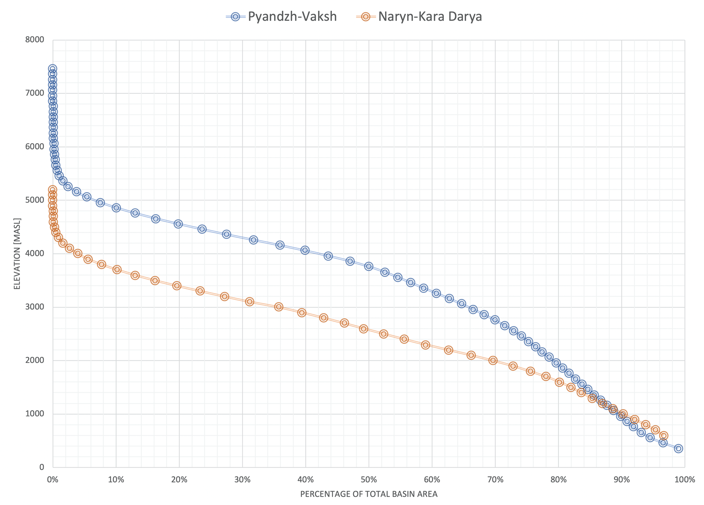

# Welcome {#Welcome .unnumbered}

Welcome to the online course book on Central Asian hydrology and the mathematical modeling of the hydrological systems there. The book is dedicated to the young and aspiring water professionals of the region.

The book adopts an open-source philosophy and promotes the use of open-source data and software. The online version is hosted at <https://tobiassiegfried.github.io/Applied_Hydrological_Modeling_Bookdown/>, maintained via GitHub and **currently work in progress**.

```{r titlePix, echo = FALSE}
knitr::include_graphics('_bookdown_files/Title-Figures/naryn.jpeg')
```

```{r include=FALSE}
# automatically create a bib database for R packages
knitr::write_bib(c(
  .packages(), 'bookdown', 'knitr', 'rmarkdown'
), 'packages.bib')
```

<!--chapter:end:index.Rmd-->

# Preface {#preface .unnumbered}

This handbook is geared towards young water professionals in Central Asia. As they now graduate, they inherit an extraordinarily complex system of man made irrigation and hydropower infrastructure that is gradually aging. At the same time, they enter a sector that has enabled the region to prosper and flourish over hundreds if not thousands of years. Finally, they face work where opportunities for modernization abound after decades of inadequate investments. It is the hope of the author that this text provides a source of inspiration for this target group and that the text and the methods presented will also be used by teachers and integrated in university curricula locally.

The author is grateful for the support by the Global Water Programme at the Swiss Agency for Development and Cooperation and especially to Stephanié Piers de Raveschroot and André Wehrli there. The author owes a lot to Andrey Yakovlev who provided invaluable guidance throughout his professional career.

Finally, this book is dedicated to our past, current and future colleagues at the Central Asian Hydrometeorological Agencies whose tireless work in collecting and analyzing hydro-meteorological data in Central Asia has helped to greatly improve our understanding of the complex runoff generation processes at work in the region.

::: {style="text-align: right"}
Tobias Siegfried, hydrosolutions GmbH
:::

::: {style="text-align: right"}
Zurich, February 2021
:::

<!--chapter:end:01_PREFACE.Rmd-->

# Foreword {#foreword .unnumbered}

```{r frontFigureForeword, echo = FALSE}
knitr::include_graphics('_bookdown_files/Preface-Figures/NearSamarkandOasis.jpeg')
```

**Oasis between Samarkand and Buchara. Source: Tobias Siegfried, hydrosolutions GmbH.**

This is a online book about applied hydrological modeling. It is geared towards students and young professionals in Central Asia who are interested in learning modern modeling approaches. The book teaches by examples and uses two catchments from the Syr Darya and Amu Darya river basins as case studies. While the presented case studies are exclusively from Central Asia, the methods demonstrated can be applied elsewhere.

First, key hydro-climatological characteristics of the region are presented. This Section draws heavily on Victor Shults' "Rivers of Middle Asia" and presents relevant materials from this famous book in a modern way. Two hydrological basins are further highlighted in in-depth case studies, i.e. the Gunt River in the Amu Darya catchment and the Chirchik river basin as the biggest right tributary to Syr Darya. The analyses of these catchments draws on available data from the Central Asian Hydrometeorological Services. The analysis of the available hydro-meteorological data uses different types of methods implemented in R which is a programming language widely used in data analysis and mining [@R-2013].

Three different types of modeling approaches are demonstrated and discussed in greater depth. First, long-term water balance modeling using the Budyko framework is introduced to discuss and demonstrate the quantification of climate change impacts on hydrological systems in Central Asia. Using this type of model, the effects of climate change on the long-term water balance are discussed for the Gunt River. The Gunt river is one of the key right tributaries to the Pjandz, i.e. the upstream Amu Darya, and emerges at high altitudes in the eastern Pamirs.

Second, a more detailed modeling approach using semi-distributed, lumped, conceptual hydrologic-hydraulic modeling will be used to demonstrate how intra-annual changes due to climate forcing and changes therein can be quantified. These approaches will be demonstrated again for the Gunt catchment and also for the Chirchik river basin and its tributaries. Furthermore, the use of these models to study different kinds of reservoir operations will be presented and impact on hydropower production as well as on downstream water availability discussed.

Third and finally, empirical modeling will be introduced for forecasting. These types of models are currently utilized in the Hydrometeorological Agencies of the region for forecasting discharge at different lead times, ranging from one day ahead up to seasonal forecasts. These models use long term time series to learn relationships between past, observed quantities and future system responses.

With everything that is presented, the focus is on the use of open source and free software. For data preparation and analysis as well as for water balance and empirical modeling, [R](https://www.r-project.org) and [RStudio](https://rstudio.com) are utilized [@R-2013; @RStudio-2020]. For the processing of geographic data, workflows in [QGIS](https://www.qgis.org/en/site/) are demonstrated [@QGIS_software]. For hydrological-hydraulic modeling, the free [RS MINERVE](https://www.crealp.ch/fr/accueil/outils-services/logiciels/rs-minerve.html) is utilized which is a environment for the modeling of free surface runoff flow formation and propagation [@rsminerve_um; @rsminerve_tm]. The reader is expected to have a basic understanding about R and QGIS and how to use these software for data analysis and processing.

The R code to produce figures, conduct analyses as well carry out empirical modeling is deliberately provided throughout the text and embedded there. While this makes the text heavier than necessary, it gives the local target group to reuse code and directly reproduce results while working on their own problems. An attempt has been made to make everything as reproducible as possible.

<!--chapter:end:02_FOREWORD.Rmd-->

# (PART) Part I Hydrological Systems {#Part1_Hydrological_Systems .unnumbered}

# Short History of Water in Central Asia {#ShortHistory}

```{r construction_BFC, echo = FALSE}
knitr::include_graphics('_bookdown_files/Chap1-Introduction-Figures/still_BFC_Construction.jpg')
```

**Still from a propaganda film documenting the construction of the Big Fergana Canal. The canal was constructed in 1939 constructed over a period of 45 days and a length of approx. 280 kilometers. Source: Youtube**

This Chapter provides a short introduction to the region of how man has tamed and allocated the Central Asian water resources. It draws on texts from an emerging field of the study of colonial times in the region and how the Zarist and Russian conquests effectuated dramatic changes in the use and allocation of water resources. These changes, however, as is becoming more and more clear thanks to recent research, were built on top of a system of traditions, some of which were developed over the course of centuries, and neither able to complete replace them nor root them out. The clash of tradition with modernity continues to this day and is the cause of renewed attention of governments and the international community alike as environmental degradation directly linked to the ineffective and unustainable use of water grows in extent.

## The Taming of the Central Asian Rivers {#TamingHydrologicalSystems}

The conquest of nature, as per the thinking of the tsarist Russian government in the late 19^th^ century, was an essential precondition of successful colonial policy. It enabled the economic appropriation of new territories and facilitated the development of administration and the integration of local authorities into the colonial system [@pravilova_2009].

<!-- There is a profound riddle at the core of everything the engineer does in Central Asia (one might even want to call it the great paradox). Namely, Soviet planning organized space and resources so that the units under consideration (including human resources) could be "identified, observed, recorded, counted, aggregated and monitored" (C. Scott: Seeing like a State, Part 3: The Social Engineering of Rural Settlement and Production). All engineering in Central Asia was based on this, be it for irrigation projects, railway lines and hydropower dams that have become emblems of authoritarianism in Soviet Central Asia (Jonas van der Straeten: Borderlands of Industrial Modernity: Explorations into the History of Technology in Central Asia, 1850 - 2000). Should there thus not be an innate interest "built-in" to the Central Asia Water Stakeholders that takes its legacy from this organizational heritage and thus jump on any new technology that would help them to improve their planning skills, also e.g. in an objective way through the use of space-based information? -->

<!-- What emerged over time was a "coexistence of the infrastructural and industrial legacies of its Soviet period, artisanal practices and material cultures that date back to the pre-Soviet time, and by the changes brought by the rapidly accelerating circulation of goods, tastes, and ideas in post-Soviet years. The coexistence of these different influences, however, is not always a harmonic one. It constantly leads to in-between situations, tensions, and paradoxes." (Jonas van der Straten:...). Tsarist and Soviet occupation and colonialism, a great disrupting force of a fragmented place with historically highly fragmented administrative structures between the traditional oases that were regarded as backward and characterized as "medieval barbarity" by those very occupiers? Occupiers, that is, that, at least in private, often acknowledged that European irrigation technology was inferior to indigenous traditional methods? -->

<!-- Some US Engineers were called in early on by the Soviets to help in the large scale landscape transformation as described in Teichmann in Chapter 7 and also for the introduction of the 'American' long-staple cotton varieties. It is instructive to quote one of them as Teichmann did: »In den Büros, auf Konferenzen und in der Presse geht es immer nur um Pläne, Programme und Fristen«, berichtete der amerikanische Ingenieur Willard Gorton nach seiner Rückkehr aus der Sowjetunion in die Vereinigten Staaten 1933. »Es wäre eine Art kommunistisches Sakrileg, etwas zu unternehmen, ohne vorher einen Plan, oder besser: ein halbes Dutzend Pläne, gemacht zu haben.« Gorton hatte zwei Jahre lang als Bewässerungsingenieur in Taschkent gearbeitet und wusste, wovon er sprach. Sowjetische Pläne und sowjetische Wirklichkeit standen, wie er immer wieder feststellen musste, in einem unauflösbaren Widerspruch. Die Planwirtschaft behindere das Erreichen der vorgesehenen Planziele, statt es sicherzustellen. »Das tatsächliche Ergebnis der Pläne«, meinte der Ingenieur, seien »Chaos« und »Unordnung«. »Vergleicht man die Leistungen, die die Roten von Tag zu Tag vollbringen, mit den Möglichkeiten, die sie von Tag zu Tag verschenken, scheint es, dass sie auf ganzer Linie scheitern werden.«1 Die Schwachpunkte der Planwirtschaft hatte Gorton schnell erfasst: Die sowjetischen Pläne beruhten auf »illusorischen Hoffnungen« und die Planer »verplemperten« ihre Zeit mit dem »Verfassen von Märchen«. Und immer gebe es mehrere, einander widersprechende Planszenarien, von denen keines ausgereift genug sei, um umgesetzt werden zu können. Obwohl »alles bis zum letzten Atemzug« durchgeplant sei, herrschten bei der Arbeit »Durcheinander, Unsicherheit und Verantwortungslosigkeit« und die Pläne erzeugten eine »kontinuierliche und überall verbreitete Unordnung, die an Chaos grenzt«. Das sowjetische Alltagsleben sei von »all den Ärgernissen und Unsicherheiten« geprägt, »die man in den kapitalistischen Ländern finden kann, und vielen anderen mehr, die man hier nicht finden kann«. Zudem erzeuge der verschwenderische Umgang mit Ressourcen Mangel und Not. »Du planst und arbeitest und verhungerst dabei«, berichtete Gorton. Wenn man überhaupt davon sprechen könne, dass die Sowjetunion »nach einem Plan lebe«, sei dieser »sicherlich vom Teufel selbst erdacht«. -->

<!-- Identification, observation, recording, counting, aggregating, and monitoring - all based on "dem Verfassen von Märchen" in Soviet Times? And, might it truly have been so that the centralized command and control economy was in reality directed "according to a system of preferences and not according to precise scientific planning" (Robert Davies quoted in Teichmann)? -->

<!-- I believe that the Czarist invaders were driven by scientifically 'enlightened' engineering. The same applied to the Homo Sovieticus who now extended engineering also in the social practices. Yet, despite its overwhelming power and oversight, the empire was never able to control every aspect of life of the indigenous people. Was it maybe that this enlightened science had to adapt over time, adapt in the sense as described above, to comply to Stalin's Planvorgaben and so became to rely on fairy tales? Additionally, was it that the 'Western' technology and science got adapted to the local colonized conditions and became a complex process of negotiation, contestation, cooptation, and resistance at work" (Cited from Baber in Obertreichs Book)? -->

```{r geographyCentralAsia, echo = FALSE, fig.cap = "Geography of the Central Asia Region. Source: Zoï Environment Network."}
knitr::include_graphics('_bookdown_files/Chap1-Introduction-Figures/geography_CentralAsia.jpg')
```

```{r waterFormationUse, echo = FALSE, fig.cap = "Water resources formation and use. The infographics river width is proportional to average discharge at the particular locations. The red arrows indicate water diversion from rivers into irrigation canals. The gray bands around the rivers in the downstream indicate their natural unaltered runoff. Also note the reuse of drainage water in the Syr Darya. Source: Zoï Environment Network."}
knitr::include_graphics('_bookdown_files/Chap1-Introduction-Figures/WaterResourcesFormation&Use.jpg')
```

## Post-Transition Development and Challenges {#PostTransitionDevelopmentsChallenges}

Political Changes: Waking up to a new Reality and Adverse Developments

<!--chapter:end:03_INTRODUCTION.Rmd-->

# Hydrological Systems in Central Asia {#HydrologicalSystems}

```{r Front_Figure_HydroSystems, echo = FALSE}
knitr::include_graphics('_bookdown_files/Chap2-HydrologicalSystems-Figures/NarynRiver.jpeg')
```

**Upstream Naryn, Kyrgyzstan. Source: Tobias Siegfried, hydrosolutions GmbH.**

## Regional Hydro-Climatological Features

The inhomogeneity of the relief structure causes Central Asia to be the territory of immense contrasts. Here, extreme aridity in the hot deserts of the plains and, only 100 km away, abundant humidity and snowfields in the mountains where precipitation levels can range between 1'000 mm up to 2'000 mm. The uneven distribution of water bodies is striking. The mountains of Central Asia are riddled with an extremely branched river network consisting of more than ten thousand watercourses. In the flat foothill areas surrounding the mountain ranges, another branching river network is found which consists of irrigation channels, which do not contribute to the runoff of the core rivers, but rather divert the water from the river network and diffuse it in the irrigated oases where much of it gets evapotranspirated.

Central Asia is spreading over approximately 4 million km^2^, including the territories of Kazakhstan, Kyrgyzstan, Tajikistan, Turkmenistan and Uzbekistan [@cia_worldfactbook]. In the vast plains that cover around 70% of the total territory, there are only very few rivers which have scarcely any tributaries from the point they leave the mountain areas all the way to their mouth. Abundant solar radiation, high temperatures, small amounts of precipitation, a lack of humidity, unstable snow cover, slight slopes, geological structures[^pi_chap2_hydrological_systems-1], etc., hinder the formation of surface flows in the plains of Central Asia, despite their big importance for the local agricultural production there. Only the largest rivers, such as Syr Darya, Amu Darya, and Ili are able to survive hundreds of kilometers of deserts and reach the most important landlocked reservoirs -- the Aral Sea and Lake Balkhash [@shults_RiversOfMiddleAsia]. Figure \@ref(fig:riversMap) shows an overview of the region.

[^pi_chap2_hydrological_systems-1]: namely the distribution of sand and loess relief types, where the former are more permeable and the latter contain more moisture

```{r riversMap, echo = FALSE, fig.cap = 'Map highlighting the Central Asian rivers network (rivers are shown in blue color). The dense river network in the mountainous areas starkly contrasts with the sparse one in the plains. Source: Zoï Environment Network.'}
knitr::include_graphics('_bookdown_files/Chap2-HydrologicalSystems-Figures/waterFormationUseCentralAsiaZoi.jpg')
```

All Central Asian river basins are endorheic with no water draining out of the region but only evaporating back to the atmosphere. This emphasizes the importance of moisture transfer as an important mechanism in the region region since the formation of substantial watercourses in the mountains is followed by their complete dissipation in the plains, including in the irrigated oases and the terminal lakes, i.e. the Aral Sea and Lake Balkash.

In the boreal summer, tropical air masses form in the plains of Central Asia. At that time, even cold air masses coming from the north heat quickly. There is no possibility for temperature differences between the lower and the middle troposphere to occur which explains the horizontal uniformity of high temperatures during summer.

Contrary to this, the temperature differences in the region are highest in January during the peak of the boreal winter. As the territory of Central Asia is unprotected from the north, it is under the influence of dry, exceptionally cold air masses originating from the Arctic region and Siberia. These air masses can cause sharp frosts. The further the Siberian or Arctic air masses penetrate towards the west and the south, the more their temperature increase. This explains the big difference in air temperatures during winter between the north and the south of Central Asia. Cold air intrusions are often accompanied by the influx of warm air from the tropics. The cold waves taking turns with hot air masses cause unsteady frost in the plains and, together with generally low precipitation values, do not allow for the formation of a significant snow pack there [@shults_RiversOfMiddleAsia].

//TODO: properly reference Section here. As is discussed further below, the winter snow cover in the high mountain ranges plays an essential role in runoff formation in the spring and summer months and is thus of key relevant to irrigation agriculture in the downstream and for hydropower production (see Section \~\ref{sec:runoffFormation} below). Understanding the atmospheric mechanisms resulting in favorable conditions for winter precipitation is thus essential. With a warming climate and the associated increase of evapotranspiration in the downstream plains and the loss of glacier storage in the mountainous areas, a solid understanding of snow pack formation becomes even more pertinent.

[@gerlitz_2018] discusses how the position of the westerly jet stream is connected with the frontal trajectories and the westerly disturbances which are the main moisture sources if the region. The relative position of these planetary wave tracks and their associated westerly flows to the orographic mountain barriers plays thus a key role. The main precipitation events migrate over the winter season from south to north. The southern parts of central Asia, particularly the windward slopes of the Karakorum and Hindu Kush mountain ranges, receive high amounts of winter precipitation (December-January-February), which reaches up to 60% of the total annual precipitation. During spring the zone of maximum precipitation migrates northward, reaches the Pamir plateau in March, and continues to Tien Shan in April/May. The interaction of tropical air masses from the Arabian Golf with westerly flow in Central Asia is another important moisture source for the region.

Using data of the ERA-Interim reanalysis, [@gerlitz_2018] classifies 8 weather types (WT) based on typical regional pressure field patterns over a domain covering 20\degree - 60\degree N and 50\degree - 90\degree E. Like this, large-scale features of winter circulation patterns in Central Asia can be captured. WT are analyzed with regard to the spatial anomalies of temperature and precipitation. Figures \@ref(fig:tempWT) and \@ref(fig:precipWT) show results. In these Figures, the individual plates WT 1 - 8 are labeled according to the main circulation feature over Central Asia, i.e. a Rossby ridge (R) or trough (T)\footnote{Acronyms in the figures indicate the major features (and their centers of action) for each WT: anti-cyclonic anomaly (AC), cyclonic anomaly (C), central Asia ([CA]), Kazakhstan ([KAZ]), Mongolia ([MON]), and Indian Ocean and Indian subcontinent ([Indic]).}.

Generally, it can be observed that configurations that are associated with a Rossby trough over Central Asia lead to an intensification of westerly moisture fluxes (WT 3, WT 7, and WT 8). If there is, however, a Rossby ridge type configuration as shown in WT 1, WT 2, and WT 4 panels of Figures \@ref(fig:tempWT) and \@ref(fig:precipWT), moisture fluxes are northward-shifted and precipitation suppressed [@gerlitz_2018].

```{r tempWT, echo = FALSE, fig.cap = 'Composite maps illustrating the averaged anomalies of ERA-Interim/Land 6-hourly temperature for each weather type (WT 1 - WT 8). Values are depicted in standard deviations for each grid cell, respectively. Arrows indicate anomalies of the 500-hPa ERA-Interim wind field [@gerlitz_2018].'}
knitr::include_graphics('_bookdown_files/Chap2-HydrologicalSystems-Figures/fig_WT_T_Anomalies.png')
```

```{r precipWT, echo = FALSE, fig.cap = 'Composite maps illustrating the averaged anomalies of ERA-Interim/Land 6-hourly precipitation sums for each weather type. Values are depicted relative to the seasonal mean 6-hourly precipitation sum ((100)^-1^) for each grid cell, respectively. Arrows indicate anomalies of vertically integrated moisture fluxes [@gerlitz_2018].'}
knitr::include_graphics('_bookdown_files/Chap2-HydrologicalSystems-Figures/fig_WT_T_Anomalies.png')
```

Precipitation is extremely unevenly distributed in the region. 20% of the plain area receives less than 100 mm, while 91% of the territory receives less than 300 mm of precipitation a year with an overall average of 173 mm. The mountains are thus an important climatological and hydrological factor, since they are the places where the water condensates and where the rivers and groundwater originate. Although the range of precipitation levels is wide (60 mm - 2'500 mm), the mountains receive on average more than three times more precipitation than the plains, and the low temperatures favor its accumulation in the solid state [@shults_RiversOfMiddleAsia].

The influence of the relief is notable also when speaking of precipitation distribution during the year. The high ground areas in Central Asia are witnessing an almost even distribution of precipitation on monthly basis, whereas at the same time, in the inner parts of high mountain ridges there is more precipitation in summer. Such a distribution of precipitation in the inner parts of mountain ridges is a consequence of high condensation levels in summer due to intense evaporation taking place in snow melting areas or, less often, on water surfaces.

A typical example showing the influence of the local water vapor emission on annual distribution of precipitation could be the Issyk Kul Lake Basin. There the percentage of precipitation received during summer and the second half of spring, so from May to August, is sometimes reaching even 80% of the total annual precipitation amount, all thanks to the evaporation of the water from the lake and the emergence of thermal convection and subsequent moisture recycling.

The areas that are characterized by a predominant precipitation during summertime are the Central Tian Shan and Eastern Pamir, where the difference between the summer and the rest of the year is so big that during summer 60% of all annual precipitation is received.

The predominance of the precipitation during summer in case of mountains with steep slopes (15° - 30°) causes fast and abundant snowmelt runoff which is directed to the lower areas and then turns into a river network. Thanks to a large amount of precipitation, relatively low evaporation levels and steep slopes, all rivers of Central Asia, including the largest ones such as Amu Daria, Syr Daria, Ili or Zeravshan, arise in the mountains. Arising in the high ground area, these rivers are mainly fed by snow, glaciers and snow patches melting, as well as by groundwater that, again, were all formed by the same sources.

Due to the presence of the vertical thermal gradient, the start of the positive air temperature season, and consequently, the start of the ice and snow melting season does not take place at the same time uniformly. Rather, the snow melting process is of protracted nature and the higher the mountains are in a particular catchment, the later the snow-melt floods take place on rivers that are emerging there.

The melting process starts last in the permanent snow and glaciers regions. Because of this, the rivers, which are fed by snowmelt in the upper parts of the catchment area, are of great importance for the irrigation of crop fields, since they are characterized by the most significant water runoff during July and August, at which point the irrigated plains experience severe drought and when irrigated crops have the highest water demand.

The rivers having this kind of a runoff regime (nivo-glacial) are Pyandzh and Vakhsh Rivers, as well as the ones deriving from them, such as Amu Darya, Chu, Zeravshan, Talas and Ili Rivers with its numerous tributaries. These rivers all feature a small variability of annual runoff. This is partly a result of the regulating effect of the zone of eternal snows and ice and is very important from the perspective of agricultural production in the downstream. These rivers are thus particularly valuable, not only for irrigation but also as a source of hydroelectric power.

Rivers originating from the low mountains but being fed mainly by the snowmelt (nival regime rivers), are characterized by the early floods (March-May) and a sharp variability of annual runoff, since the amount of water is almost entirely determined by the snow reserves in the mountains which were accumulated in the previous winter season.

Finally, the watercourses originating from the lowest parts of mountains or from low mountains, (nivo-pluvial regime rivers), which in comparison to other regimes receive much more liquid precipitation, are characterized by large amounts of water, often saturated by sediment, passing during short periods of time. These are so-called mudflows. These watercourses often dry up during summer because of a decrease in supplies from groundwater.

When entering the plains, the rivers of Central Asia form wide-spreading alluvial fans consisting of materials brought by them from the mountains. Here the rivers are usually divided into several channels, and a large part of water is filtered by these sediments. The large quantities of groundwater in these alluvial fans, which appear due to this process, mostly protrude from the earth surface at the edges these alluvial fans, causing the small rivers that are fed by groundwater, so-called Karasu rivers, to emerge, which are also used for irrigation.

The relief thus has an extremely strong and many-sided impact on runoff formation processes. This influence is mediated through climatic factors, on which the recharge of the rivers, as well as the processes of thawing of snow and ice, etc., depend. In this regard, both the average water content, consistency of the annual runoff and its distribution over a year, as well as other characteristics of the river runoff cannot be considered independently from key relief factors, first and foremost altitude. All this demands a careful and comprehensive analysis of the impact of the relief on runoff processes.

## Regional Water Balance {#chap:regionalWaterBalance}

It is instructive to show the opposite hydrological functions of mountain versus flat areas of Central Asia by means of simple water balance considerations.

The water balance equation for mountain area, broadly defined, can be written as follows:

```{=tex}
\begin{equation}
    (\#eq:regWB)
    p = e + q_{s} + q_{g}
\end{equation}
```
whereby $p$ represents the average long-term amount of precipitation and condensation of water vapor from the atmosphere, $e$ the average long-term evaporation, $q_{s}$ the average long-term surface outflow and $q_{g}$ the average outflow of groundwater. This equation shows that the mountain area receives moisture only from the atmosphere and rainfall which precipitates within its limits and evaporates only partially. The remainder part of it flows down in the form of surface and underground drainage. Sharp partition of a relief in the mountain area, and consequently, a deep natural drainage is the reason why groundwater is almost entirely connected to the river network already in the mountain area. The Meso-Cenozoic deposits, containing waterproof horizons, and the Paleozoic massifs on the border with the flat areas obstruct groundwater flows. Thus, the groundwater inflow to the flat areas makes no more than 10% - 15% of the surface one and therefore it can be neglected in the first equation.

Then the water balance equation will have the following appearance:

```{=tex}
\begin{equation}
    (\#eq:regWB2)
    p = e + q_{s}
\end{equation}
```
Based on available data, the rate of surface outflow $q_{s}$ can be calculated quite precisely: 155 billion m^3^ or 201 mm annually. River basin-specific surface runoff values are provided in Table. It is impossible to measure the amount of the accumulated water vapor in the mountains accurately just by observation, so we have to proceed from the rate of the runoff, for which we need to know the value of runoff coefficient. The last can be approximately considered as equal to 0.35 (see also next Section). Then, $p$ equals 575 mm and $e$, as follows, 575 mm - 201 mm = 374 mm.

+---------------------------------+--------------+-----------------+------------------------------------+----------------+
| Basin Name                      | Area (km^2^) | Runoff (m^3^/s) | Runoff entering flatlands (m^3^/s) | Runoff Coeff.\ |
|                                 |              |                 |                                    | (l/ (s km^2^)) |
+:================================+:=============+:================+:===================================+:===============+
| Caspian Sea                     | 29'700       | 22              | 12                                 | 0.74           |
+---------------------------------+--------------+-----------------+------------------------------------+----------------+
| Endhoreic Basins of TUK and AFG | 193'300      | 180             | 155                                | 0.93           |
+---------------------------------+--------------+-----------------+------------------------------------+----------------+
| Amu Darya                       | 227'300      | 2'500           | 2'500                              | 11             |
+---------------------------------+--------------+-----------------+------------------------------------+----------------+
| Syr Darya                       | 150'100      | 1'200           | 1'200                              | 8              |
+---------------------------------+--------------+-----------------+------------------------------------+----------------+
| Chu and Talas River Basin       | 37'540       | 190             | 190                                | 5.1            |
+---------------------------------+--------------+-----------------+------------------------------------+----------------+
| Lake Issyk Kul                  | 12'600       | 115             | \-                                 | 9.1            |
+---------------------------------+--------------+-----------------+------------------------------------+----------------+
| Southern Balkash Lake           | 119'000      | 800             | 800                                | 6.7            |
+---------------------------------+--------------+-----------------+------------------------------------+----------------+
| Total                           | 769'600      | 5'007           | 4'857                              | 6.5            |
+---------------------------------+--------------+-----------------+------------------------------------+----------------+

: (\#tab:simple-WB-Rivers) Key water balance basin statistics of selected large basins in Central Asia.

It should be noted that the rate of surface water inflow to the flatlands is smaller than the runoff which is generated in the mountain areas as part of it is utilized in the mountain area for irrigation purposes (the rivers of Turkmenistan are in this regard an especially good example), or it evaporates from a surface like of the Lake Issyk Kul and other smaller lakes.

If, from the mountain area, we exclude reservoirs of the river Atrek and the rivers of Turkmenistan and Afghanistan with no runoff which, occupying the big space (29% of all mountain area of Central Asia), excel in a minute quantity of rainfall and exclusively low water levels, separate elements of water balance will be expressed by the following sizes: $p$ = 675 mm\footnote{In this case, the runoff coefficient is taken equal to 0.40 taking into account the increase in the average height of the mountain area.} , $q_{s}$ = 270 mm and $e$ = 405 mm. In this case, the water balance of mountain area shows its hydrological essence even more clearly.

The equation of water balance for the flat area can be written in the form of

$$
p + q_{i} = e 
$$

where $q_{i}$ represents the surface inflow of water.

We neglect underground outflow in the flat area as, even when it takes place, it is absolutely insignificant. The average amount of rainfall calculated by planimetering of the isohyetal map is equal to 173 mm. The rate of inflow of water is equal to the outflow of water from mountain area, i. e. $q_{s} = q_{i} = 155 \cdot 10^{9} \text{ m} ^{3}$. After making its way down to the flat area, which includes the surface of the Aral Sea and Lake Balkhash, the surface inflow of the rivers reaches 124 mm and the evaporation is $e = p + q_{i} = 173 \text{ mm} + 124 \text{ mm} = 297 \text{ mm}$. It is noteworthy to mention that from the entire moisture appearing in the flat area, 58% nevertheless is from atmospheric precipitation, despite its rather insignificant absolute amount.

Comparing the two water balance equations shows that the mountain areas receive 575 mm of moisture from the atmosphere of which 374 mm evaporates back to the atmosphere and 201 mm reach the downstream flat area in the form of a surface runoff. Conversely to this, the flat areas receive 297 mm of water from direct precipitation and from inflow of mountain runoff. All of this water evaporates back to the atmosphere.

To summarize, it is clear that in the area of runoff formation, $p>e$, in the area of runoff losses $p<e$, and that in the area of runoff balance $p\approx e$. In each area where the runoff processes show the same orientation, its origin, distribution in time and space, and also the intensity of processes can however vary. In this sense, depending mainly on local topography (generally speaking, depending on the altitude, orientation and exposure of a reservoir to humid air masses), the specific runoff, the persistence of the annual runoff and its distribution over a year, as well as other characteristics of the river flow can sharply differ in different parts of the area of runoff formation, as it was already discussed above. On the other hand, the intensity of runoff losses, their distribution over a year, etc. within the area of runoff losses, considerably depend on the economic activities and features of climatic conditions.

## Runoff Formation

The process of runoff formation is critically determined by the generation of direct runoff from liquid precipitation and the melting of snow and ice over the course of a hydrological year. Considering carefully the individual components for basins under consideration is important in order to properly understand the runoff regimes of individual rivers and for conceptualizing key processes for mathematical modeling.

```{r ZonesOfRunoffFormation, echo = FALSE, fig.cap = 'Map of the upper Syr Darya and Amu Darya catchments. The catchments are outlined. Colors encode topographic height. Basin outlets (red dots) are chosen to correspond to the confluence of the two main rivers for each catchment. Topographic data is from [@USGS_2020].'}
knitr::include_graphics('_bookdown_files/Chap2-HydrologicalSystems-Figures/fig_AmuSyrDarya.png')
```

First, we study the role of glacier melt. For this, it is instructive to start to look at the condition of discharge formation in the Amu Darya and Syr Darya basins (see Figure \@ref(fig:ZonesOfRunoffFormation)). More specifically, we compare the two main subcatchments of the Vakhsh and Pyandzh Rivers in the Amu Darya and the Naryn and Kara Darya catchments in the Syr Darya[^pi_chap2_hydrological_systems-2]. In the first two reservoirs, the mountains exceeding 5'000 m occupy 6.2% of their area, and the mountains higher than 4'000 m --- 42%, in case of reservoirs of the second two rivers, the mountains exceeding 5'000 m occupy less than 1% of their area and the ones with altitudes over 4'000 m --- only 4%. Figure \@ref(fig:AmuSyrDaryaHypsography) shows the basins' hypsographic curves.

[^pi_chap2_hydrological_systems-2]: (The emerging river after the confluence of the Vakhsh and Pyandzh rivers is called Amu Darya whereas the Syr Darya emerges after the confluence of the Naryn and Kara Darya rivers.)

Even if we take into account that in the case of the basins of Pyandzh and Vakhsh the snow line is on average located at the height of 4'600 m --- 4'500 m and in case of the basins of Naryn and Kara Darya at 4'000 m - 3'900 m, 19% --- 22% of the reservoirs of Pyandzh and Vakhsh is located above the snow line, and in case of reservoirs of Naryn and Kara Darya it is only 4% --- 5%. The role of glaciers in the annual distribution of runoff is thus more substantial in the case of the Amu Darya as compared to the Syr Darya. And to come to an informed conclusion, one has to take into account all land ice features, including their altitude.

```{r AmuSyrDaryaHypsography, echo = FALSE, fig.cap = 'Hypsographic curves of the upper Syr Darya and Amu Darya catchments. The SRTM topographic model was used for the calculation of the curves [@USGS_2020].'}

```

Data on land ice can be obtained from the Global Land Ice Measurements from Space glacier database GLIMS [@glims_global]. The Global Land Ice Measurements from Space (GLIMS) project at NSIDC has implemented a database of glacier outlines from around the world and other information about glaciers that includes the metadata on how those outlines were derived. At \<www.glims.org\>, one can download outlines and metadata for glaciers in a choice of different formats, including KML (for viewing in Google Earth), ESRI shapefiles, GMT (Generic Mapping Tools), MapInfo, or GML (Geography Markup Language). Figure \@ref(fig:AmuDaryaGlaciers) shows a sample visualization of the GLIMS data for the zone of runoff formation of the Amu Darya. The data will also be utilized in Chapter @ref(\#HydrologicalSystems) below to obtain good ideas of the subcatchments' glaciation levels.

```{r AmuDaryaGlaciers, echo = FALSE, fig.cap = 'Visualization of the GLIMS data glaciation in the Vaksh-Pyandzh basin. The light blue shaded polygons show land ice on top of the underlying digital elevation model.'}
knitr::include_graphics('_bookdown_files/Chap2-HydrologicalSystems-Figures/fig_VakshPyandz_GLIMS.png')
```

Figure \@ref(fig:elDistGlaciers) shows the distribution of mean glacier elevations of the Randolph Glacier Inventory 6.0 dataset in the GLIMS database. The center of mass for the Amu Darya is at 4'827 masl whereas it is at 4'110 masl for the Syr Darya.

```{r elDistGlaciers, echo=FALSE, fig.cap='Distribution of mean glacier elevations as extract from the GLIMS database. Only data from the Randolph Glacier Inventory 6.0 was used as subset of the complete GLIMS record. For the computation of the mean elevation, SRTM data was utilized.'}
knitr::include_graphics('_bookdown_files/Chap2-HydrologicalSystems-Figures/fig_GlacierElevationDistribution.png')
```

Since the GLIMS database contains contains the shapes of glaciers as geometric features, we can calculate easily calculate areas that the individual glaciers cover and then utilize scaling relationships between surface area and volume to estimate total ice storage in the individual Central Asian catchments. [@Aizen_2007] reports such scaling relationship for the Central Asian region. As a function of glacier area, they are

$$
V = 0.03782 S^{1.23} \text{ for } S< 0.1 \text{ km}^2 \\
V = \frac{0.03332 S ^ {1.08} e^{0.1219 L}}{L^{0.08846}} \text{ for } 0.1 < S < 25 \text{ km}^2 \\
V = 0.01848 S + 0.021875 S^{1.3521} \text{ for } S > 25 \text{ km}^2
$$

where $S$ is the area of a glacier, $L$ the length of the glacier and $V$ the computed volume from the scaling relationship. The length $L$ of the individual glaciers can be approximated by subtracting the minimum glacier elevation from the corresponding maximum elevation. Like this, we can compute land ice volumes of the Amu Darya and Syr Darya basins in an approximate yet scientific way.

Alternatively, we can use the volume area scaling relationship by Yerashov.

<!-- Andrey Yakovlev, [10 Dec 2020 at 15:53:54]: -->

<!-- Erasov. V=O.027*F^1.5 -->

<!-- Where F - area of glacier, km^2, V - volume of glacier, km^3 -->

<!-- Erasov N.V. Method for determining of volume of mountain glaciers. MGI, M, 1968, issue 14, 307-308 pp -->

## Average Multi-Year Runoff

## Annual Runoff Fluctuations

Here, maybe also take a long-term view over the 20th century and even longer, by looking at e.g. Issy Kul Lake Level variations.

<!--chapter:end:04_HYDRO_SYSTEMS.Rmd-->

# Case Studies {#CaseStudies}

```{r,message=FALSE,echo=FALSE}
# Tidy data wrangling
library(tidyverse)
library(here)
library(timetk)
library(tidymodels)
library(lubridate)
library(timetk)

# ggplot add-on
devtools::install_github("eliocamp/ggnewscale")
library(ggnewscale)
library(ggpubr)

# Our own package for load and processing local data
library('riversCentralAsia')

# Spatial data processing
library(ncdf4)
library(raster)
library(rgdal)
library(sf)
library(smoothr)
library(units)
```

```{r Front_Figure_Chirchick, echo = FALSE}
knitr::include_graphics('_bookdown_files/Chap3-ChirchikRB-Figures/CharvakReservoir_lr.jpeg')
```

**Charvak reservoir in the Chirchik river basin.. Source: Tobias Siegfried, hydrosolutions GmbH.**

In this Chapter, two Central Asian river basins are presented and extensively discussed. The purpose is to familiarize the reader with key hydrological processes but also to demonstrate ways of hydro-meteorological time series analyses with R [@R-2013]. First, the Gunt river basin in the upper Pandzh is presented. It is representative of a high mountain catchment in an arid to hyper-arid part of Central Asia, i.e. the Pamirs. Mostly because of its elevation, the catchment is largely untouched by human activity. In recent years, hydropower was developed in the of the basin in the lower reaches of the river, shortly before its confluence with the Pyandzh river.

Second the Chirchik river basin is presented in detail. The Chirchik river is the largest right tributary to the Syr Darya and the vital source for freshwater supply of the Tashkent Oasis and its surrounding. The bulk of the water is utilized there in irrigation and some of it even diverted to neighboring catchments. After the confluence of its main tributaries, the river is heavily regulated for hydropower production and the supply of irrigation water in the downstream oases.

## Gunt River Basin {#GuntRB}

### Basin Characterization {#GuntRBOverview}

The Gunt river basin is located in the Pamir mountain in

```{r}
## MeteoStation locations and elevation
meteoStations <- # just put everything in a regular dataframe
  tibble(StationName=c("Bulunkul","Khorog","Khorog","Javshangoz","Navobod"),
         StationCode = c(38953, 38954, 17050, 38956, 38950),
         lat   = c(37.70416667,37.50361111,37.50361111,37.39083333,37.59416667),
         lon   = c(72.94583333,71.515,71.515,72.29583333,71.86555556),
         utm.x = NA,
         utm.y = NA,
         masl  = c(3746, 2075, 2075,3438, 2566),
         type = c("Meteo", "Meteo","Discharge Gauge","Meteo","Meteo"))
## convert lat / lon coordinates to UTM
cord.dec = SpatialPoints(cbind(meteoStations$lon, meteoStations$lat), proj4string=CRS("+proj=longlat"))
cord.UTM <- spTransform(cord.dec, CRS("+init=epsg:32642"))
cord.UTM.tbl <- cord.UTM %>% as_tibble()
meteoStations$utm.x <- cord.UTM.tbl$coords.x1
meteoStations$utm.y <- cord.UTM.tbl$coords.x2
meteoStations
```

A map of the Gunt river is shown in Figure \@ref(fig:mapGuntRiver).

```{r mapGuntRiver, message=FALSE,warning=FALSE,fig.cap='Map of the Gunt river basin. The subcatchments are named with white labels and the meteorological stations indicated with red diamonds. The discharge station 17050 at Gunt is located at the meteostation 38954. The naming convention we apply is not entirely corresponding to reality since the Alsihur changes its name to Gunt after the outflow of Yashilkul lake some kilometers upstream of the confluence with Tokusbulak. The reason for our simnplified naming is that it facilitates the rainfall-runoff modeling which will be demonstrated in Chapter 7.'}
# convert to sf object
meteoStations_sf <- st_as_sf(meteoStations %>% dplyr::select(StationName,lat,lon),
                            coords = c("lon","lat"),
                            remove = FALSE,
                            crs = "epsg:32642", 
                            agr = "constant") 

# Load catchment shp
gunt_Shapefile <- st_read('./data/AmuDarya/Gunt/GeospatialData/Gunt_Basin_poly.shp',quiet = TRUE)
gunt_Shapefile <- gunt_Shapefile %>% subset(fid==2)
gunt_Shapefile_LatLon <- st_transform(gunt_Shapefile,crs = st_crs(4326))
areaGunt <- gunt_Shapefile %>% st_area() %>% as.numeric()
# Load subbasins
gunt_subbasins_shp <- st_read('./data/AmuDarya/Gunt/GeospatialData/Gunt_Subbasins_RSMinerve.shp',quiet = TRUE)

# Areas of Interest
aoi_CentralAsia_LatLon <- extent(c(65,80.05,35.95,44.05)) # in lat/lon
aoi_Basin_LatLon <- gunt_Shapefile_LatLon %>% extent() # GUNT
aoi_Basin_UTM <- gunt_Shapefile %>% extent() # GUNT, in UTM

# Load DEM
Gunt_DEM <- raster('./data/AmuDarya/Gunt/GeospatialData/17050_Gund_Basin_DEM.tif', )
Gunt_DEM_lr <- raster::aggregate(Gunt_DEM,fact=10) # this is in UTM 42N
Gunt_DEM_lr_LatLon <- raster::projectRaster(Gunt_DEM_lr, crs = "+init=epsg:4326")

# Load simplified river network with first order tributaries only
gunt_river_shape <- st_read('./data/AmuDarya/Gunt/GeospatialData/Gunt_Rivers_RSMinerve.shp',quiet = TRUE)

# Create slope and hillshade
slope = terrain(Gunt_DEM_lr_LatLon, opt='slope')
aspect = terrain(Gunt_DEM_lr_LatLon, opt='aspect')
hillshade_Gunt = hillShade(slope, aspect, 40, 270)

# Subbasins naming
subbasins <- # just put everything in a regular dataframe
  tibble(basin=c("Shakhdara","Gunt","Tokusbulak","Alishur"),
         lat   = c(37.2,37.75,37.6,37.61),
         lon   = c(72.0,71.8,72.6,73.25))
subbasins_coord_latlon = SpatialPoints(cbind(subbasins$lon, subbasins$lat), proj4string=CRS("+proj=longlat"))
subbasins_coord_UTM <- spTransform(subbasins_coord_latlon, CRS("+init=epsg:32642")) %>% 
  coordinates() %>% as_tibble() %>% 
  rename(x=coords.x1,y=coords.x2)
subbasins <- bind_cols(subbasins,subbasins_coord_UTM)

# Convert to dataframe for ggplotting
Gunt_DEM_spdf <- as(Gunt_DEM_lr_LatLon, "SpatialPixelsDataFrame")
Gunt_DEM_df <- as.data.frame(Gunt_DEM_spdf)
colnames(Gunt_DEM_df) <- c("value", "x", "y")
hillshade_Gunt_spdf <- as(hillshade_Gunt, "SpatialPixelsDataFrame")
hillshade_Gunt_df <- as.data.frame(hillshade_Gunt_spdf)
colnames(hillshade_Gunt_df) <- c("value", "x", "y")

# plot
ggplot() +
  geom_tile(data = hillshade_Gunt_df, aes(x = x, y = y, fill = value)) + 
  scale_fill_gradient(low = "black", high = "white") + 
  new_scale_fill() +
  geom_tile(data=Gunt_DEM_df, aes(x=x, y=y, fill=value), alpha=0.8)+
  geom_sf(data=gunt_Shapefile_LatLon,color="black",fill=NA) +
  geom_sf(data=gunt_subbasins_shp,color="black",fill=NA,linetype="11",size=0.25) +
  geom_sf(data=gunt_river_shape,color="blue",fill=NA) + 
   geom_point(data = meteoStations, 
                aes(x = lon, y = lat), 
                size = 2, shape = 23, 
                fill = "darkred") +
   geom_text(data = meteoStations,
               aes(x = lon, y = lat, label = StationName),
               vjust = -.3,
               hjust = -.2) +
  scale_fill_gradientn(colours = terrain.colors(100)) + 
  xlab("Longitude") + ylab("Latitude") + 
  guides(fill=guide_legend(title="Alt. [masl]")) + 
  # ggtitle("Gunt Catchment with Main Subbasins") +
  coord_sf(xlim = c(71.4, 74.2), ylim = c(36.9, 38.2), expand = FALSE)  + 
  geom_label(data = subbasins,aes(x = lon, y = lat, label = basin),vjust = 0,hjust = 0)
```

```{r,echo=FALSE}
# Calulations for Table => To delete after!
## Annual specific discharge
3.28/13693*10^6
239/349*100 -100
```

| Attribute                                           | Value        |
|-----------------------------------------------------|--------------|
| Basin Area (calculated after basin GIS delineation) | 13'693 km^2^ |
| Norm hydrological year discharge                    | 103.8 m^3^/s |
| Norm cold season discharge (Oct. - Mar., Q4/Q1)     | 19.8 m^3^/s  |
| Norm warm season discharge (Apr. - Sept., Q2/Q3)    | 84.2 m^3^/s  |
| Annual discharge volume                             | 3.28 km^3^   |
| Annual specific discharge                           | 239 mm       |
| Mean basin precipitation $P$ [@beck2020]            | 349 mm       |
| Potential Evaporation $E_{pot}$ [@Trabucco2019]     | 929 mm       |
| Aridity Index $\phi = E_{pot} / P$                  | 2.7          |

: Key relevant basin statistics for Gunt river basin. All values are derived from data provided by the Tajik Hydrometeorological Agency. Mean basin precipitation is from the CHELSA v.1.2.1 dataset [@chelsaData_Beck].

With the values provided in the table above, the discharge index $Q/P$ is 68.5 % and the evaporative index $E/P$ is 31.5 %. In other words, the long-term water balance shows that 3 precipitation units gets partitioned into 2 discharge units and 1 evaporation unit, approximately. At the same time, the aridity index $\phi$ as calculated in the Table above confirms the pronounced arid characteristics of the catchment.

### Hydrology {#GuntHyrology}

For the analysis of the key hydro-climatological characteristics, we first load the available decadal and monthly station data[^case_studies-1]. The data used in this Chapter can be accessed on the public GitHub repository [Applied Modeling of Hydrological Systems in Central Asia](https://github.com/tobiassiegfried/Applied_Hydrological_Modeling_Bookdown) and the ./data/AmuDarya/Gunt/ folder in there.

[^case_studies-1]: The data was kindly provided by the Tajik Hydrometeorological Agency.

First, we load the available data into `R`.

```{r}
# Load data records
fPath = fPath <- './data/AmuDarya/Gunt/StationData/'
fName = 'gunt_data_cleaned.Rds'
data <- read_rds(paste0(fPath,fName))
data
```

This dataframe contains all available data hydro-meteorological data from the basin. All available hydro-meteorological stations in the basin are listed in the following dataframe. The Khorog meteorological station is at the same site as the gauging stations, hence their locations coincide (lat and lon are latitude and longitude, utm.x and utm.y are station locations in Universal Transverse Mercator (UTM) coordinate reference system for Zone 42N, masl denotes the approximate station location).

```{r}
## MeteoStation locations and elevation
meteoStations <- # just put everything in a regular dataframe
  tibble(StationName=c("Bulunkul","Khorog","Khorog","Javshangoz","Navobod"),
         StationCode = c(38953, 38954, 17050, 38956, 38950),
         lat   = c(37.70416667,37.50361111,37.50361111,37.39083333,37.59416667),
         lon   = c(72.94583333,71.515,71.515,72.29583333,71.86555556),
         utm.x = NA,
         utm.y = NA,
         masl  = c(3746, 2075, 2075,3438, 2566),
         type = c("Meteo", "Meteo","Discharge Gauge","Meteo","Meteo"))
## convert lat / lon coordinates to UTM
cord.dec = SpatialPoints(cbind(meteoStations$lon, meteoStations$lat), proj4string=CRS("+proj=longlat"))
cord.UTM <- spTransform(cord.dec, CRS("+init=epsg:32642"))
cord.UTM.tbl <- cord.UTM %>% as_tibble()
meteoStations$utm.x <- cord.UTM.tbl$coords.x1
meteoStations$utm.y <- cord.UTM.tbl$coords.x2
meteoStations
```

Data are available at monthly time scales. The discharge data from Gauge 17050 can be accessed and extracted from the Gunt dataset in the following way.

```{r}
q_17050_mon <- data %>% filter(type == "Q" & code == '17050' & resolution == 'mon')
q_17050_mon
```

When we plot the data, we see that we have a near complete monthly record from 1940 onward (Figure \@ref(fig:GuntMonthlyQ)). The data gap in the 1990ies was during the Tajik civil war.

```{r GuntMonthlyQ, fig.cap="Monthly Discharge Data at Gunt Gauging Station (17050)"}
q_17050_mon %>% plot_time_series(date,
                                 data,
                                 .smooth        = FALSE,
                                 .interactive   = TRUE,
                                 .title         = "",    
                                 .x_lab         = 'Year',
                                 .y_lab         = 'Mean monthly Q [m3/s]',
                                 .plotly_slider = TRUE)
```

Please also note the visible changes in the low flow regime from 2007 onward.

> Todo: Ask TAJ HM for clarification on this observation and its probably causes.

The seasonal diagnostics of the monthly discharge time series is shown in Figure \@ref(fig:guntSeasonalDiagnostics). The peak discharge of this very high elevation basin is in July unlike in the lower lying Chirchik tributaries as shown in Figure \@ref(fig:ChirchikSeasonalityLargeTribs) above.

```{r guntSeasonalDiagnostics,message=FALSE,warning=FALSE,fig.cap="Seasonal diagnostics of the monthly discharge time series at the Gunt-Khorog gauging station (17050)"}
q_17050_mon %>% 
  plot_seasonal_diagnostics(.date_var      = date,
                            .value         = data,
                            .title         = "",
                            .feature_set   = c("month.lbl"),
                            .interactive   = FALSE,
                            .x_lab         = "Year",
                            .y_lab         = "Mean monthly Q [m3/s]") +
  scale_x_discrete(breaks=c("January", "February", "March", "April", "May", 
                            "June", "July", "August", "September", "October", 
                            "November", "December", "1", "2", "3", "4"),
                   labels=c("J", "F", "M", "A", "M", "J", "J", "A", "S", "O", "N", "D","1", "2", "3", "4"))
```

Below in Figure \@ref(fig:guntMonthlyFlowChanges), we are plotting changes to monthly flows over time by binning all available data in the corresponding monthly slots. The red lines are linear regression lines that indicate trends for the individual months. Over the observational record of approx. 80 years, changes in monthly discharge regimes are clearly visible. On the one hand, summer discharge of Gunt river during the third quarter (Q3) is decreasing whereas the cold season discharge in Q1 and Q4 is increasing. This is a clear indication that the basin hydrology is already reacting to a changing climate. This observation motivates us to further investigate future changes with hydrological modeling (see Chapter \@ref(HydroModelsPhysicalModels) for more details).

```{r guntMonthlyFlowChanges,message=FALSE,warning=FALSE}
q_17050_mon %>% 
  summarise_by_time(.date_var = date, 
                    .by       = "month",
                    value     = mean(data)) %>% 
  tk_ts(frequency = 12) %>% 
  forecast::ggsubseriesplot(year.labels = FALSE) + 
              geom_smooth(method = "lm",color="red") +
              xlab('Month') +
              ylab('Mean monthly Q [m3/s]')
```

Whenever we analyze annual data and changes therein, we should work with data as observed during the hydrological year. The hydrological year in Central Asia is defined as:

-   monHY(Oct) = 1

-   monHY(Nov) = 2

-   ...

-   monHY(Sep) = 12

This also holds for meteorological data. Using this definition, we can further define cold and warm seasons easily where the cold season lasts from October through end of March (Q4 to Q1 the following year) and the warm season from April through end of September (Q2 and Q3). With this in mind, we can define the hydrological year discharge.

The function `convert2HYY()` as part of the `riversCentralAsia` package provides a convenient way to compute hydrological year mean discharge, including for cold and warm seasons. For monthly mean temperatures mean(T), it computes hydrological year mean temperatures, including for cold and warm seasons. Finally, for precipitation, the function computes the hydrological year sum, including also for cold and warm season months. Figure \@ref(fig:guntHYYDischarge) shows the discharge time series analysis for the Khorog gauging station.

```{r guntHYYDischarge,message=FALSE,warning=FALSE,fig.cap="Hydrological year discharge timeseries, incl. cold and warm season values. If data are not complete for all 12 months, the hydrological year statistics are not computed. data: entire year discharge, data_cs: cold season Q1/Q4 discharge and data_ws: warm season Q2/Q3 discharge."}
# Computation of hydrological year discharge and plotting
qHYY <- data %>% convert2HYY(.,'17050','Q')
qHYY %>%   pivot_longer(-hyYear) %>% 
  plot_time_series(hyYear,value,name,
                   .title = '',
                   .x_lab = 'Year',
                   .y_lab = 'Mean monthly Q [m3/s]',
                   .interactive = FALSE,
                   .smooth=FALSE)
```

Figure \@ref(fig:guntHYYDischarge) confirms the findings from the seasonal analysis. However, it also shows that the first two decades of the 21st century show a marked decline in total discharge as compared to the period between 1960 to 2000.

A common way to plot changes over time in hydrometeorological time series is to plot annual deviations from corresponding long-term norms (long-term mean values). For this, we can use the `plotNormDevHYY()` function. Given the three hydrological year annual time series, it computes long-term norms over the entire data set and subtracts actual annual values from the norm value. Like this, temporal changes and trends become even better visible. Figure \@ref(fig:guntNormDeviations) shows the results for the hydrological year data shown in Figure \@ref(fig:guntHYYDischarge).

```{r guntNormDeviations,warning=FALSE,message=FALSE, fig.cap="Deviations from the corresponding long-term norms for the discharge time series at gauging station 17050. It should be noted that the values shown are deviations from the corresponding norms which are shown in the subtitles above the figure plates."}
plotNormDevHYY(qHYY,'Q','Khorog-Gunt 17050')
```

Figure \@ref(fig:guntNormDeviations) shows that in absolute terms, the discharge in the high-flow season is undergoing a much greater reduction than an increase in the low-flow season. Hence, we cannot simply explain the decline of discharge in one season with the increase in the other. In other words, the early melting of the winter snow pack cannot alone explain the summer decline in water availability. Some other mechanism much be at work which we still need to better understand. One hypothesis could be that an increase in summer temperatures leads to higher evaporation over the basin thus leading to reduced discharge (see also Section \@ref(GuntRBClimatology) below).

In order to gauge whether there is a robust trend in discharge over the observed time period, we compute decadal (10 year means) and plot the results.

```{r gunt10YMeanQ,message=FALSE,warning=FALSE,fig.cap="10-year mean hydrological year discharge of Gunt River, including the cold and warm season components. The decadal mean values are related in time to the beginning of the corresponding decade in the Figure. The strongly declining trend in warm season discharge causes the overall observed decline in hydrological year discharge."}
mean10yearQ <- qHYY %>% filter(hyYear < '2020-01-01') %>% 
  pivot_longer(-hyYear) %>% group_by(name) %>% summarise_by_time(hyYear,value,.by="10 year",mean10yearQ = mean(value,na.rm=TRUE)) %>% dplyr::select(-value) %>% distinct() %>% ungroup()
mean10yearQ %>% pivot_wider(names_from = name,values_from = mean10yearQ)
mean10yearQ %>%  plot_time_series(hyYear,mean10yearQ,name,
                                  .smooth = FALSE,
                                  .x_lab  = "Year",
                                  .y_lab  = "Q [m^3/s]",
                                  .title  = "")
```

This is informative. From the 1990ies onwards, a strong reduction in mean hydrological year warm season discharge is observed of about - 16% relative to mean 1940 - 1989 values. At the same time, 10-year mean hydrological year cold season discharge remained almost stable. These findings are the a key motivation to study climate impacts in the Gunt River basin in greater details.

#### Climatology {#GuntClimatology}

A significant amount of meteorological data available. This is an invitation to explore these data. We start with the Gunt-Khorog station 38954. Lets get some data ready to be analyzed later. Note, to remain consistent with the discharge data, we only use data from 1940 onward. While we mostly concentrate on mean monthly data for temperature, we should note that the available data record also contains data on absolute and mean minimum and maximum temperatures.

```{r guntMeanMonthlyT,warning=FALSE,message=FALSE,fig.cap="Mean Monthly Temperature Climatology in the Gunt River Basin from 1940 - 2020. While first observations are available from the very beginning of the 20th century, data are only shown from 1940 onwards wich marks the start of a coherent record."}
# Extracting mean station data from the four stations.
Tmean_38954 <- data %>% filter(code=="38954" & type =='mean(T)') %>% filter(date>='1939-01-01') %>% dplyr::select(date,data) %>% rename(Tmean_38954=data)
Tmean_38950 <- data %>% filter(code=="38950" & type =='mean(T)') %>% filter(date>='1939-01-01') %>% dplyr::select(date,data) %>% rename(Tmean_38950=data)
Tmean_38953 <- data %>% filter(code=="38953" & type =='mean(T)') %>% filter(date>='1939-01-01') %>% dplyr::select(date,data) %>% rename(Tmean_38953=data)
Tmean_38956 <- data %>% filter(code=="38956" & type =='mean(T)') %>% filter(date>='1939-01-01') %>% dplyr::select(date,data) %>% rename(Tmean_38956=data)
# Assembling the data. 
T <- full_join(Tmean_38950,Tmean_38953,by="date")
T <- full_join(T,Tmean_38954,by="date")
T <- full_join(T,Tmean_38956,by="date")
# Plotting the dataframe
T %>% pivot_longer(-date) %>% 
  filter(date>='1940-01-01') %>% 
  plot_time_series(date,
                   value,
                   name,
                   .smooth = FALSE,
                   .x_lab = 'Year',
                   .y_lab = 'Mean monthly T [deg. C]',
                   .title = "",
                   .interactive = TRUE)
# add a month identifier
T <- T %>% mutate(mon = month(date))
```

Because of the high quality and the consistency of the long-term record of the data at Khorog station 39854, we focus the further climatological analysis there. Figure \@ref(fig:guntKhorogDeviationsFromNorm) shows deviations from norm mean temperatures over the last 120 years. The recent two decades stand out because of the pronounced warming observed at the station, especially during the cold season where norm deviations on average range between 1 - 2 degrees Celsius.

```{r guntKhorogDeviationsFromNorm,message=FALSE,warning=FALSE,fig.cap="Annual devations from the norm of the mean temperature for the Khorog station 38954 record are shown for the entire hydrological year and for the corresponding cold and warm seasons. Note that the entire data record is taken into account here from the start of the 20th century."}
# Station Khorog 38954
meanTHYY_38954 <- data %>% convert2HYY(38954,'mean(T)') %>% filter(hyYear >= "1900-10-01")
meanTHYY_38954 %>% plotNormDevHYY(.,'mean(T)','Khorog 38954')
```

## Chirchik River Basin {#CRB}

### Basin Characterization {#CRBOverview}

The Chirchik is a river in the Tashkent region of Uzbekistan. Its natural basin covers 13'112 km^2^, not accounting for the modern-time interbasin water transfers to the neighboring Akhangaran basin in the south (the outline of the basin is shown in Figure \@ref(fig:ChirchikRiverOverview)) and to the north. In terms of total runoff contribution, it is the biggest right tributary of the Syr Darya (see also further below in Section \@ref(ChirchikHydroCharacteristics)).

The river is formed by the confluence of the Chatkal and the Pskem rivers. They emerge at the south-western end of the Tien Shan mountains, i.e. the Talas Alatau, in the border region of Kyrgyzstan, Kazakhstan and Uzbekistan. The main tributaries are in clock-wise direction starting from north: Ugam, Pskem, Kosku and Chatkal. The Charvak reservoir receives water from these rivers. Ugam is the largest right tributary downstream of the reservoir and Aksak Ata the largest left-side tributary.

Below the Charvak hydroelectric power station, the river water gets diverted in numerous canals for irrigation in and around the Tashkent oasis and for interbasin water transfer to the Akhangaran basin in the south. As part of the Chirchik-Bozsuu cascade, several smaller dams along the river serve hydropower production and irrigation purposes.

```{r ChirchikRiverOverview, echo = FALSE, fig.cap = 'Overview over the Chirchik river basin with tributaries and the location of the main gauging stations in the zone of runoff formation and near the confluence with the Syr Darya.'}
knitr::include_graphics('_bookdown_files/Chap3-ChirchikRB-Figures/ChirchikRiverBasin_Annotated_lr.jpg')
```

Figure \@ref(fig:ChirchikRiverOverview) shows a comprehensive overview of the Chirchik river basin and its tributaries as well as relevant modern gauging stations. Gauges are indicated with the semi-round shapes and the corresponding five digit official code as utilized by the Uzbek Hydrometeorological Service (HMS) indicated. The virtual gauge is not a real gauge in the sense that reservoir inflow is calculated from all contributing tributary flow components, i.e. Chatkal river, Pskem river, Nauvalisoy and Koksu Rivers.

Koksu however, with a basin area of 392 km$^2$, is ungauged. Its discharge contribution is calculated using an established empirical relationship between discharge in Chatkal River and discharge in Koksu. The empirical relationship is derived further below in Section \@ref(CRBKoskuDischargeContribution). First, we now turn our attention to the description of key hydrological basin features.

### Hydrology {#CRBBasinCharacteristics}

This Section uses a number of available data that are available to characterize the Chirchik River Basin from the hydro-climatological perspective. Data access and modeling is further described in Chapter \@ref{HydroModelsEmpiricalModels} in Part II of this Book.

The available discharge data is shown in Figure \@ref(fig:completeDischargeData). These are near complete historic records. See above Figure \@ref(fig:ChirchikRiverOverview) for the station locations.

```{r completeDischargeData, warning=FALSE,echo=FALSE, fig.cap="Available discharge data of Chirchik River Basin"}
data <- ChirchikRiverBasin
data %>% 
  filter(type=='Q') %>% 
  group_by(type,code,station,resolution) %>% 
  plot_time_series(date,
                   data,
                   .facet_ncol      = 2,
                   .interactive     = FALSE, 
                   .smooth          = FALSE,
                   .title           = '')
```

The discharge measurements at Gazalkent gauge started already in 1900 and is one of the longest records available in Central Asia. The monthly record of the station is shown in Figure \@ref(fig:qGazalkent). You can zoom into the time series and investigate it in detail.

```{r qGazalkent,message=FALSE,echo=FALSE,fig.cap = "Monthly discharge at Gauge 16262, Gazalkent. "}
data %>% filter(code=='16262') %>% plot_time_series(date,data,
                                                    .interactive = TRUE,
                                                    .smooth = FALSE,
                                                    .title = "",
                                                    .x_lab = 'date',
                                                    .y_lab = 'Discharge in cubic meters per second',
                                                    .plotly_slider = TRUE)
```

As is easily visible, the June 1969 discharge was the historic monthly mean maximum with 1'220 m^3^/s. The characteristics of the timeseries feature the typical snowmelt-driven runoff pattern with pronounced seasonality and interannual variability.

At Chinaz near the confluence of the Chirchik River with the Syr Darya (Gauge 16275), however, a changing discharge regime can be identified over time (Figure \@ref(fig:qChinaz)). The drastic decrease in discharge there is due to two effects. First, water diversions and interbasin water transfers for irrigation purposes have greatly increased over the course of the 20th century. Second, the closure of the Charvak dam in 1974 and the subsequent filling of the dam decreased discharge during the filling period. Furthermore, the interannual variability of flows decreased from there onwards due to the now regulated flow regime. This latter effect is also visible at the Gazalkent gauge. The non-stationarity in the discharge timeseries at these stations is thus explained by anthropogenic effects.

```{r qChinaz,message=FALSE,echo=FALSE,fig.cap = "Monthly discharge at Gauge 16275, Chinaz "}
data %>% filter(code=='16275') %>% plot_time_series(date,data,
                                                    .interactive = TRUE,
                                                    .smooth = FALSE,
                                                    .title = "",
                                                    .x_lab = 'date',
                                                    .y_lab = 'Discharge in cubic meters per second',
                                                    .plotly_slider = TRUE)
```

The effect of water diversion becomes even more apparent when the annual discharge at Gazalkent gauging station upstream of any major water diversion and at Chinaz gauge, which is in the very downstream of Chirchik River right before its confluence with the Syr Darya, are compared. The corresponding annual timeseries are shown in Figure \@ref(fig:qAnnualGazalkentChinaz) together with the difference of the two time series.

```{r qAnnualGazalkentChinaz, echo=FALSE, warning=FALSE,fig.cap="Annual discharge at Gauge 16262, Gazalkent and Gauge 16275, Chinaz and the difference of the two timeseries. The difference of the two time series is from the allocation of water for human purposes, mostly for irrigation."}
q16262 <- data %>% filter(code=='16262') %>% dplyr::select(date,data) %>% rename(Q16262 = data) # Gazalkent
q16275 <- data %>% filter(code=='16275') %>% dplyr::select(date,data) %>% rename(Q16275 = data) # Chinaz
q_wide <- left_join(q16262,q16275,by = 'date') %>% 
  mutate(diffUD = Q16262 - Q16275)
q_wide_annual <- q_wide %>% 
  summarize_by_time(.date_var = date,
                    .by="year",
                    Q16262 = sum(Q16262)*3600*24*10/10^9,
                    Q16275 = sum(Q16275)*3600*24*10/10^9,
                    flowDifference = sum(diffUD)*3600*24*10/10^9) 

q_long <- q_wide_annual %>% pivot_longer(-date) 

p1 <- q_long %>% plot_time_series(date,
                            value,
                            .color_var = name,
                            .interactive = FALSE,
                            .title = "",
                            .x_lab = 'date',
                            .y_lab = 'Discharge in cubic kilometers per year',
                            .smooth = FALSE) 

p1 + theme(legend.position = c(0.1, 0.15))
```

Figure \@ref(fig:qAnnualGazalkentChinaz) shows the growing water allocation in the catchment from the 1930ies up to the end of the 20th century. Allocation grew almost 3-fold over this period. Interestingly, in the first decade of the 21st century, trends in allocation completely revered and in 2009, roughly one third of the total flow at Gazalkent was allocated consumptively. The trend reversal might be due to a change in irrigation policy, problems with intake infrastructure or both.

```{r, message=FALSE,echo=FALSE}
data_stats <- data %>% filter(type == 'Q') %>% 
  dplyr::select(date,data,code,station) %>% group_by(code) %>% 
  summarise(mean = mean(data,na.rm=TRUE) %>% round(digits = 1), 
            min = min(data,na.rm=TRUE) %>% round(digits = 1), 
            max = max(data,na.rm=TRUE) %>% round(digits = 1), 
            sd = sd(data,na.rm=TRUE) %>% round(digits = 1),.groups = 'keep')
data_stats %>% dplyr::select(-code) 
# Nice tables - try kable()
knitr::kable(data_stats, caption = "Key statistics of Chirchik basin rivers.")
```

The largest left tributary to Chirchik below the Charvak reservoir Aksak Ata. The gauging station on the river got dismantled a long time ago. An average long-term mean discharge of 2.35 m$^{3}$/s is a solid estimated of its contribution to the overall discharge of Chirchik. Thus, if we add up long-term average discharge at Gazalkent and the one from Aksak Ata we obtain an annual norm discharge of 231 m$^{3}$/s.

Chirchik river is thus the biggest right-tributary to the Syr Darya. Chatkal river contributes exactly half to it (115.7 m$^{3}$/s) and Pskem river approximately one third (34.4% or 79.4 m$^{3}$/s). Nauvalisoy is only a very small river with 1.6 % runoff contribution (3.8 m$^{3}$/s). From the available data, the long-term average runoff contribution by the ungauged Koksu river can be estimated to be 6.4 m$^{3}$/s or 2.8 %. Downstream of the reservoir, Ugam river contributes an additional 9.7 % (22.4 m$^{3}$/s) to the total flow.

Let us now turn our attention to the seasonality of the tributaries. We exclude both, the Chinaz Gauge and Gazalkent Gauge data in our analysis for the above-mentioned reason that flow there is no longer representing a natural runoff regimes there. We thus plot seasonalities of the key gauged and unregulated tributaries , i.e. Chatkal, Pskem, Nauvalisoy and Ugam rivers in Figures \@ref(fig:seasonalityLargeTribs) and \@ref(fig:ChirchikseasonalitySmallTribs) below.

```{r ChirchikSeasonalityLargeTribs, warning=FALSE, echo=FALSE,fig.cap="Seasonality diagnostics of the two large tributaries, i.e. the Chatkal and Pskem rivers."}
data %>% filter(type=='Q', code!="16275",code!="16262",code!="16924",code!="16298",code!="16300") %>% 
  dplyr::select(date,data,code,river) %>% 
  group_by(code, river) %>% 
  plot_seasonal_diagnostics(.date_var = date,
                            .value = data,
                            .interactive = FALSE,
                            .feature_set = c("week","month.lbl"),
                            .title = "")
```

Discharge seasonality of the gauging stations downstream of Charvak reservoir is shown below. Note that we only have monthly values for Ugam station which explains the appearance of the weekly plot in the upper right panel of Figure \@ref(fig:seasonalitySmallTribs).

```{r seasonalitySmallTribs, warning=FALSE, echo=FALSE, fig.cap="Seasonality diagnostics of the two minor tributaries taht are gauged."}
data %>% filter(type=='Q', code!="16275",code!="16262",code!="16924",code!="16279",code!="16290") %>% 
  dplyr::select(date,data,code,river) %>% 
  group_by(code, river) %>% 
  plot_seasonal_diagnostics(.date_var = date,
                            .value = data,
                            .interactive = FALSE,
                            .feature_set = c("week","month.lbl"),
                            .title = "")
```

The seasonality with the spring and summer runoff peaks is striking in all the rivers. Nauvalisoy discharge peaks, on average, during or around week 20. Chatkal river discharge peaks around week 23 and Pskem river around week 26. These differences can be explained with the difference in mean catchment elevations which are as follows:

-   Nauvalisoy catchment: 2'160 masl,
-   Ugam catchment: 803 masl,
-   Chatkal catchment: 2'692 masl, and
-   Pskem Catchment: 2'795 masl

where Ugam is the lowest lying and Pskem catchment the highest catchment (see also Chapter \@ref(HydrologicalSystems) for more information). Figure \@ref(fig:ChirchikRiverHypsometricCurves) shows the hypsometric curves of the main tributaries to the Chirchik River.

```{r ChirchikRiverHypsometricCurves, echo = FALSE, fig.cap = 'Hypsometric Curves of the tributaries to the Chirchik River Basin.'}
knitr::include_graphics('_bookdown_files/Chap3-ChirchikRB-Figures/hypsometric_Curves.jpg')
```

Using a LOESS smoother, we can remove discharge time series seasonality and catch a glimpse of the underlying longterm trends. This is shown for gauging station 16294, i.e. the inflow to the Charvak Reservoir, in Figure \@ref(fig:lttCharvakReservoir16924). If anything, a slightly increasing trend in mean discharge can be observed over the last 40 years. We will further discuss this finding also in the context of the analysis of the meteorological data record in the next Section.

```{r lttCharvakReservoir16924, warning=FALSE, message=FALSE, echo=FALSE,fig.cap="Changes in mean monthly discharges are plotted with black lines over the entire observational record for Charvak Reservoir gauge (16924).The blue line shows a smoothed trend using a LOESS-smoother."}
data %>% filter(code=="16924") %>% 
  dplyr::select(date,data,code,river)  %>% 
  summarise_by_time(.date_var = date, .by="month",value=mean(data)) %>% 
  plot_time_series(date,value)
```

But what about changes for particular seasons and months? To understand these changes, we plot monthly average data grouped together individually for all months. Figure \@ref(fig:monthlyQChangesCharvakReservoir16924) shows the resulting graphs together with their best fit regression lines for each month. Several interesting observations can be done.

```{r monthlyQChangesCharvakReservoir16924, warning=FALSE, message=FALSE, echo=FALSE,fig.cap="Changes in mean monthly discharges are plotted with black lines over the entire observational record for Charvak Reservoir gauge (16924).The red lines are the per month best fit regression lines."}
data %>% filter(code=="16924") %>% 
  dplyr::select(date,data,code,river)  %>% 
  summarise_by_time(.date_var = date, .by="month",value=mean(data)) %>% 
  tk_ts(frequency = 12) %>% 
  forecast::ggsubseriesplot(year.labels = FALSE) + 
              geom_smooth(method = "lm",color="red") +
              xlab('month') +
              ylab('m^3/month')
```

First, cold season discharge in quarter 1 (Q1) and Q4 have a slightly increasing trend. Converse to this, the warm season quarterly trends are not uniform where Q2 trends are strongly increasing and Q3 trends are markedly decreasing. This is in line with what one would expect from a warming climate, i.e. that the snow-melt driven hydrograph peak flows shift in their timing towards earlier towards spring. At the same time, Q3 warm season discharge diminishes because of the earlier snowmelt, assuming no changes in the precipitated water. We will investigate the available climate and precipitation record in the following section.

```{r minMaxMeanQuarterlyDischarge, message=FALSE,warning=FALSE,echo=FALSE,fig.cap="The plates show mean, minimum and maximum quarterly discharges for Q1 (upper left plate), Q2 (upper right plate), Q3 (lower left plate) and Q4 (lower right plate). All values are in mean quarterly discharge per second"}
quarterQ_mean <- data %>% filter(type == "Q" & code=="16924") %>% 
  dplyr::select(date,data,code,river)  %>% 
  summarise_by_time(.date_var = date,.by = "quarter",value = mean(data,na.rm = TRUE)) %>% 
  rename(mean = value) #%>% na.omit()

quarterQ_max <- data %>% filter(type == "Q" & code=="16924") %>% 
  dplyr::select(date,data,code,river)  %>% 
  summarise_by_time(.date_var = date, .by = "quarter", value = max(data,na.rm = TRUE)) %>% 
  rename(max = value) #%>% na.omit()

quarterQ_min <- data %>% filter(type == "Q" & code=="16924") %>% 
  dplyr::select(date,data,code,river)  %>% 
  summarise_by_time(.date_var = date, .by = "quarter", value = min(data,na.rm = TRUE)) %>% 
  rename(min = value) #%>% na.omit()

quarterQ <- left_join(quarterQ_mean,quarterQ_max,by='date')
quarterQ <- left_join(quarterQ,quarterQ_min,by='date')

quarterQ <- bind_cols(quarterQ,quarterQ$date %>% tsibble::yearquarter()) %>% rename(quarter='...5')
quarterQ$quarter <- quarterQ$quarter %>% format(.,format = "Q%q")

q1Q <- quarterQ %>% filter(quarter=='Q1') %>% dplyr::select(-quarter) %>% na.omit() %>%pivot_longer(-date)
q2Q <- quarterQ %>% filter(quarter=='Q2') %>% dplyr::select(-quarter) %>% na.omit() %>%pivot_longer(-date)
q3Q <- quarterQ %>% filter(quarter=='Q3') %>% dplyr::select(-quarter) %>% na.omit() %>%pivot_longer(-date)
q4Q <- quarterQ %>% filter(quarter=='Q4') %>% dplyr::select(-quarter) %>% na.omit() %>%pivot_longer(-date)

pQ1 <- q1Q  %>% na.omit() %>% #group_by(name) %>% 
  plot_time_series(date,value,name,
      .smooth = TRUE, .smooth_degree = 1, .smooth_period = 'auto',
      .title = "", .interactive = F, .facet_ncol = 1,
      .x_lab = "year", .y_lab = "Q", .legend_show = T
      ) + theme(legend.position = c(0.1, 0.8))
pQ2 <- q2Q  %>% na.omit() %>%#group_by(name) %>% 
  plot_time_series(date,value,name,
      .smooth = TRUE, .smooth_degree = 1, .smooth_period = 'auto',
      .title = "", .interactive = F, .facet_ncol = 1,
      .x_lab = "year",.y_lab = "Q", .legend_show = F
      ) #+ theme(legend.position = c(0.1, 0.8))
pQ3 <- q3Q  %>% na.omit() %>%#group_by(name) %>% 
plot_time_series(date,value,name,
      .smooth = TRUE, .smooth_degree = 1, .smooth_period = 'auto',
      .title = "", .interactive = F, .facet_ncol = 1,
      .x_lab = "year",.y_lab = "Q",.legend_show = F
      ) #+ theme(legend.position = c(0.1, 0.8))
pQ4 <- q4Q  %>% na.omit() %>% #group_by(name) %>% 
plot_time_series(date,value,name,
      .smooth = TRUE, .smooth_degree = 1, .smooth_period = 'auto',
      .title = "", .interactive = F, .facet_ncol = 1,
      .x_lab = "year",.y_lab = "Q",.legend_show = F
      ) #+ theme(legend.position = c(0.1, 0.8))

plotM <- list(pQ1,pQ2,pQ3,pQ4)
cowplot::plot_grid(plotlist = plotM, nrow = 1, ncol = 4)
```

The development of the quarterly minimum, maximum and mean discharge Q over the years for Gauge 16924 (Charvak reservoir inflow) is shown in Figure \@ref(fig:minMaxMeanQuarterlyDischarge). The increasing trends in cold season discharge (Q1 and Q4) is confirmed. In these quarters, minimum, mean and maximum discharges appear to increase with a probably link to temperature increases during these quarters (see Section \@ref(ChirchikClimateCharacteristics) for a discussion). In Q2, minimum and mean discharges have an increasing trend. In Q3, maximum discharge appears to decrease over time.

#### Climatology {#CRB_Climatology}

Long-term climate data from three different stations located in the vicinity and upstream of Charvak Reservoir is available. The stations are meteostation 38642 and 38339, both in Pskem River Basin, Meteostation 38471, Chatkal River Basin and Meteostation 38464 in the vicinity of the Charvak Reservoir (see also Figure \@ref(fig:ChirchikRiverOverview) above for their locations.

The raw temperature data is shown in Figure \@ref(fig:ChirchikMeteoStanzaT) whereas the per month temperature trends are shown in Figures \@ref(fig:monthlyTChangesPskem38462) and \@ref(fig:monthlyTChangesChatkal38471). At both stations, a significant cold season warning trend is visible.

```{r ChirchikMeteoStanzaT, message=FALSE, warning=FALSE, echo=FALSE, fig.cap="Available decadal temperature records at Pskem and Chatkal meteorological stations. The record at the Kyrgyz Chatkal Meteo Station shows a large data gap in the post-transition years. The blue trend lines (LOESS smoother) indicate an increasing temperature trend at both mountain stations."}
data %>% 
  filter(type=='T') %>% 
  group_by(type,code,station,resolution) %>% 
  plot_time_series(date,
                   data,
                   .facet_ncol      = 1,
                   .interactive     = FALSE, 
                   .smooth          = TRUE,
                   .title           = '')
```

```{r monthlyTChangesPskem38462, warning=FALSE, message=FALSE, echo=FALSE,fig.cap="Changes in mean monthly temperatures are plotted with black lines over the entire observational record for Pskem meteorological station.The red lines are the per month best fit regression lines."}
data %>% filter(type == "T" & code=="38462") %>% 
  dplyr::select(date,data,code,river)  %>% 
  summarise_by_time(.date_var = date, .by="month",value=mean(data)) %>% 
  tk_ts(frequency = 12) %>% 
  forecast::ggsubseriesplot(year.labels = FALSE) + 
              geom_smooth(method = "lm",color="red") +
              xlab('month') +
              ylab('deg. C.')
```

```{r monthlyTChangesChatkal38471, warning=FALSE, message=FALSE, echo=FALSE,fig.cap="Changes in mean monthly temperatures are plotted with black lines over the entire observational record for Pskem meteorological station. The red lines are the per month best fit regression lines. The peak in the month of September is an outlier."}
data %>% filter(type == "T" & code=="38471") %>% 
  dplyr::select(date,data,code,river)  %>% 
  summarise_by_time(.date_var = date, .by="month",value=mean(data)) %>% 
  tk_ts(frequency = 12) %>% 
  forecast::ggsubseriesplot(year.labels = FALSE) + 
              geom_smooth(method = "lm",color="red") +
              xlab('month') +
              ylab('deg. C.')
```

Similarily to the analysis carried out above for the development of quarterly flows, we can analyze the development of quarterly temperature statistics. Figure \ref(fig:quarterlyMeanMinMaxT_38462) shows the result.

```{r quarterlyMeanMinMaxT_38462,echo=FALSE,message=FALSE,warning=FALSE,fig.cap="Development of mean, minimum and maximum quarterly temperatures for Q1 at Station 38462"}

quarterT_mean <- data %>% filter(type == "T" & code=="38471") %>% 
  dplyr::select(date,data,code,river)  %>% 
  summarise_by_time(.date_var = date, .by = "quarter",value = mean(data,na.rm = TRUE)) %>% 
  rename(mean = value) %>% na.omit()

quarterT_max <- data %>% filter(type == "T" & code=="38471") %>% 
  dplyr::select(date,data,code,river)  %>% 
  summarise_by_time(.date_var = date, .by = "quarter",value = max(data,na.rm = TRUE)) %>% 
  rename(max = value) %>% na.omit()

quarterT_min <- data %>% filter(type == "T" & code=="38471") %>% 
  dplyr::select(date,data,code,river)  %>% 
  summarise_by_time(.date_var = date,.by = "quarter",value = min(data,na.rm = TRUE)) %>% 
  rename(min = value) %>% na.omit()

quarterT <- left_join(quarterT_mean,quarterT_max,by='date')
quarterT <- left_join(quarterT,quarterT_min,by='date')

quarterT <- 
  bind_cols(quarterT,quarterT$date %>% tsibble::yearquarter()) %>% rename(quarter='...5')
quarterT$quarter <- quarterT$quarter %>% format(.,format = "Q%q")

q1T <- quarterT %>% filter(quarter=='Q1') %>% dplyr::select(-quarter) %>% pivot_longer(-date)
q2T <- quarterT %>% filter(quarter=='Q2') %>% dplyr::select(-quarter) %>% pivot_longer(-date)
q3T <- quarterT %>% filter(quarter=='Q3') %>% dplyr::select(-quarter) %>% pivot_longer(-date)
q4T <- quarterT %>% filter(quarter=='Q4') %>% dplyr::select(-quarter) %>% pivot_longer(-date)

pQ1 <- q1T  %>% #group_by(name) %>% 
  plot_time_series(date,value,name,
      .smooth = TRUE, .smooth_degree = 1, .smooth_period = 'auto',
      .title = "", .interactive = F, .facet_ncol = 1,
      .x_lab = "year", .y_lab = "deg. C.",.legend_show = T
      ) + theme(legend.position = c(0.1, 0.8))
pQ2 <- q2T  %>% #group_by(name) %>% 
  plot_time_series(date,value,name,
      .smooth = TRUE, .smooth_degree = 1, .smooth_period = 'auto',
      .title = "", .interactive = F, .facet_ncol = 1,
      .x_lab = "year",.y_lab = "deg. C.",.legend_show = F
      )
pQ3 <- q3T  %>% #group_by(name) %>% 
plot_time_series(date,value,name,
      .smooth = TRUE, .smooth_degree = 1, .smooth_period = 'auto',
      .title = "", .interactive = F, .facet_ncol = 1,
      .x_lab = "year",.y_lab = "deg. C.", .legend_show = F
      )
pQ4 <- q4T  %>% na.omit() %>% #group_by(name) %>% 
plot_time_series(date,value,name,
      .smooth = TRUE, .smooth_degree = 1, .smooth_period = 'auto',
      .title = "", .interactive = F, .facet_ncol = 1,
      .x_lab = "year",.y_lab = "deg. C.",.legend_show = F
      )

plotM <- list(pQ1,pQ2,pQ3,pQ4)
cowplot::plot_grid(plotlist = plotM,nrow = 1,ncol = 4)
```

```{r ChirchikMeteoStanzaP, message=FALSE, warning=FALSE, echo=FALSE, fig.cap="Available decadal and monthly data records from different meteorological stations that are located in the zone of runoff formation. As in the case of temperature, the precipitation record at the Kyrgyz Chatkal Meteo Station shows a large data gap in the post-transition years."}
data %>% 
  filter(type=='P') %>% 
  group_by(type,code,station,resolution) %>% 
  plot_time_series(date,
                   data,
                   .facet_ncol      = 1,
                   .interactive     = FALSE, 
                   .smooth          = FALSE,
                   .title           = '')
```

```{r quarterlyMeanMinMaxT,echo=FALSE,message=FALSE,warning=FALSE,fig.cap="Development of mean, minimum and maximum quarterly temperatures for Q1 at Station 38462"}

quarterP_mean <- data %>% filter(type == "P" & code=="38464") %>% 
  dplyr::select(date,data,code,river)  %>% 
  summarise_by_time(.date_var = date, .by = "quarter",value = mean(data,na.rm = TRUE)) %>% 
  rename(mean = value) %>% na.omit()

quarterP_max <- data %>% filter(type == "P" & code=="38464") %>% 
  dplyr::select(date,data,code,river)  %>% 
  summarise_by_time(.date_var = date, .by = "quarter",value = max(data,na.rm = TRUE)) %>% 
  rename(max = value) %>% na.omit()

quarterP_min <- data %>% filter(type == "P" & code=="38464") %>% 
  dplyr::select(date,data,code,river)  %>% 
  summarise_by_time(.date_var = date,.by = "quarter",value = min(data,na.rm = TRUE)) %>% 
  rename(min = value) %>% na.omit()

quarterP <- left_join(quarterP_mean,quarterP_max,by='date')
quarterP <- left_join(quarterP,quarterP_min,by='date')

quarterP <- 
  bind_cols(quarterP,quarterP$date %>% tsibble::yearquarter()) %>% rename(quarter='...5')
quarterP$quarter <- quarterP$quarter %>% format(.,format = "Q%q")

q1P <- quarterP %>% filter(quarter=='Q1') %>% dplyr::select(-quarter) %>% pivot_longer(-date)
q2P <- quarterP %>% filter(quarter=='Q2') %>% dplyr::select(-quarter) %>% pivot_longer(-date)
q3P <- quarterP %>% filter(quarter=='Q3') %>% dplyr::select(-quarter) %>% pivot_longer(-date)
q4P <- quarterP %>% filter(quarter=='Q4') %>% dplyr::select(-quarter) %>% pivot_longer(-date)

pQ1 <- q1P  %>% #group_by(name) %>% 
  plot_time_series(date,value,name,
      .smooth = T, .smooth_degree = 1, .smooth_period = 'auto',
      .title = "", .interactive = F, .facet_ncol = 1,
      .x_lab = "year", .y_lab = "deg. C.",.legend_show = T
      ) + theme(legend.position = c(0.1, 0.8))
pQ2 <- q2P  %>% #group_by(name) %>% 
  plot_time_series(date,value,name,
      .smooth = T, .smooth_degree = 1, .smooth_period = 'auto',
      .title = "", .interactive = F, .facet_ncol = 1,
      .x_lab = "year",.y_lab = "mm / 10 days",.legend_show = F
      )
pQ3 <- q3P  %>% #group_by(name) %>% 
plot_time_series(date,value,name,
      .smooth = T, .smooth_degree = 1, .smooth_period = 'auto',
      .title = "", .interactive = F, .facet_ncol = 1,
      .x_lab = "year",.y_lab = "mm / 10 days", .legend_show = F
      )
pQ4 <- q4P  %>% na.omit() %>% #group_by(name) %>% 
plot_time_series(date,value,name,
      .smooth = T, .smooth_degree = 1, .smooth_period = 'auto',
      .title = "", .interactive = F, .facet_ncol = 1,
      .x_lab = "year",.y_lab = "mm / 10 days",.legend_show = F
      )

plotM <- list(pQ1,pQ2,pQ3,pQ4)
cowplot::plot_grid(plotlist = plotM,nrow = 1,ncol = 4)
```

Investigate temperature precipitation link

```{r}
q1TP <- left_join(q1T ,q1P ,by=c('date','name')) %>% rename(T=value.x,P=value.y)
p1 <- q1TP %>% na.omit() %>% ggplot(aes(x=T,y=P)) + geom_point() + geom_smooth(formula = y ~ x,method = "lm")
q2TP <- left_join(q2T ,q2P ,by=c('date','name')) %>% rename(T=value.x,P=value.y)
p2 <- q2TP %>% na.omit() %>% ggplot(aes(x=T,y=P)) + geom_point() + geom_smooth(formula = y ~ x,method = "lm")
q3TP <- left_join(q3T ,q3P ,by=c('date','name')) %>% rename(T=value.x,P=value.y)
p3 <- q3TP %>% na.omit() %>% ggplot(aes(x=T,y=P)) + geom_point() + geom_smooth(formula = y ~ x,method = "lm")
q4TP <- left_join(q4T ,q4P ,by=c('date','name')) %>% rename(T=value.x,P=value.y)
p4 <- q4TP %>% na.omit() %>% ggplot(aes(x=T,y=P)) + geom_point() + geom_smooth(formula = y ~ x,method = "lm")

p <- list(p1,p4)
cowplot::plot_grid(plotlist = p,nrow = 1,ncol = 2)

```

Investigate temperature discharge link

```{r}
q1TQ <- left_join(q1T ,q1Q ,by=c('date','name')) %>% rename(T=value.x,Q=value.y)
p1 <- q1TQ %>% na.omit() %>% ggplot(aes(x=T,y=Q)) + geom_point() + geom_smooth(formula = y ~ x,method = "lm")
q2TQ <- left_join(q2T ,q2Q ,by=c('date','name')) %>% rename(T=value.x,Q=value.y)
p2 <- q2TQ %>% na.omit() %>% ggplot(aes(x=T,y=Q)) + geom_point() + geom_smooth(formula = y ~ x,method = "lm")
q3TQ <- left_join(q3T ,q3Q ,by=c('date','name')) %>% rename(T=value.x,Q=value.y)
p3 <- q3TQ %>% na.omit() %>% ggplot(aes(x=T,y=Q)) + geom_point() + geom_smooth(formula = y ~ x,method = "lm")
q4TQ <- left_join(q4T ,q4Q ,by=c('date','name')) %>% rename(T=value.x,Q=value.y)
p4 <- q4TQ %>% na.omit() %>% ggplot(aes(x=T,y=Q)) + geom_point() + geom_smooth(formula = y ~ x,method = "lm")

p <- list(p1,p4)
cowplot::plot_grid(plotlist = p,nrow = 1,ncol = 2)

```

Precipitation - Discharge Link

```{r}
q1PQ <- left_join(q1P,q1Q ,by=c('date','name')) %>% rename(P=value.x,Q=value.y)
p1 <- q1PQ %>% na.omit() %>% ggplot(aes(x=P,y=Q)) + geom_point() + geom_smooth(formula = y ~ x,method = "lm")
q2PQ <- left_join(q2P,q2Q ,by=c('date','name')) %>% rename(P=value.x,Q=value.y)
p2 <- q2PQ %>% na.omit() %>% ggplot(aes(x=P,y=Q)) + geom_point() + geom_smooth(formula = y ~ x,method = "lm")
q3PQ <- left_join(q3P,q3Q ,by=c('date','name')) %>% rename(P=value.x,Q=value.y)
p3 <- q3PQ %>% na.omit() %>% ggplot(aes(x=P,y=Q)) + geom_point() + geom_smooth(formula = y ~ x,method = "lm")
q4PQ <- left_join(q4P,q4Q ,by=c('date','name')) %>% rename(P=value.x,Q=value.y)
p4 <- q4PQ %>% na.omit() %>% ggplot(aes(x=P,y=Q)) + geom_point() + geom_smooth(formula = y ~ x,method = "lm")

p <- list(p1,p2,p3,p4)
cowplot::plot_grid(plotlist = p,nrow = 1,ncol = 4)

```

Q1 versus Q2

```{r}
q1QQ <- q1Q %>% add_column(Q2=q2Q$value) %>%  rename(Q1=value)
p1 <- q1QQ %>% na.omit() %>% ggplot(aes(x=Q1,y=Q2)) + geom_point() + geom_smooth(formula = y ~ x,method = "loess")

q2QQ <- q2Q %>% add_column(Q3=q3Q$value) %>%  rename(Q2=value)
p2 <- q2QQ %>% na.omit() %>% ggplot(aes(x=Q2,y=Q3)) + geom_point() + geom_smooth(formula = y ~ x,method = "loess")

# q3QQ <- q3Q %>% add_column(Q4=q4Q$value) %>%  rename(Q3=value)
# p3 <- q3QQ %>% na.omit() %>% ggplot(aes(x=Q3,y=Q4)) + geom_point() + geom_smooth(formula = y ~ x,method = "loess")


p <- list(p1,p2)
cowplot::plot_grid(plotlist = p,nrow = 1,ncol = 2)
```

### Discharge Estimation from the Ungauged Kosku Tributary {#CRB_KoskuDischargeContribution}

Before the closure of the Charvak dam and the subsequent filling of the reservoir in and after 1974, the HydroMet experts started a detailed 3-years measurement comparison campaign at Charvak gauge and at gauge 16279 in Khudaydod (see Figure \@ref(fig:ChirchikRiverOverview)). Both are located on Chatkal river. Charvak gauge had to be decommissioned after the closure of the dam because it got flooded.

The confluence of Koksu river with Charvak river is just upstream of the former Charvak gauge. Using daily data from the measurement comparisons campaign, the HydroMet experts could then relate Charvak gauge discharge to Khudaydod discharge using a linear relationship. At the same time, they were now able to relate Koksu discharge to the discharge at Chatkal River in Khudaydod in the following manner

$$
Q_{Koksu} \propto Q_{Charvak} - Q_{16279}
$$

We show the procedure here. After loading the `riversCentralAsia` Package as shown above, the relevant daily data from 01/01/1965 - 31/12/1967 can be loaded.

```{r}
KoksuDischargeDerivation <- riversCentralAsia:::KoksuDischargeDerivation # load Data
```

Please not that, unless otherwise mentioned, all data from discharge meteorological stations utilized in this book are from the Uzbek HMS.

The data is stored in *long format*, meaning that measurements in time and for the two gauging stations are just stacked on top of each other in one long table. For the purpose here, we prefer the *wide format* where we have one date column with unique dates and then the data listed for each station in corresponding columns.

```{r}
KoksuDischarge_wide <- KoksuDischargeDerivation %>% pivot_wider(id_cols = 'date',values_from = 'data',names_from = "code")
KoksuDischarge_wide
```

The runoff contribution of Koksu can be calculated in a simple manner.

```{r}
# Adding Koksu discharge to the dataframe
KoksuDischarge_wide <- KoksuDischarge_wide %>% mutate(Koksu = Charvak - `16279`)
KoksuDischarge_wide
```

The relationship can now be visualized.

```{r}
# and visualize
ggplot(KoksuDischarge_wide, aes(`16279`, Koksu)) +
  geom_point() + 
  xlab(bquote('Discharge at Gauge 16279 Khudaydod in'~m^3/s)) +
  ylab (bquote('Koksu river discharge in'~m^3/s))
```

We can perform a linear regression to related discharge at Khudaydod to the one at Koksu. The coefficients of the linear regression can be obtained in the following way:

```{r}
lm <- lm(Koksu ~ 0 + `16279`,KoksuDischarge_wide)
summary(lm)
```

Please note, in the specification of the linear model we add the 0 term to force the regression through the origin. Hence, the discharge of Koksu River can be estimated to be

$$
Q_{Koksu} = 0.145 * Q_{Khudaydod}
$$

<!--chapter:end:05_CASE_STUDIES.Rmd-->

# (PART) Part II Applied Modeling {#Part2-Applied-Modeling .unnumbered}

# Budyko-Type Long-term Water Balance Modeling {#ManualWaterBalance}

In this Chapter, we are looking at watersheds from a long-term perspective and want to understand the key processes that lead to a partitioning of precipitation into evaporation and runoff.

```{r genericRiverBasin,fig.cap="The generic river basin. Not yet final Figure, needs to be improved since E is missing.",echo = FALSE}
knitr::include_graphics('_bookdown_files/Chap4-ManualWaterBalance-Figures/GenericRiverBasin_lr.jpg')
```

## Derivation of the Budyko Relationship {#BudykoDerivation}

The general water balance for a catchment can be written as

$$
Q = P - E + \Delta S 
(\#eq:WB1)
$$

where $P$ is precipitation in mm, $E$ is evapotranspiration in mm, $\Delta S$ is net storage and $Q$ is specific discharge in mm. Over hydrological years and longer time scales, we expect $\Delta S$ to be 0. Hence, the above Equation \@ref(eq:WB1) can be rewritten as

$$
Q = P - E 
(\#eq:WB2)
$$

Dividing by $P$, we get

$$
\frac{Q}{P} = 1 - \frac{E}{P} 
(\#eq:WB3)
$$

where $Q/P$ can be called the runoff index and $E/P$ is the evaporation index or evaporative fraction. Note that this equation does not distinguish between solid (smow) and liquid (rain) precipitation. How to adapt this equation to high mountain catchments where a substantial fraction of precipitation falls as snow is discussed in the next Section \@ref(BudykoSnowEffects) below.

In the following derivation of the relationship between a catchment's aridity index and the evaporation fraction, we follow [@ARORA2002164].

The surface energy balance can be written as

$$
R_{N} = H_{S} + H_{L} + \Delta H_{G} 
(\#eq:EB1)
$$

where $R_{N}$ is the net radiation [in W/m^2^ = kg/s^3^], $H_{S}$ is the upward sensible heat flux, $H_{L}$ is the latent heat flux and $\Delta H_{G}$ the net ground heat flux. It should be noted that $H_{L} = L \cdot E$ where $L = 2.5 \cdot 10^{6}$ J/kg [= m^2^/s^2^] is the latent heat of vaporization and $E$ is the actual evaporation in [m/s]. As in the case of the water balance, at the annual or longer time scales, we can neglect the storage effect and get

$$
R_{N} = H_{S} + L \cdot E
(\#eq:ltEB)
$$

With the Bowen ratio defined as the fraction of the sensible heat flux divided by the latent heat flux, i.e.

$$
\gamma = \frac{H_{S}}{H_{L}} = \frac{H_{S}}{L \cdot E }
(\#eq:bowenRatio)
$$

and by rearranging the terms, the long-term energy balance in Equation \@ref(eq:ltEB) can simply be rewritten as

$$
R_{n} = (1 + \gamma)L E
(\#eq:EB2)
$$

Using the fact that $R_{n} = L E_{pot}$, where $E_{pot}$ is the potential evaporation, and dividing by precipitation, we can rewrite the above Equation \@ref(eq:EB2) as

$$
\frac{E_{pot}}{P} = (1 + \gamma) \frac{E}{P}
(\#eq:aridityIndex)
$$

where the left-hand side is called the aridity index, i.e. $\phi = E_{pot}/P$ and $E/P$ is called the evaporative fraction or evaporation index. With this, Equation \@ref(eq:WB3) from above can be written as a function of the Bowen ratio and the aridity index, i.e.

$$
\frac{E}{P} = 1 - \frac{Q}{P} = \frac{\phi}{(1 + \gamma)}
(\#eq:WBEB1)
$$

$Q/P$ is again the runoff index. Since the Bowen ratio is also water and energy limited, it too is a function of the aridity index and we can thus rewrite Equation \@ref(eq:WBEB1) to

$$
\frac{E}{P} = 1 - \frac{Q}{P} = F[\phi]
(\#eq:Budyko1)
$$

Following the groundbreaking work by Budyko and others, many expressions have been developed for $F[\phi]$ to describe the long-term catchment water balance (citations...). Here, we use the Choudhury equation which relates the aridity index $\phi$ to the evaporative fraction $E/P$ in the following way

```{=tex}
\begin{equation}
  \frac{E}{P} = \left[ 1 + \left( \frac{E_{pot}}{P} \right) ^{-n} \right]^{1/n}
  (\#eq:Choudhury1)
\end{equation}
```
where $n$ is a catchment-specific parameter which accounts for factors such as vegetation type and coverage, soil type and topography, etc. (see e.g. [@Zhang2015] for more information).

## Effects of Snow Ratio on Annual Runoff within the Budyko Framework {#BudykoSnowEffects}

Source article: [@Zhang2015]

## Hydrological Response to a Changing Climate {#BudykoClimateChangeResponseModel}

Source articles: @Ning2018, [@Zhou2016].

## Application to Central Asian River Basins {#BudykoClimateChangeModelCentralAsia}

### Data

### Model

### Conclusions

<!--chapter:end:06_WATER_BALANCE.Rmd-->

# Data Retrieval, Preparation & Analysis {#Chapter-RetrievalAnalysisHydroData}

In this Chapter, we will discuss how to retrieve, prepare and process the data that is required for modeling. This includes

-   in-situ station data,

-   geospatial data,

-   climate reanalysis data, and

-   climate projections data.

As will become clear, the preparation of these data requires a substantial amount of work, local storage space and, in some instances, computational power. With a focus on the generation of input files for hydrological-hydraulic modeling with RS Minerve, the flow diagram Figure \@ref(fig:ClimateImpactModelChain) shows the required steps for the individual data types. These steps will be discussed in the individual Sections below in detail.

{#ClimateImpactModelChain}

## Station Data

## Geospatial Data

## Climate Reanalysis Data

## Climate Projections

## Snow Cover Data (optional)

<!--chapter:end:07_DATA.Rmd-->

# Hydrological-Hydraulic Modeling {#HydroModelsPhysicalModels}

Hydrological-hydraulic models are used for different purposes, including for the design of basin plans while taking into consideration different development options, for the study of effective water resources management schemes while taking into consideration the different types of sectoral users and uses of water in a basin (ideally also including minimal environmental flows), and for the detailed study of basin-scale climate impacts and their repercussions.

This Chapter introduces combined hydrologic and hydraulic modeling using the freely available graphical modeling environment RS MINERVE [@rsminerve_um; @rsminerve_tm][^rs_minerve-1]. Figure \@ref(fig:rsminerveModelPreview) shows a screen shot of a model of the Gunt river basin setup in RSMinerve as a teaser.

[^rs_minerve-1]: The reader is advised to consult the user manual and familiarizes himself or herself with the walk through examples that are discussed and presented there. They give a solid first hands-on introduction about the basic functionalities of the modeling environment.

```{r rsminerveModelPreview,echo = FALSE, fig.cap = 'Screenshot of an RSMinerve model setup for Gunt river basin.'}
knitr::include_graphics('_bookdown_files/Chap7-PhysicalModels-Figures/rsminerveModelPreview_lr.png')
```

It should be noted that other modeling packages exist for hydrological-hydraulic modeling. Among others, these include

-   [WEAP: Water Evaluation and Planning System](https://www.weap21.org){target="_blank"},
-   [SWAT: Soil & Water Assessment Tool](https://swat.tamu.edu){target="_blank"}, and
-   [Mike Hydro Basin](https://www.mikepoweredbydhi.com/products/mike-hydro-basin){target="_blank"}

As some if not most of these modeling packages are license-based, the advantage of using the combination of [QGIS](https://www.qgis.org/en/site/), [R](https://www.r-project.org) and [RS MINERVE](https://www.crealp.ch/fr/accueil/outils-services/logiciels/rs-minerve.html) is that this is a completely free software suit for any user and use scenario.

Departing from catchment GIS data, RSMinerve allows to quickly develop, test and calibrate different types of lumped conceptual precipitation runoff models while taking into account the evolution of water balances in glacier, snow, surface and subsurface compartments over time and in different sections in the catchment under consideration. This is demonstrated here for the Gunt River Basin in the Pamirs (see Chapter \@ref(GuntRB) for more information).

The main goal in this Chapter is to familiarize the student on how to setup such model, calibrate and validate it for past and current climate conditions and then to **study climate change impacts in the basin**.

## Data Preparation and Setup

The data used in this Chapter can be accessed on the public GitHub repository [Applied Modeling of Hydrological Systems in Central Asia](https://github.com/tobiassiegfried/Applied_Hydrological_Modeling_Bookdown) and the ./data/AmuDarya/Gunt/ folder in there. It is advisable that the user downloads the data and sets up a similar data directory structure on their local machines.

### Examining and Understanding the GIS Data

As demonstrated in the Examples of the User Manual, RSMinerve does not necessarily require GIS input files for setting up models. These can also be setup and wired by hand. However, individual subbasins that contribute to flow in a larger catchment have different characteristics that need to be derived from spatial data, i.e. GIS files. For example, subbasin areas, river stretch lengths, terrain slopes, etc., are all required data in an RSMinerve model. These data could either be typed in by hand for each subbasin or automatically inserted via the GIS Import option. The latter method is much more convenient and is demonstrated here[^rs_minerve-2].

[^rs_minerve-2]: We assume that the basic steps of GIS basin delineation have been carried out as described in Chapter \@ref(Chapter-RetrievalAnalysisHydroData) and the Section \@ref(GeospatialData) there. We thus depart here assuming that the basin outlet (i.e. the location of the discharge gauge), the basin shape file as well as the digital elevation model are available.

First, we load the required packages in `R`.

```{r message=FALSE}
# Loading required packages
## Tidy data wrangling
library(tidyverse)
library(here)
library(timetk)
library(tidymodels)
library(lubridate)
library(timetk)
## riversCentralAsia Package
library('riversCentralAsia')
## Spatial data processing
library(raster)
library(sf)
```

Now, we can visualize the GIS files that are required in RSMinerve in the following Figure \@ref(fig:GuntGISRSMinerve).

```{r GuntGISRSMinerve, fig.cap = "Gunt river basin overview, showing the digital elevation model, the 4 subcatchments, the elevation bands with 1'000 meters intervals, the main tributary rivers and the corresponding junctions.", message=FALSE, warning=FALSE}
# Load data
fPath <- './data/AmuDarya/Gunt'
gunt_DEM <- raster(paste0(fPath,'/GeospatialData/17050_Gund_Basin_DEM.tif'))
gunt_elBands_shp_utm <- st_read(paste0(fPath,'/GeospatialData/Gunt_ElevationBands_Subbasins_RSMinerve.shp'),quiet=TRUE)
gunt_subbasins_shp_utm <- st_read(paste0(fPath,'/GeospatialData/Gunt_Subbasins_RSMinerve.shp'),quiet=TRUE)
gunt_subbasin_junctions_shp_utm <- st_read(paste0(fPath,'/GeospatialData/Gunt_Junctions_RSMinerve.shp'),quiet=TRUE)
gunt_rivers_shp_utm <- st_read(paste0(fPath,'/GeospatialData/Gunt_Rivers_RSMinerve.shp'),quiet=TRUE)

# Downsample DEM and create hillshade
gunt_DEM_lr <- raster::aggregate(gunt_DEM,fact=10) # this is in UTM 42N
gunt_slope <- terrain(gunt_DEM_lr, opt='slope')
gunt_aspect <- terrain(gunt_DEM_lr, opt='aspect')
gunt_DEM_hillshade <- hillShade(gunt_slope, gunt_aspect, 40, 270)

# Convert to dataframe for ggplotting
gunt_DEM_spdf <- as(gunt_DEM_lr, "SpatialPixelsDataFrame")
gunt_DEM_df <- as.data.frame(gunt_DEM_spdf)
colnames(gunt_DEM_df) <- c("value", "x", "y")
hillshade_Gunt_spdf <- as(gunt_DEM_hillshade, "SpatialPixelsDataFrame")
hillshade_Gunt_df <- as.data.frame(hillshade_Gunt_spdf)
colnames(hillshade_Gunt_df) <- c("value", "x", "y")

# Used for subbasins naming
subbasins <- # just put everything in a regular dataframe
  tibble(basin=c("Shakhdara","Gunt","Tokusbulak","Alishur"),
         lat   = c(37.4,37.75,37.6,37.65),
         lon   = c(72.0,71.8,72.6,73.25))
subbasins_coord_latlon = SpatialPoints(cbind(subbasins$lon, subbasins$lat), proj4string=CRS("+proj=longlat"))
subbasins_coord_UTM <- spTransform(subbasins_coord_latlon, CRS("+init=epsg:32642")) %>% 
  coordinates() %>% as_tibble() %>% 
  rename(x=coords.x1,y=coords.x2)
subbasins <- bind_cols(subbasins,subbasins_coord_UTM)
# Plotting
ggplot() +
  geom_tile(data=gunt_DEM_df, aes(x=x, y=y, fill=value), alpha=0.8) +
  geom_sf(data=gunt_subbasins_shp_utm,color="black",fill=NA,linetype="11",size=0.25) +
  geom_sf(data=gunt_rivers_shp_utm,color="blue",fill=NA) + 
  geom_sf(data=gunt_elBands_shp_utm,color="black",fill=NA,linetype="11",size=.2) +
  geom_sf(data=gunt_subbasin_junctions_shp_utm,color="red",fill="red") + 
  scale_fill_gradientn(colours = terrain.colors(100)) + 
  xlab("Longitude") + ylab("Latitude") + 
  guides(fill=guide_legend(title="Alt. [masl]")) + 
  ggtitle("Gunt catchment and subbasins") +
  geom_label(data = subbasins,aes(x = x, y = y, label = basin),vjust = 0,hjust = 0)
```

Figure \@ref(fig:GuntGISRSMinerve) shows the four subbasins. After the confluence with Tokusbulak river, Alishur river becomes Gunt river in Junction 1 (called junct_1 in the corresponding shapefile below). The confluence is noted by the corresponding red dot. Further downstream, approximately 5 km before the Gunt-Khorog gauging station (Hydromet Code 17050), indicated by the leftmost outlet point (red dot, called junct_2 in the junct_down attribute field of the shapefile), Shakhdara river feeds into Gunt. The subbasin-specific elevation bands are indicated by dotted lines.

As described in the RSMinerve User Manual in Chapter 5 [@rsminerve_um], the following three shapefiles need to be prepared for later loading into RSMinerve: subbasins.shp, junctions.shp and rivers.shp (see Figure \@ref(fig:requiredGISInputFiles)).

```{r requiredGISInputFiles,echo = FALSE, fig.cap = 'Required GIS input files for RSMinerve. See corresponding user manual for more information.'}
knitr::include_graphics('_bookdown_files/Chap7-PhysicalModels-Figures/required_GIS_Input_Files.png')
```

The shapefile attributes that you downloaded of the required data can easily be displayed. First, we analyze the subbasins \`gunt_elBands_shp_utm\` file. The file contains the following attributes as per the requirements specified in Figure \@ref(fig:requiredGISInputFiles): name and junct_down. The attributes Z, ModelGuid and *geometry* are additional fields. The field *Z* that contains information of the mean elevation of the subbasin. Note that the shapefile is does not only contain the shape of the four subbasins Alishu, Tokusbulak, Gunt and Shakdara but also the elevation bands of each subbasin.

```{r}
# view meta data summary of the subbasins file
gunt_elBands_shp_utm <- sf::st_read(paste0(fPath,'/GeospatialData/Gunt_ElevationBands_Subbasins_RSMinerve.shp'),quiet=TRUE)
gunt_elBands_shp_utm
```

This is because in RSMinerve, we will model each elevation zone of each subbasin with a separate rainfall-runoff model. These are then linked to each other via the topological ordering that is given by the rivers and junctions. The naming of the subbasins is somewhat arbitrary and tailored to the particular catchment under consideration. The prefix 'basin\_' is everywhere the same. The basic idea is to identify a main river stem (denoted with mX) where the X is a number that increases from 1 towards the downstream after each confluence with a right or left tributary. In our case, Alishur river is denoted with m1. Gunt river, which emerges after the confluence with Tokusbulak (see Figure \@ref(fig:GuntGISRSMinerve)), is denoted with m2. Finally, Gunt river after the confluence with Shakhdara is m3. Each left tributary is denoted with lX and each right tributary with rX, where X is again a number starting from 1 and gradually increasing. In our case, Tokusbulak thus is l1 (the first left tributary joining the main river). Finally, Shakhdara is l2. Note, in the Gunt river basin, we do not have major right tributaries.

'm1_b2' the refers to the main upstream river, Alishur in this case, and its elevation band 2. m1_b3 would then be the third elevation band accordingly and so on. Why is there no m1_b1 feature? This is simple to understand. Since the entire basin is subdivided into n equally spaced elevation zones, the higher lying subbasins might no longer contain all elevation bands. For both, Alishur (main m1) and Tokusbulak (l1) this is the case where band b1 is simply not represented because of the high elevations of the subbasins.

```{r}
#  view meta data summary of the junctions file
gunt_subbasin_junctions_shp_utm <- sf::st_read(paste0(fPath,'/GeospatialData/Gunt_Junctions_RSMinerve.shp'),quiet=TRUE)
gunt_subbasin_junctions_shp_utm
```

```{r,echo=FALSE}
# this is just to correct the shapefile and store it. the block can be deleted later.
# gunt_subbasin_junctions_shp_utm_corr <- gunt_subbasin_junctions_shp_utm %>% dplyr::select(-ModelGuid)
# gunt_subbasin_junctions_shp_utm_corr$name[1] <- 'junct_2'
# gunt_subbasin_junctions_shp_utm_corr$name[2] <- 'junct_3'
# gunt_subbasin_junctions_shp_utm_corr$name[3] <- 'junct_1'
# gunt_subbasin_junctions_shp_utm_corr$river_down[1] <- 'gunt_ds'
# gunt_subbasin_junctions_shp_utm_corr$river_down[3] <- 'gunt_us'
# gunt_subbasin_junctions_shp_utm_corr
# sf::st_write(gunt_subbasin_junctions_shp_utm_corr,paste0(fPath,'/GIS/Gunt_Junctions_RSMinerve.shp'),append=FALSE)
```

For the junctions shapefile, we define their names as well the field river_down, i.e. the name of the river downstream of the junction. Finally, for the rivers shapefile, we define the rivers name and the downstream junction junct_down. The terminal junction corresponds to the outlet of the model. It can be easily seen that junct_3 is the outlet since there is no more downstream river, i.e. \<NA\>.

```{r}
# view meta data summary of the rivers file
gunt_rivers_shp_utm <- st_read(paste0(fPath,'/GeospatialData/Gunt_Rivers_RSMinerve.shp'),quiet=TRUE)
gunt_rivers_shp_utm
```

```{r,echo=FALSE}
# this is just to correct the shapefile and store it. the block can be deleted later.
# gunt_rivers_shp_utm_cor <- gunt_rivers_shp_utm %>% dplyr::select(-ModelGuid)
# gunt_rivers_shp_utm_cor$name[1] <- 'shakhdara'
# gunt_rivers_shp_utm_cor$name[2] <- 'gunt_ds'
# gunt_rivers_shp_utm_cor$name[3] <- 'tokusbulak'
# gunt_rivers_shp_utm_cor$name[4] <- 'alishur'
# gunt_rivers_shp_utm_cor$name[5] <- 'gunt_us'
# gunt_rivers_shp_utm_cor
# sf::st_write(gunt_rivers_shp_utm_cor,paste0(fPath,'/GIS/Gunt_Rivers_RSMinerve.shp'),append=FALSE)
```

### Loading GIS Data and Model Creation

As described in the RSMinerve user manual in Chapter 5 there, these three shapefiles can then be loaded into RSMinerve and automatically translated into an RSMinerve model via the `Creation` option [@rsminerve_um]. In Figure \@ref(fig:RSMinerveGuntModelCreation), a screen shot is shown where in a somewhat arbitrary manner, all subbasins got assigned individual HBV models. Note the highlighted `Creation` button.

```{r RSMinerveGuntModelCreation,echo = FALSE,fig.cap = 'Using the `Creation` Menu, the information from the shapefiles gets translated into a number of interlinked subcatchment and elevation band-specific models.'}
knitr::include_graphics('_bookdown_files/Chap7-PhysicalModels-Figures/rsminerveGuntModelCreation')
```

Since the shapefile containing the elevation bands for each subbasin also contains mean subbasin elevation, we can extract the Altitude (Z) from the corresponding feature. Similarly, the area of the subbasins and the length of the rivers can all be computed from the shapefiles. The corresponding boxes should be ticked.

After these steps, the student can click the `Create Model` button in the lower left corner of the window and then switch to the `Model New` tab to examine the resulting model. A screen shot showing the results is shown in Figure \@ref(fig:RSMinerveGuntModelCreationResult).

```{r RSMinerveGuntModelCreationResult,echo = FALSE,fig.cap = 'The result of the GIS-based creation of the Gunt river basin model in RSMinerve. Note that even without proper arrangement of the individual model elements, the subbasins and their models are already visible.'}
knitr::include_graphics('_bookdown_files/Chap7-PhysicalModels-Figures/rsminerveGuntModelCreationResult')
```

After rearranging the individual model elements and loading a background .jpeg-image (see Figure \@ref(fig:rsminerveModelPreview), the setup step has been completed.

### Climate Data

RSMinerve simulates discharge in response to climate forcing.

## Model Calibration and Validation

### Basic Principles

### Practical Steps

## Application: Investigating Climate Change Impacts

## Discussion

<!--chapter:end:08_RS_MINERVE.Rmd-->

# Discharge Forecasting with Predictive Inference {#HydroModelsEmpiricalModels}

## Prerequisites {.unnumbered}

This is the first 'practical' Chapter of the book and comes with software requirements. For the analysis of the available data we use R [@R-2013]. R is a computer language and environment for data analysis, statistical computation and data visualization. It can be downloaded at \<<https://www.r-project.org>\>. Together with R, we are using RStudio as the IDE [@RStudio-2020].

Some core R software packages used in this Chapter need to be installed so that the analyses can be done as shown there. The installation can be done in the following way:

```{r,eval=FALSE}
# Core Libraries
install.packages('tidyverse')    # Meta - dplyr, ggplot2, purrr, tidyr, stringr, forcats
install.packages('lubridate')    # date and time
install.packages('timetk')       # Time series data wrangling, visualization and preprocessing

# Extras
if (!require(devtools)) install.packages("devtools", repos = "http://cran.us.r-project.org")
# install_github("boxuancui/DataExplorer", ref="develop") # Simplifies and automates EDA process and reporting

# Data and helper functions
devtools::install_github("hydrosolutions/riversCentralAsia")
```

The packages can then be loaded and made available in your R session.

```{r,message=FALSE}
library(devtools)
library(tidyverse)
library(lubridate)
library(timetk)
library(DataExplorer)
library(riversCentralAsia)
```

When other, additional packages are needed, they will be loaded in the corresponding Sections below.

Please also remember the following rules when working with R dataframes in the tidyverse:

-   Every column is variable.
-   Every row is an observation.
-   Every cell is a single value.

A final note. In all of the following, we mostly use the powerful data manipulation and visualization techniques for time series data as provided by the `timetk` package. This package is in active development and greatly facilitates any work with time series data as it, among other things, nicely integrates with the R 'tidyverse'.

## Forecasting Using Predictive Inference {#Chap9PredictiveInference}

In this Section, we are concerned with predictive inference using observed data to predict future data that is not known yet but that is important to forecast with high confidence and low uncertainty. In other words, it is assumed that we can encapsulate historic patterns in a model a learn about the future with such model.

In hydrology, we are dealing with time series, i.e. ordered observations in time. A generic model structure thus can be specified in the following way

$$
y(t+\Delta t) = f(y(t),x(t)) + \epsilon(t)
$$

where $y(t+\Delta t)$ is called the forecast target (discharge at a particular gauge in our case) and is the variable that we want to forecast in the future, i.e. $\Delta t$ time away from now. $y(t)$ denotes past known observations of discharge up and including time $t$. Similarly, $x(t)$ denotes other variables of interest, called external regressors, that might be relevant to obtain good quality forecasts such as meteorological data from local stations, including precipitation and temperature. Finally, $f()$ denotes the type of model that is being used for forecasting and $\epsilon$ are the time-dependent error terms. If, for example, one would use a linear modeling approach without external regressors, such type of model could simply be written as

$$
y(t+\Delta t) = \beta_{0} + \beta_{1} \cdot y(t) + \epsilon(t)
$$

In the model specification above, the aim is to predict into the future with a lead time of $\Delta t$, i.e. for example one month ahead. The lead-time model can be written in equivalent form using lags in the following way

$$
y(t) = f(y(t-lag),x(t-lag)) + \epsilon(t)
$$

where $lag = \Delta t$. This just means that we use all the available observations until and including $t-lag$ for predicting the target at time $t$. We will use this specification throughout the Chapter when working with and developing new forecasting models

-   feature engineering

-   experimentation and ensembling

-   Knowledge of key events, i.e. date shifts holidays

-   Deep learning (data permitting)

-   Boosting errors

## Forecasting in the Central Asian Hydromets

### Background

The key agencies that that are charged in predicting river discharge regularly in Central Asia are the Hydrometeorological Agencies. For predicting mean discharge over a certain future period, they use different types of statistical models.

The particular type of model they use depends on the available hydrological and meteorological data for a particular river whose mean discharge is to be forecasted and on the type of the forecast. Types of forecasts include

-   daily forecasts, i.e. $\Delta t = 1 \text{ day}$,
-   pentadal forecasts, i.e. $\Delta t = 5 \text{ days}$,
-   decadal forecasts, i.e. $\Delta t = 10 \text{ days}$,
-   monthly forecasts, i.e. $\Delta t = 1 \text{ month}$, and
-   seasonal forecasts, i.e. $\Delta t = 6 \text{ months}$.

To this date, these types of forecasts are performed at regular intervals by the operational hydrologists. Normally, this requires normally a lot of manual work. Recently, selected Hydrometeorological Agencies use automated software to automatize this type of work[^pii_chap5_empiricalmodels-1].

[^pii_chap5_empiricalmodels-1]: The software used is called *iEasyHydro* and currently operationalized in the Kyrgyz Hydromet. Other Hydromets are testing the software (as of 2020). More information about iEasyHydro can be obtained by contacting the author.

In Uzbekistan, for example, the following list of forecast objects exists in the Hydromet.

+--------------------------------+-------------------------------------+-----------------------------------------------------------------------------------------+---------+-----------------------+
| River                          | Gauge (Target Object)               | Gauge Code                                                                              | Country | Types of Forecasts    |
+================================+=====================================+=========================================================================================+=========+=======================+
| Chirchik                       | Inflow to Charvak Res.              | 16924                                                                                   | UZ      | dl, m, s              |
+--------------------------------+-------------------------------------+-----------------------------------------------------------------------------------------+---------+-----------------------+
| Chirchik                       | Inflow to Charvak Res. + Ugam River | 16924 + 16300                                                                           | UZ      | m, s                  |
+--------------------------------+-------------------------------------+-----------------------------------------------------------------------------------------+---------+-----------------------+
| Akhangaran                     | Irtash                              | 16230                                                                                   | UZ      | m, s                  |
+--------------------------------+-------------------------------------+-----------------------------------------------------------------------------------------+---------+-----------------------+
| Chadak                         | Dzhulaysay                          | 16202                                                                                   | UZ      | m, s                  |
+--------------------------------+-------------------------------------+-----------------------------------------------------------------------------------------+---------+-----------------------+
| Gavasay                        | Gava                                | 16193                                                                                   | UZ      | m, s                  |
+--------------------------------+-------------------------------------+-----------------------------------------------------------------------------------------+---------+-----------------------+
| Padsha-Ata                     | Tostu                               | 16176                                                                                   | KG      | m, s                  |
+--------------------------------+-------------------------------------+-----------------------------------------------------------------------------------------+---------+-----------------------+
| Kara Darya                     | Inflow to Andizhan water reservoir  | 16938                                                                                   | UZ/KG   | dl, m, s              |
+--------------------------------+-------------------------------------+-----------------------------------------------------------------------------------------+---------+-----------------------+
| Isfayramsoy                    | Uch-Kurgan                          | 16169                                                                                   | KG      | m, s                  |
+--------------------------------+-------------------------------------+-----------------------------------------------------------------------------------------+---------+-----------------------+
| Sokh                           | Sarykanda                           | 16198                                                                                   | UZ      | dl (May - Sep.), m, s |
+--------------------------------+-------------------------------------+-----------------------------------------------------------------------------------------+---------+-----------------------+
| Sanzar                         | Kyrk                                | 16223                                                                                   | UZ      | m, s                  |
+--------------------------------+-------------------------------------+-----------------------------------------------------------------------------------------+---------+-----------------------+
| Naryn                          | Inflow to Toktogul water reservoir  | 16936                                                                                   | KG      | m, s                  |
+--------------------------------+-------------------------------------+-----------------------------------------------------------------------------------------+---------+-----------------------+
| Vaksh                          | Inflow to Nurek water reservoir     | 17084 (Vakh river - Darband gauge)                                                      | TJ      | m, s                  |
+--------------------------------+-------------------------------------+-----------------------------------------------------------------------------------------+---------+-----------------------+
| Kafirnigan                     | Tartki                              | 17137                                                                                   | TJ      | m, s                  |
+--------------------------------+-------------------------------------+-----------------------------------------------------------------------------------------+---------+-----------------------+
| Tupalang                       | Inflow to Tupalang water reservoir  | 17194                                                                                   | UZ      | m, s                  |
+--------------------------------+-------------------------------------+-----------------------------------------------------------------------------------------+---------+-----------------------+
| Sangardak                      | Keng-Guzar                          | 17211                                                                                   | UZ      | m, s                  |
+--------------------------------+-------------------------------------+-----------------------------------------------------------------------------------------+---------+-----------------------+
| Akdarya                        | Inflow to Gissarak water reservoir  | 17464 (Akfariya river - Hissarak gauge)                                                 | UZ      | m, s                  |
+--------------------------------+-------------------------------------+-----------------------------------------------------------------------------------------+---------+-----------------------+
| Yakkabagdarya                  | Tatar                               | 17260                                                                                   | UZ      | m, s                  |
+--------------------------------+-------------------------------------+-----------------------------------------------------------------------------------------+---------+-----------------------+
| Uryadariya + Kichik Uryadariya | Inflow to Pachkamar water reservoir | 17279 (Uryadariya river - Bazartepe gauge) + 17275 (Kichik Uryadariya - Gumbulak gauge) | UZ      | m, s                  |
+--------------------------------+-------------------------------------+-----------------------------------------------------------------------------------------+---------+-----------------------+
| Zeravshan                      | Inflow to Rovatkhodzha hydro work   | 17461                                                                                   | UZ      | m, s                  |
+--------------------------------+-------------------------------------+-----------------------------------------------------------------------------------------+---------+-----------------------+

: List of Uzbek forecast target objects. Forecast type abbreviations are dl: daily forecast, m: monthly forecast, s: seasonal forecast. Country abbreviations are UZ: Uzbekistan, KG: Kyrgyzstan and TJ: Tajikistan. Source: Uzbek Hydrometeorological Service.

It should be noted that all of the Hydromets have such type of lists with different forecast target and types. As can be seen from the above list, Uzbekistan does neither issue pentade nor decadal forecasts, i.e. types of forecasts which are widely used in the Kyrgyz Hydromet in contrast.

Finally, seasonal forecasts in the Uzbek Hydromet are issued twice prior to the irrigation season with 3. - 5. March being the first issues data range and 3. - 5. April being the second one. Converse to this, monthly forecasts are issues between the 25. - 27. day each month. Finally, decadal and pentade forecasts are issued each morning at the day of the end of the corresponding pentade or decade.

It is important to emphasize again that there is currently no standardized way in the region to produce these forecasts. While in some instances, a particular approach and method works very well, it fails to produce acceptable forecasts in other basins. However, as we shall see, certain techniques work very well for particular forecast horizons which then explains why such type of technique has become widely used in the region.

### Forecasting for What and Whom?

Why is all this work is required? What is the purpose of predicting mean discharge into the future at regular intervals? Important recipients of the forecast products include the Water Authorities which are in charge of delivering adequate amounts of water for irrigation at the right time and location.

It all starts with pre-season irrigation planning. The main irrigation season in most of Central Asia is from April 1. through the end of September. Previous to the start of the irrigation season, irrigation plans are drafted based on computed irrigation water demand of all the water users that are connected to a particular irrigation system. These irrigation system are defined in terms of canal topology where demand gets aggregated from the bottom up to the Rayvodkhozes and the Oblvodkhozes. The later then starts with the pre-season irrigation planning given the water irrigation system-level demand. These plans specify decadal water discharge for each irrigation system and the corresponding canals.

Demand is one thing, but expected supply from the Central Asian rivers another. In order to be able to match the irrigation water demand, the water authorities do what is needed and receive from the Hydromets first the seasonal discharge forecasts. Given this forecast of irrigation-season water availability, the water authorities then adjust their plans given the particular expected circumstances. If, for example, an exceptionally dry year is expected, they activate limit plans and reduce planned water distributions according to forecasted quantities. If a wet year is expected, they do not perform these adjustments and maybe even release water from reservoirs previous to the irrigation season to ensure enough storage capacity in the reservoirs.

With the beginning of the irrigation season, another seasonal forecast is carried out by the Hydromets and communicated to the Central Asian water authorities. Given the updated forecast, planning is revised and adjusted accordingly. Then, finally, throughout the irrigation season pentadal, decadal and monthly forecasts are produced constantly to carefully balance water demand with supplies while the season is under way.

Needless to say that other important customers for hydrometeorological forecasts exist, including for example airports, road departments that need to ensure road safety, agricultural clusters that are interested in frost and hail warnings, local authorities that need to be alerted in the case of extreme local weather conditions, etc.

## Data and Preparation {#Chap9DataPreparation}

### Available Data {#Chap9AvailableData}

The `riversCentralAsia` Package provides available data of the gauging and meteorological stations in the Chirchik River Basin.

Before starting any type of modeling, it is important to get a good understanding of the data that we are dealing with and whether there exist problems with the raw data that need to be addressed prior to modeling. Problems usually include data gaps and outliers as data record that one obtains are usually ever complete nor clean of errors.

The steps performed here are thus required steps for any type of successful modeling and should be performed with great care. We concentrate our efforts here on discharge records and data from meteorological stations in the Chirchik River Basin. The techniques shown here for decadal (10-days) data naturally extend to monthly data and other basins.

### Gap Filling Discharge Data {#Chap9DataPreparationQ}

In the following, we will work with decadal discharge data from the two main tributaries, i.e. the Chatkal and (Gauge 16279) Pskem rivers (Gauge 16290) and the data of the inflow to the Charvak reservoir (Gauge 16924). The goal is to analyze the data and prepare for modeling. First, let us load the relevant discharge data.

```{r}
data <- ChirchikRiverBasin # load data
q_dec_tbl <- data %>% filter(code == '16279' | code == '16290' | code == '16924') # Note for the new name of the object, we choose to add periodicity (_dec_) and data type (_tbl for tibble/dataframe) to the data name. This just helps to stay organized and is good practice in R programming.
q_dec_tbl
```

You can get more information about the available data by typing `?ChirchikRiverBasin`.

It is advisable to check at this stage for missing data in time series and to fill gaps where present. As can be seen in Figure \@ref(fig:dischargeData) , close inspection of the time series indeed reveals some missing data in the 1940ies.

```{r dischargeData,warning=FALSE, fig.cap='Discharge data of selected gauges in the upstream zone of runoff formation in the Chirchik River Basin. Data Source: Uzbek Hydrometeorological Service.'}
q_dec_tbl %>% plot_time_series(date,data,
                               .facet_vars  = code,
                               .smooth      = FALSE,
                               .interactive = TRUE,
                               .x_lab       = "year",
                               .y_lab       = "m^3/s",
                               .title       = ""
                               )
```

Figure \@ref(fig:dischargeData) and the following Figures are interactive, so you can zoom in to regions of interest.

Missing data are also confirmed by the warning that the function `timetk::plot_time_series()` throws (suppressed here). Statistics of the missing data can be easily obtained. As the Table below shows, we can do this analysis for each discharge station separately.

```{r}
q_dec_tbl %>% group_by(code) %>% 
  summarize(n.na = sum(is.na(data)), na.perc = n.na/n()*100)
```

Summarizing the number of observation with missing data reveals 15 data points for station 16279 (0.5 % of total record length) and 39 for station 16290 (1.3 % of total record length). As there are only very few gaps in the existing time series, we use a simple method to fill these. Wherever there is a gap, we fill in the corresponding decadal norm as stored in the *norm* column in the object `q_dec_tbl`. The visualization of the results confirms that our simple gap filling approach is indeed satisfactory (Figure \@ref(fig:gapFilledPskemChatkal)).

```{r gapFilledPskemChatkal, fig.cap="Gap filled Pskem and Chatkal river discharges."}
q_dec_filled_tbl <- q_dec_tbl

q_dec_filled_tbl$data[is.na(q_dec_filled_tbl$data)] = 
  q_dec_filled_tbl$norm[is.na(q_dec_filled_tbl$data)] # Gap filling step

q_dec_filled_tbl %>% plot_time_series(date, data, 
                                      .facet_vars  = code, 
                                      .smooth      = FALSE,
                                      .interactive = TRUE,
                                      .x_lab       = "year",
                                      .y_lab       = "m^3/s",
                                      .title       = ""
                                      )
```

A note of caution here. This simple gap filling technique reduces variance in the time series. It should only be used when the percentage of missing data is low. As will be discussed in the next Section \@ref(Chap9DataPreparationPT) below, better techniques have to be utilized when there exist substantial gaps and in the case of less regular data.

Finally, we discard the norm data which we used for gap filling of the missing discharge data and convert the data to wide format (see the Table below) to add to it meteorological data in the next Section.

```{r}
q_dec_filled_wide_tbl <- q_dec_filled_tbl %>% # again we use the name convention of objects as introduced above
  mutate(code = paste0('Q',code %>% as.character())) %>% # Since we convert everything to long form, we want to keep information as compact as possible. Hence, we paste the type identifier (Q for discharge here) in from of the 5 digit station code.
  dplyr::select(date,data,code) %>% # ... and then ditch all the remainder information
  pivot_wider(names_from = "code",values_from = "data") # in order to pivot to the long format, we need to make a small detour via the wide format.

q_dec_filled_long_tbl <- q_dec_filled_wide_tbl %>% pivot_longer(-date) # and then pivot back
q_dec_filled_wide_tbl
```

As a result, we now have a complete record of decadal discharge data for the two main tributaries of the Chirchik river and the inflow time series to Charvak Reservoir from the beginning of 1932 until and including 2015, i.e. 84 years. The same type of preparatory analysis will now be carried out for the meteorological data.

### Gap Filling Meteorological Data {#Chap9DataPreparationPT}

Here, we use precipitation and temperature data from Pskem (38462), Chatkal (38471) and Charvak Reservoir (38464) Meteorological Stations (see Chapter \@ref(CaseStudyChirchikRiver) for more information on these stations). We also have data from Oygaing station (Station Code 38339) but the record only starts in 1962 and the time resolution is monthly. Therefore, we do not take this station into account here for the time being.

We start with precipitation and plot the available data.

```{r rawDataP, fig.cap = "Raw decadal precipitation data from Pskem (38462), Charvak Reservoir (38471) and Chatkal Meteo Station (38471)."}
p_dec_tbl <- data %>% filter(type=="P" & code!="38339") 
p_dec_tbl %>% plot_time_series(date,data,
                               .facet_vars  = code,
                               .interactive = TRUE,
                               .smooth      = FALSE,
                               .title       = "",
                               .y_lab       = "mm/decade",
                               .x_lab       = "year"
                               )
```

The precipitation data from these 3 stations shows some significant data gaps. The Chatkal Meteorological Station that is located in Kyrgyzstan apparently did not work in the post-transition years and continuous measurements were only resumed there in 1998.

Let us see what happens if we were to use the same simple gap filling technique that we introduced above for discharge.

```{r rawDataPnormFill, fig.cap="Precipitation Data gap-filled with norms. The filled values from 1990 - 2000 in the case of the Station 38471 indicate that the norm-filling technique is not good."}
p_dec_filled_tbl <- p_dec_tbl
p_dec_filled_tbl$data[is.na(p_dec_filled_tbl$data)] = p_dec_filled_tbl$norm[is.na(p_dec_filled_tbl$data)]
p_dec_filled_tbl %>% plot_time_series(date,data,
                                      .facet_vars  = code,
                                      .interactive = TRUE,
                                      .smooth      = FALSE,
                                      .title       = "",
                                      .y_lab       = "mm/decade",
                                      .x_lab       = "year"
                                      )
```

Closely inspect the significant data gap in the 1990ies at Station 38741 (tip: play around and zoom into the time series in the 1990ies in Figure \@ref(fig:rawDataP) and comparing it with the resulting gap-filled timeseries in Figure \@ref(fig:rawDataPnormfill). We see that our technique of gap filling with long-term norms is not suitable for this type of data and the significant gap size. The effect of variance reduction is also clearly visible.

Hence, we resort to a more powerful gap filling technique that uses a (regression) model to impute the missing values from existing ones at the neighboring stations, i.e. Stations 38462 and 38464. To do so, we utilize an R package that is tightly integrated in the `tidyverse`[^pii_chap5_empiricalmodels-2].

[^pii_chap5_empiricalmodels-2]: Please note that if you do not have the required package installed locally, you should install it prior to its use with the following command `install.packages('simputation')`

```{r rawData_P_rlm,message=FALSE,warning=FALSE,fig.cap="Precipitation Data gap filled with a robust linear regression modeling approach"}
library(simputation)
# First, we bring the data into the suitable format. 
p_dec_wide_tbl <- p_dec_tbl %>% 
  mutate(code = paste0('P',code %>% as.character())) %>% 
  dplyr::select(date,data,code) %>% 
  pivot_wider(names_from = "code",values_from = "data")

# Second, we impute missing values.
p_dec_filled_wide_tbl <- p_dec_wide_tbl  %>% 
  impute_rlm(P38471 ~ P38462 + P38464) %>% # Imputing precipitation at station 38471 using a robust linear regression model
  impute_rlm(P38462 ~ P38471 + P38464) %>% # Imputing precipitation at station 38462 using a robust linear regression model
  impute_rlm(P38464 ~ P38462 + P38471) # Imputing precipitation at station 38464 using a robust linear regression model

p_dec_filled_long_tbl <- p_dec_filled_wide_tbl %>% pivot_longer(c('P38462','P38464','P38471')) 

p_dec_filled_long_tbl%>% plot_time_series(date,value,
                                          .facet_vars  = name,
                                          .interactive = TRUE,
                                          .smooth      = FALSE,
                                          .title       = '',
                                          .y_lab       = "mm/decade",
                                          .x_lab       = "year"
                                          )
```

As you can see, we use simple linear regression models to impute missing value in the target time series using observations from the neighboring stations.

Through simple visual inspection, it becomes clear that this type of regression model for gap filling is better suited than the previous approach chosen. Let us check whether we could successfully fill all gaps with this robust linear regression approach.

```{r,message=FALSE}
p_dec_filled_long_tbl %>% group_by(name) %>% summarize(n.na = sum(is.na(value)), n.na.perc = n.na/n()*100)
```

It turns out that we still have very few gaps to deal with. We can see them by simply visualizing the wide tibble. The problem persisted at times when two or more values were missing across the available stations at the same time and where thus the linear regression could not be carried out.

```{r}
p_dec_filled_wide_tbl %>% head(10)
```

```{r}
p_dec_filled_wide_tbl %>% tail()
```

We can solve the issues related to the missing values at the start of the observation record by using the same technique as above and by only regressing P38462 and P38464 on P38471.

```{r}
p_dec_filled_wide_tbl <- p_dec_filled_wide_tbl  %>% 
  impute_rlm(P38462 ~ P38471) %>% # Imputing precipitation at station 38462 using a robust linear regression model
  impute_rlm(P38464 ~ P38471) # Imputing precipitation at station 38464 using a robust linear regression model
p_dec_filled_wide_tbl %>% head(10)
```

Converse to this, the complete set of observations is missing for December 2015. We will thus remove these non-observations from our tibble.

```{r}
p_dec_filled_wide_tbl <- p_dec_filled_wide_tbl %>% na.omit()
p_dec_filled_wide_tbl %>% tail()

p_dec_filled_long_tbl <-  p_dec_filled_wide_tbl %>% pivot_longer(-date)
```

Inspecting the temperature data, we see similar data issues as in the precipitation data set.

```{r rawData_T,warning=FALSE,fig.cap="Raw temperature data from the meteorological stations Pskem (38462) and Chatkal (38471)"}
t_dec_tbl <- data %>% filter(type=="T") 
t_dec_tbl %>% plot_time_series(date,data,
                               .facet_vars  = code,
                               .interactive = TRUE,
                               .smooth      = FALSE,
                               .title       = '',
                               .y_lab       = "deg. Celsius",
                               .x_lab       = "year"
                               )
```

```{r rawData_T_rlm,warning=FALSE,message=FALSE,fig.cap="Temperature data gap filled with robust linear regression modeling."}
# First, we bring the data into the suitable format. 
t_dec_wide_tbl <- t_dec_tbl %>% 
  mutate(code = paste0('T',code %>% as.character())) %>% 
  dplyr::select(date,data,code) %>% 
  pivot_wider(names_from = "code",values_from = "data")

# Second, we impute missing values.
t_dec_filled_wide_tbl <- t_dec_wide_tbl  %>% 
  impute_rlm(T38471 ~ T38462) %>% # Imputing precipitation at station 38471 using a robust linear regression model
  impute_rlm(T38462 ~ T38471) # Imputing precipitation at station 38462 using a robust linear regression model

t_dec_filled_long_tbl <- t_dec_filled_wide_tbl %>% 
  pivot_longer(c('T38462','T38471')) 

t_dec_filled_long_tbl%>% 
  plot_time_series(date,value,
                   .facet_vars  = name,
                   .interactive = TRUE,
                   .smooth      = FALSE,
                   .title       = '',
                   .y_lab       = "deg. Celsius",
                   .x_lab       = "year"
                   )
```

There are some irregularities in the temperature time series of Chatkal Meteorological Station in the first decade of the 20th century (tip: zoom in to see these more clearly). Note that these were not introduced by the gap filling technique that we used but are most likely wrong temperature readings. We will return to these in the outlier analysis below in Section \@ref(Chap9AnomaliesOutliers).

```{r,message=FALSE}
t_dec_filled_long_tbl %>% 
  group_by(name) %>% 
  summarize(n.na = sum(is.na(value)), n.na.perc = n.na/n()*100)
```

To see where the missing value are, we find them easily again by looking at the head and tail of the tibble.

```{r}
t_dec_filled_wide_tbl %>% head()
```

```{r}
t_dec_filled_wide_tbl %>% tail()
```

Finally, we remove the non observations again as above with the function `na.omit`.

```{r}
t_dec_filled_wide_tbl <- t_dec_filled_wide_tbl %>% na.omit()
t_dec_filled_long_tbl <- t_dec_filled_wide_tbl %>% pivot_longer(-date)
```

To deal with the missing values at the end of the observational record, we could also have used any other technique. Using the norm values however would have artificially reduced the variance in both cases as explained above. Furthermore and at least in the case of temperature, it is also questionable to what extent a norm calculated over the last 84 years is still representative given global warming. We will look in this important and interesting topic in the next section.

### Anomalies and Outliers {#Chap9AnomaliesOutliers}

We use the function `timetk::plot_anomaly_diagnostics` to investigate anomalies in the time series. For discharge, we first log-transform the raw data with the following transformation to reduce the variance of the original data.

$$
\hat{q}(t) = log(q(t) + 1) 
$$ where $\hat{q}(t)$ denotes the transformed discharge. Prior to the log transformation, 1 is added so as to avoid cases where discharge would be 0 and the logarithmic transform thus undefined. The transformation can easily be done with the `log1p()` function in R. Backtransformation via the function `expm1()` simply involves taking the exponent and subtracting 1 from the result. Figure \@ref(anomaliesQ) shows the result.

The exceptionally wet year 19169 shows up as anomalous in the Chatkal River Basin and at the downstream Charvak Reservoir inflow gauge.

, \@ref(anomaliesP) and \@ref(anomaliesT) show anomalies diagnostics of the available data.

```{r anomaliesQ,message=FALSE, fig.cap="Anomaly diagnostics of discharge data. The transparent grey band shows the width of the normal range. The highly anomalous wet year of 1969 is clearly visible in the discharge record of the Chatkal river basin (Station 16279)."}
q_dec_filled_long_tbl %>% 
  plot_anomaly_diagnostics(date,
                           value %>% log1p(),
                           .facet_vars  = name,
                           .frequency = 36,
                           .interactive = T,
                           .title = "")
```

The investigation of precipitation anomalies shows a succession of regular anomalous wet events over time. It is interesting to see that the winter 1968/69 regularly anomalous at all three stations (Figure \@ref(fig:anomaliesP), zoom in to investigate).

```{r anomaliesP,message=FALSE,fig.cap="Anomaly diagnostics of precipitation data."}
p_dec_filled_long_tbl %>% 
  plot_anomaly_diagnostics(date,
                           value,
                           .facet_vars  = name,
                           .interactive = TRUE,
                           .title = "")
```

While intuitively, we would have expected an eceptionally mild winter in 1968/69 due to the precipitation excess, the corresponding anomaly does not show up in the temperature record (Figure \@ref(fig:anomaliesT)).

```{r anomaliesT, message=FALSE, fig.cap="Anomaly diagnostics of temperature data."}
t_dec_filled_long_tbl %>%  
  plot_anomaly_diagnostics(date,value,
                           .facet_vars  = name,
                           .interactive = TRUE,
                           .title = "")
```

Apart from the identification of extremal periods since as the 1969 discharge year in the Chatkal river basin, the diagnostics of anomalies also helps to identify likely erroneous data records. In Figure \@ref(anomalies_T) for example, when we zoom into the data of the series T38471 in the first decade of the 21st century, problems in relation to positive anomalies during the winter are visible in 4 instances. One explanation would be that in at least some instances, the data are erroneously recorded as positive values when in fact they were negative (see dates '2002-01-31', '2005-01-10' and '2007-02-28', Chatkal Station 38471).

### Putting it all together {#Chap9_FinalData}

Finally, we are now in the position to assemble all data that we will use for empirical modeling. The data is stored in long and wide form and used accordingly where required. For example, in Section \@ref{TimeSeriesReg}, we are working with the wide data format to investigate model features in linear regression. Note that we also add a column with a decade identifier. Its use will become apparent in the Section \@ref(Chap9FeatureEngineering) below.

```{r,message=FALSE}
# Final concatenation
data_wide_tbl <- right_join(q_dec_filled_wide_tbl,p_dec_filled_wide_tbl,by='date')
data_wide_tbl <- right_join(data_wide_tbl,t_dec_filled_wide_tbl,by='date')
# Add period identifiers (decades in this case)
s <- data_wide_tbl$date %>% first()
e <- data_wide_tbl$date %>% last()
decs <- decadeMaker(s,e,'end')
decs <- decs %>% rename(per=dec)
data_wide_tbl <- data_wide_tbl %>% left_join(decs,by='date')
# Creating long form
data_long_tbl <- data_wide_tbl %>% 
  pivot_longer(-date)
# Cross checking completeness of record
data_long_tbl %>% 
  group_by(name) %>% 
  summarize(n.na = sum(is.na(value)), n.na.perc = n.na/n()*100)

## Temp storage of data (remove later)
# fPath <- '/Users/tobiassiegfried/Dropbox (hydrosolutions)/1_HSOL_PROJECTS/PROJECTS/SDC/DKU_WRM_COURSE_CA/Course Materials/Handbook/Applied_Hydrological_Modeling_Bookdown/temp/'
# saveRDS(data_wide_tbl,file=paste(fPath,'data_wide_tbl',sep=""))
# saveRDS(data_long_tbl,file=paste(fPath,'data_long_tbl',sep=""))
```

A consistent data record from 1933 until and including November 2015 is now prepared\^Please note that by using `left_join` above, we have cut off discharge data from the year 1932 since we do not have meteorological data there.\^. Let us analyze these data now.

## Data Analysis {#Chap9_DataAnalysis}

In this Section, the goal is to explore and understand the available time series data and their relationships and to take the necessary steps towards feature engineering. Features are predictors that we want to include in our forecasting models that are powerful in the sense that they help to improve the quality of forecasts in a significant manner. Sometimes, the modeler also wants to include synthetic features, i.e. predictors that are not observed but for example derived from observations.

Different techniques are demonstrated that allow us to get familiar with the data that we are using. While we are interested to model discharge of Chatkal and Pskem rivers, it should be emphasized that all the techniques utilized for forecasting easily carry over to other rivers and settings.

Let us start with a visualisation of the complete data record. Using `timetk::plot_time_series` and groups, we can plot all data into separate, individual facets as shown in Figure \@ref(fig:completeDataRecord).

```{r completeDataRecord, fig.cap="Complete Data hydro-meteorological record for the zone of runoff formation in the Chirchik river basin."}
data_long_tbl %>% 
  group_by(name) %>% 
  plot_time_series(date, value,
                   .smooth      = FALSE,
                   .interactive = FALSE,
                   .facet_ncol  = 2,
                   .title       = ""
                   )
```

### Data Transformation {#Chap_9_DataTransformation}

It is interesting to observe that discharge values range over 2 - 3 orders of magnitude between minimum and maximum flow regimes. As can be seen in Figure \@ref(fig:histogramsData), discharge and precipitation data are heavily skewed. When this is the case, it is generally advisable to consider data transformations as they help to improve predictive modeling accuracy of regression models.

```{r histogramsData, fig.cap = "Histograms of available raw data." }
data_long_tbl %>% 
  group_by(name)  %>%
  ggplot(aes(x=value,colour = name)) +
  geom_histogram(bins=50) +
  facet_wrap(~name, scales = "free") + 
  theme(legend.position = "none")
```

Let us for example look at a very simple uniform non-parametric transformation, i.e. a logarithmic transformation (see Figure \@ref(fig:histogramsData_transformed). As compared to parametric transformation, the logarithmic transformation is simple to apply for data greater than zero and does not require us to keep track of transformation parameters as, for example, is the case when we center and scale the data.

```{r histogramsData_transformed, fig.cap="Histograms of transformed discharge and precipitation data together with the raw temperature data." }
data_wide_tbl %>% 
  mutate(across(Q16279:P38471,.fns = log1p)) %>% # transforms  discharge and precipitation time series
  pivot_longer(-date) %>% 
  ggplot(aes(x=value,colour = name)) +
  geom_histogram(bins=50) +
  facet_wrap(~name, scales = "free") + 
  theme(legend.position = "none")
```

Please note that with the base-R command `log1p`, 1 is added prior to the logarithmic transformation to avoid cases where the transformed values would not be defined, i.e. where discharge or precipitation is 0. More information about the `log1p()` function can be obtained by simply typing `?log1p`. Recovering the original data after the `log1p` transformation is simply achieved by taking the exponent of the transformed data and subtracting 1 from the result. The corresponding R function is `expm1()`.

Clearly, the log-transformed discharge values are no longer skewed (Figure \@ref(fig:histogramsData_transformed)). We now see interesting bimodal distributions. At the same time, the variance of the transformed variables is greatly reduced. These are two properties that will help us construct a good model as we shall see below. Finally, the transformed discharge time series are shown in Figure \@ref().

```{r dischargeData_log1p, fig.cap="log1p() transformed discharge data."}
data_long_tbl %>% 
  filter(name=='Q16279' | name=='Q16290') %>% 
  plot_time_series(date, log(value+1),
                   .facet_vars  = name,
                   .smooth      = FALSE,
                   .interactive = FALSE,
                   .title       = "",
                   .y_lab       = "[-]",
                   .x_lab       = "year"
                   )
```

### Detecting Trends {#Chap9_Trends}

Lower frequency variability in time series, including trends, can be visualized by using the `.smooth = TRUE` option in the `plot_time_series()` function. To demonstrate this here, we have a closer look at the temperature data in our data record (Figure \@ref(fig:T_trends)).

```{r T_trends, fig.cap="Temperature time series and trends."}
data_long_tbl %>% 
  filter(name == 'T38462' | name == 'T38471') %>% 
  plot_time_series(date, value, 
                   .smooth     = TRUE,
                   .facet_vars = name,
                   .title      = "",
                   .y_lab      = "deg. C.",
                   .x_lab      = "year"
                   )
```

In both time series, a slight upward trend is visible that picks up over the most recent decades. We can look at these trends in greater detail, for example at monthly levels (Figure \@ref(fig:T_monthly_trends)).

```{r T_monthly_trends,warning=FALSE,message=FALSE, fig.cap="Sample development of Monthly Mean Temperatures from 1933 - 2015 at Station 38462."}
data_long_tbl %>% 
  filter(name == 'T38462') %>% 
  summarise_by_time(.date_var = date, .by="month",value=mean(value)) %>% 
  tk_ts(frequency = 12) %>% 
  forecast::ggsubseriesplot(year.labels = FALSE) + 
              geom_smooth(method = "lm",color="red") +
              #ggtitle('Development of Monthly Mean Temperatures from 1933 - 2015 at Station 38462') +
              xlab('month') +
              ylab('Degrees Celsius')
```

In the Figure above, a significant winter warming over the period of data availability is confirmed at Pskem meteorological station. As shown in Chapters \@ref(HydrologicalSystems) and \@ref(CaseStudyChirchikRiver), these trends are observed throughout the Central Asian region and are an indication of the changing climate there. We will have to take into account such type of trends in our modeling approach.

### Auto- and Crosscorrelations {#Chap9_Autocorrelations}

A time series may have relationships to previous versions of itself - these are the 'lags'. The autocorrelation is a measure of the strength of this relationship of a series to its lags. The autocorrelation function ACF looks at all possible correlations between observation at different times and how they emerge. Contrary to that, the partial autocorrelation function PACF only looks at the correlation between a particular past observation and the current one. So in other words, ACF includes direct and indirect effects whereas PACF only includes the direct effects between observations at time t and the lag. As we shall see below, PACF is super powerful to identify relevant lagged timeseries predictors in autoregressive models (AR Models).

Figure \@ref(fig:Q_autocorr) shows the ACF and PACF over the interval of 72 lags (2 years). The AC function shows the highly seasonal characteristics of the underlying time series. It also shows the pronounced short-term memory in the basin, i.e. the tendency to observe subsequent values of high flows and subsequent values of low flow - hence the smoothness of the curve. This time of autocorrelation behavior is typical for basins with large surface storage in the form of lakes, swamps, snow and glaciers, permafrost and groundwater reserves [@Cancelliere_2019]. The Chatkal river basin certainly belongs to that category.

```{r Q_autocorr, fig.cap="Autocorrelation function (ACF) and partial autocorrelation function (PACF)  are shown for the discharge time series at station 16279."}
data_long_tbl %>% filter(name == 'Q16279') %>% 
  plot_acf_diagnostics(date, value,
                      .show_white_noise_bars = TRUE,
                      .lags = 72,
                      .title = ""
                      )
```

But is there also autocorrelation of the annual time series? Let us test.

```{r annualAutoCorr, fig.cap="Testing autocorrelation at annual scales for discharge at station 16279."}
Q16279_annual <- data_long_tbl %>% filter(name == 'Q16279') %>% dplyr::select(-name) %>% 
  summarize_by_time(.date_var = date,
                    .by="year",
                    sum=sum(value)*3600*24*10/10^9) 

Q16279_annual %>% plot_time_series(date,sum,
                                   .smooth = FALSE,
                                   .title = "",
                                   .x_lab = "year",
                                   .y_lab = "Discharge [cubic km per year]")
Q16279_annual %>% 
  plot_acf_diagnostics(.date_var = date,
                       .value = sum,
                       .lags = 50,
                       .show_white_noise_bars = TRUE,
                       .title = "",
                       .x_lab = "year")
```

The above Figure \@(fig:annualAutoCorr) shows a fast decaying autocorrelation function for the annualized time series where even lag 1 values are no longer correlated in a significant manner.

The PAC function, on the other hand, demonstrates that lag 1 is really critical in terms of direct effects (Figure \@ref(fig:Q_autocorr)). After that, the PACF tapers off quickly. To utilize these findings in our modeling approach that uses lagged regression is important, as we shall see below.

We can also study cross-correlations between two different time series. In other words, in cross-correlation analysis between two different time series, we estimate the correlation one variable and another, time-shifted variable. For example, we can cross-correlate discharge at Gauge 16279 (Chatkal river) to discharge at Gauge 16290 (Pskem River) as shown in Figure \@ref(fig:crosscor_Q). As is easily visible, the discharge behavior of the two rivers is highly correlated.

```{r crosscor_Q, fig.cap="Cross-correlation analysis of the two discharge time series Q16279 and Q16290."}
data_wide_tbl %>% plot_acf_diagnostics(date,Q16279,
                                       .ccf_vars = Q16290,
                                       .show_ccf_vars_only = TRUE,
                                       .show_white_noise_bars = TRUE,
                                       .lags = 72,
                                       .title = ""
                                       )
```

Converse to this, discharge shows a lagged response to temperature which is clearly visible in the cross-correlation function.

```{r ccf_TQ,fig.cap="Cross-correlation between temperature at station 38471 and the discharge at station 16279. "}
data_wide_tbl %>% plot_acf_diagnostics(date,T38471,
                                       .ccf_vars = Q16279,
                                       .show_ccf_vars_only = TRUE,
                                       .show_white_noise_bars = TRUE,
                                       .lags = 72,
                                       .title = ""
                                       )
```

A less pronounced cross-correlation exists between precipitation and discharge when measured at the same stations (Figure \@ref(ccf_PQ)).

```{r ccf_PQ,fig.cap="Cross-correlation between temperature at station 38471 and the discharge at station 16279. "}
data_wide_tbl %>% plot_acf_diagnostics(date,P38471,
                                       .ccf_vars = Q16279,
                                       .show_ccf_vars_only = TRUE,
                                       .show_white_noise_bars = TRUE,
                                       .lags = 72,
                                       .title = ""
                                       )
```

### Time Series Seasonality {#Chap9_SeasonalityAnalysis}

There is a pronounced seasonality in the discharge characteristics of Central Asian rivers. One of the key reason of this is the annual melt process of the winter snow pack. Figure \@ref(seasonalityDiagnostic_Q) shows the seasonality of the log-transformed discharge. These observations can help in investigating and detecting time-based (calendar) features that have cyclic or trend effects.

```{r seasonalDiagnostic_Q, fig.cap="Seasonal diagnostics of log1p discharge. Weekly (top row), monthly (middle row) and yearly diagnostics (bottom row) are shown for the two discharge time series."}
data_long_tbl %>% 
  filter(name=="Q16279" | name=="Q16290") %>% 
  plot_seasonal_diagnostics(date,
                            log(value+1),
                            .facet_vars = name, 
                            .feature_set = c("week","month.lbl","year"),
                            .interactive = FALSE,
                            .title = ""
                            )
```

Figure \@ref(seasonalDiagnostic_P) shows the seasonal diagnostic for the log-transfomred precpitation time series. The significant interannual variability is visible. In the annualized time series, no trend is available.

```{r seasonalDiagnostic_P, fig.cap="Seasonal Diagnostics of precipitation Weekly (top row), monthly (middle row) and yearly diagnostics (bottom row) are shown for the available precipitation data in the zone of runoff formation of the two tributary rivers."}
data_long_tbl %>% 
  filter(name=="P38462" | name=="P38464" | name=="P38471") %>% 
  plot_seasonal_diagnostics(date,
                            log1p(value),
                            .facet_vars = name, 
                            .feature_set = c("week","month.lbl","year"),
                            .interactive = FALSE,
                            .title = ""
                            )
```

Finally, Figure \@ref() displays the seasonal diagnostics of the temperature time series. Notice that we use untransformed, raw values here for plotting.

```{r seasonalDiagnostic_T, fig.cap="Seasonal Diagnostics of temperature Weekly (top row), monthly (middle row) and yearly diagnostics (bottom row) are shown for the available temperature data in the zone of runoff formation of the two tributary rivers."}
data_long_tbl %>% 
  filter(name=="T38462" | name=="T38471") %>% 
  plot_seasonal_diagnostics(date,
                            value,
                            .facet_vars = name, 
                            .feature_set = c("week","month.lbl","year"),
                            .interactive = FALSE,
                            .title = "",
                            )
```

## Investigating and Engineering Predictors {#Chap9FeatureEngineering}

All the data that we have available have been analyzed by now and we can now move to generating a good and solid understanding of the relevance of predictors for statistical modeling. To start with, we will keep things deliberately simple. Our approach is tailored to the particular local circumstances and the needs and wants of the hydrometeorological agencies that are using such types of model to issue high quality forecasts.

First, the plan here to start with the introduction and discussion of the current forecasting techniques that are used operationally inside the Kyrgyz Hydrometeorological agency. These models and their forecast quality will serve as benchmark to beat any of the other models introduced here. At the same time, we will introduce a measure with which to judge forecast quality.

Secondly, we evaluate the simplest linear models using time series regression. This will also help to introduce and explain key concepts that will be discussed in the third and final section below.

Finally, we show the application of more advanced forecasting modeling techniques that use state-of-the-art regression type algorithms.

The forecasting techniques will be demonstrated by focussing on the Pskem river. The techniques extend to other rivers in the region and beyond in a straight forward manner.

### Benchmark: Current Operational Forecasting Models in the Hydrometeorological Agencies {#Chap9_CurrentPractice}

### Time Series Regression Models {#Chap9_TSR}

The simplest linear regression model can be written as

$$
y_{t} = \beta_{0} + \beta_{1} x_{t} + \epsilon_{t}
$$

where the coefficient $\beta_{0}$ is the intercept term, $\beta_{1}$ is the slope and $\epsilon_{t}$ is the error term. The subscripts $t$ denote the time dependency of the target and the explanatory variables and the error. $y_{t}$ is our target variable, i.e. discharge in our case, that we want to forecast. At the same time, $x_{t}$ is an explanatory variable that is already observed at time $t$ and that we can use for prediction.

As we shall see below, we are not limited to the inclusion of only one explanatory variable but can think of adding multiple variables that we suspect to help improve forecast modeling performance.

To demonstrate the effects of different explanatory variables on our forcasting target and the quality of our model for forecasting discharge at stations 16290, the function `plot_time_series_regression` from the `timetk` package is used. First, we we only want to specify a model with a trend over the time $t$. Hence, we fit the model

$$
y_{t} = \beta_{0} + \beta_{1} t + \epsilon_{t}
$$

```{r trendModel, fig.cap="Linear regression trend model."}
model_formula <- as.formula(log1p(Q16290) ~ 
                              as.numeric(date)
                            )

model_data <- data_wide_tbl %>% dplyr::select(date,Q16290)

model_data %>% 
  plot_time_series_regression(
    .date_var = date,
    .formula = model_formula,
    .show_summary = TRUE,
    .title = ""
  )
```

Note that the `timetk::plot_time_series` function is a convenience wrapper to make our lives easy in terms of modeling and immediately getting a resulting plot. The same model could be specified in the traditional R-way, i.e. as follows

```{r}
model_data %>% 
  lm(formula = model_formula) %>% 
  summary()
```

The adjusted R-squared shows the medicore performance of our simple model as it cannot capture any of the seasonal variability. Furthermore we see that the trend coefficient is negative which indicates a decrease in mean discharge. However, as the p-value confirms, the trend is only significant at the 0.1 level.

The first step in improving our model is to account for seasonality. In the case of decadal time series, we can add categorical variables (as factor variables) decoding the corresponding decades. Similarly, in the case of monthly data, we could use month names or factors 1..12 to achieve the same. The same reasoning extends to other periods (quarters, weekdays, etc.). We will use a quarterly model to explain the concept since the inclusion of 4 indicator variables for the individual quarters is easier to grasp than to work with 36 decadal indicators.

```{r trend_season_model, fig.cap="Example quarterly linear model with trend and seasonality."}
# Computing quarterly mean discharge values
q16290_quarter_tbl <- model_data %>% 
  summarize_by_time(date,value=mean(log1p(Q16290)),.by = "quarter")
# adding quarters identifier
q16290_quarter_tbl <- q16290_quarter_tbl %>% 
  mutate(per = quarter(date) %>% as.factor())

model_formula <- as.formula(value ~ 
                              as.numeric(date) + 
                              per
                            )
q16290_quarter_tbl %>% 
  plot_time_series_regression(date,
                              .formula = model_formula,
                              .show_summary = TRUE,
                              .title = ""
                              )
```

What we did here is to compare a continuous variable, i.e. the discharge, across 4 categories. Hence, we can write down the model in the following way:

$$
y_{t} = \beta_{0} + \beta_{1} \delta_{t}^{Qtr2} + \beta_{2} \delta_{t}^{Qtr3} + \beta_{3} \delta_{t}^{Qtr4} + \epsilon_{t}
$$

Using 'one hot encoding', we include only N-1 (here, 3) variables out of the N (here,4) in the regression because we can safely assume that if we are in Quarter 4, all the other indicator variables are simply 0. If we are in quarter 1 (Qtr1), the model would just be

$$
y_{t} = \beta_{0} + \epsilon_{t}
$$

If we are in Quarter 2 (Qtr2), the model would be

$$
y_{t} = \beta_{0} + \beta_{1} + \epsilon_{t}
$$

since $\delta_{t}^{Qtr2} = 1$. Hence, whereas $\beta_{0}$ is to be interpreted as the estimated mean discharge in Quarter 1 (called (Intercept) in the results table below), $\beta_{1}$ (called qtr2 in the results table below) is the estimated difference of mean discharge between the two categories/quarters We can get the values and confidence intervals of the estimates easily in the following way

```{r}
lm_quarterlyModel <- q16290_quarter_tbl %>% 
  lm(formula = model_formula)

meanQtrEstimates <- lm_quarterlyModel %>% coefficients()
meanQtrEstimates %>% expm1()
lm_quarterlyModel %>% confint() %>% expm1()
```

The same reasoning holds true for the model with decadal observations to which we return now again. First, we add decades as factors to our `data_wide_tbl`.

<!-- ```{r} -->

<!-- s <- data_wide_tbl$date %>% first() -->

<!-- e <- data_wide_tbl$date %>% last() -->

<!-- decs <- decadeMaker(s,e,'end') %>%  -->

<!--   mutate(per = as.factor(dec)) %>%  -->

<!--   select(-dec) -->

<!-- data_wide_tbl<-   left_join(data_wide_tbl,decs,by='date') -->

<!-- data_wide_tbl -->

<!-- ``` -->

Now, we can specify and calculate the new model.

```{r dec_trend_season_model, fig.cap="Decadal linear regression model with trend and seasonality."}
model_formula <- as.formula(log1p(Q16290) ~ 
                              as.numeric(date) + # trend components
                              per # seasonality (as.factor)
                            )

model_data <- data_wide_tbl %>% dplyr::select(date,Q16290,per)

model_data %>% 
  plot_time_series_regression(
    .date_var = date,
    .formula = model_formula,
    .show_summary = TRUE,
    .title = ""
  )
```

What we see is that through the inclusion of the categorical decade variables, we have greatly improved our modeling results since we can now capture the seasonality very well (Tip: zoom into the time series to compare highs and lows and their timing for the target variable and its forecast). However, despite the excellent adjusted R-squared value of 0.9117, our model is far from perfect as it is not able to account for inter-annual variability in any way.

Let us quickly glance at the errors.

```{r scatterplot_Obs_vs_Fcst, fig.cap = "Scatterplot of observed versus calculated values."}
lm_decadalModel <- model_data %>% 
  lm(formula = model_formula)

obs_pred_wide_tbl <- model_data%>% 
  mutate(pred_Q16290 = predict(lm_decadalModel) %>% expm1()) %>% 
  mutate(error = Q16290 - pred_Q16290)

ggplot(obs_pred_wide_tbl, aes(x      = Q16290,
                           y         = pred_Q16290,
                           colour    = per )) +
  geom_point() + 
  geom_abline(intercept = 0, slope = 1)
```

We do not seem to make a systematic error as also confirmed by inspecting the histogram or errors (they are nicely centered around 0).

```{r}
ggplot(obs_pred_wide_tbl,aes(x=error)) +
  geom_histogram(bins=100)
```

In Section \@ref(Chap9_Autocorrelations) above, we saw that the PAC function is very high at lag 1. We exploit this fact be incorporating in the regression equation the observed previous discharge, i.e. $y_{t-1}$ at time $t-1$ to predict discharge at time $t$. Hence, our regression can be written as

$$
y_{t} = \beta_{0} + \beta_{1} t + \beta_{2} y_{t-1} + \sum_{j=2}^{36} \beta_{j} \delta_{t}^{j} + \epsilon_{t}
$$

where the $\delta_t^{j}$ correspondingly are the 35 indicator variables as discussed above in the case of quarterly time series where we had 3 of these variables included. Before we can estimate this model, we prepare a tibble with the relevant data as shown in the table below (note that we simply renamed the discharge column to Q out of convenience).

```{r}
model_data <- data_wide_tbl %>% 
  dplyr::select(date,Q16290,per) %>% 
  rename(Q=Q16290) %>% 
  mutate(Q = log1p(Q)) %>% 
  mutate(Q_lag1 = lag(Q,1))
model_data
```

Notice that to accommodate the $y_{t-1}$ in the data, we simply add a column that contains a lagged version of the discharge time series itself (see column Q_lag1). Now, for example, for our regression we have a first complete set of data points on $t = '1933-01-20'$, with $Q=3.226844$, $dec=2$ and $Q_{lag1}=3.374169$. Notice how the last value corresponds to the previously observed and now known $y_{t-1}$.

```{r}
# Specification of the model formula
model_formula <- as.formula(Q ~ as.numeric(date) + per + Q_lag1)
# Note that we use na.omit() to delete incomplete data records, ie. the first observation where we lack the lagged value of the discharge. 
model_data %>%  na.omit() %>% lm(formula = model_formula) %>% summary()
```

It looks like we have made a decisive step in the right direction by incorporating the previously observed discharge value. Also, notice that some of the decade factors have lost their statistical significance meaning that the seasonality can now be captured in part also by the lagged version of the time series.

Let us visualize the results quickly (tip: also zoom in to explore the fit).

```{r lag_trend_season_Model, fig.cap="Linear regression model results with trend, seasonality and lag 1 predictors."}
model_data %>% 
  na.omit() %>% 
  plot_time_series_regression(
  .date_var         = date,
  .formula          = model_formula,
  .show_summary     = FALSE, # We do show the summary since we have plotted the summary output already above.
  .title            = ""
)
```

This is clearly an astonishing result. Nevertheless, we should keep a couple of things in mind:

1.  What about the rate of change of the discharge and the acceleration of discharge? Would the incorporation of these features help to improve the model?
2.  We have not assess the quality of the forecasts using the stringent quality criteria as they exist in the Central Asian Hydrometeorological Services. How does our forecast perform under this criteria?
3.  Does the incorporation of precipitation and temperature data help to improve our forecast skills?
4.  We did not test our model on out-of-sample data. Maybe our model does not generalize well? We will discuss these and related issues soon when using more advanced models but for the time being declare this a benchmark model due to its simplicity and predictive power.

We will work on these questions now and focus first on the incorporation of the rate of change in discharge and the acceleration of discharge over time. First, we add $Q_{lag2}$ to our model data and then compute change and acceleration accordingly.

```{r}
model_data <- model_data %>% 
  mutate(Q_lag2 = lag(Q,2)) %>% 
  mutate(change = Q_lag1 -Q_lag2) %>% # that is the speed of change in discharge
  mutate(change_lag1 = lag(change,1)) %>% 
  mutate(acc = change - change_lag1) %>% na.omit() # and that is the acceleration of discharge
model_data

# Specification of the model formula
model_formula <- as.formula(Q ~ as.numeric(date) + per + Q_lag1 + change + acc)
model_data %>% na.omit() %>% 
  plot_time_series_regression(
  .date_var = date,
  .formula = model_formula,
  .show_summary = TRUE, # We do show the summary since we have plotted the summary output already above.
  .title = ""
)

model <- model_data %>% lm(formula=model_formula)

model %>% summary()

# Here, we add the the prediction to our tibble so that we can assess model predictive quality later.
model_fc_wide_tbl <- model_data %>% 
  mutate(pred = predict(model)) %>% 
  mutate(obs = expm1(Q), pred = expm1(pred)) %>% 
  dplyr::select(date,obs,pred,per)
model_fc_wide_tbl

```

Another, albeit small improvement in the forecast of predicting discharge 1-step ahead! It is now time to properly gauge the quality of this seemingly excellent model. Does it conform to local quality standards that apply to decadal forecasts? The Figure \@ref(benchmarkModel_obs_pred_comparison) shows the un-transformed data. We see that we are not doing so well during the summer peak flows. As we shall see further below, these are the notoriously hard to predict values, even just for 1-step ahead decadal predictions.

```{r benchmarkModel_obs_pred_comparison, fig.cap=""}
model_fc_wide_tbl %>% 
  dplyr::select(-per) %>% 
  pivot_longer(-date) %>% 
  plot_time_series(date,
                   value,
                   name,
                   .smooth = F,
                   .title = "")
```

### Assessing the Quality of Forecasts {#Chap9_ForecastQuality}

How well are we doing with our simple linear model? Let us assess the model quality using the local practices. For the Central Asian Hydromets, a forecast at a particular decade $d$ is considered to be excellent if the following holds true

$$
|Q_{obs}(d,y) - Q_{pred}(d,y)| \le 0.674 \cdot \sigma[\Delta Q(d)]
$$ where $Q_{obs}(d,y)$ is the observed discharge at decade $d$ and year $d$, $Q_{pred}(d,y)$ is the predicted discharge at decade $d$ and year $y$, $|Q_{obs}(d) - Q_{pred}(d)|$ thus the absolute error and $\sigma[\Delta Q(d)] = \sigma[Q(d) - Q(d-1)]$ is the standard deviation of the difference of decadal observations at decade $d$ and $d-1$ over the entire observation record (hence, the year indicator $y$ is omitted there). The equation above can be reformulated to

$$
\frac{|Q_{obs}(d,y) - Q_{pred}(d,y)|}{\sigma[\Delta Q(d)]} \le 0.674
$$ So let us assess the forecast performance over the entire record using the \`riversCentralAsia::assess_fc_qual\`\` function. Note that the function returns a list of three objects. First, it returns a tibble of the number of forecasts that are of acceptable quality for the corresponding period (i.e. decade or month) as a percentage of the total number of observations that are available for that particular period. Second, it returns the period-averaged mean and third a figure that shows forecast quality in two panels.

So, for our model which we consiedered to be performing well above, we get the following performance specs

```{r benchmarkModelPerformance, warning = FALSE, fig.cap=""}
plot01 <- TRUE 
te <- assess_fc_qual(model_fc_wide_tbl,plot01)
te[[3]]
```

In other words, roughly two thirds of our *in-sample* forecasts comply will be considered good enough when measured according to the quality criterion. Furthermore, the model performs worse than average during the second quarter (Q2) decades, i.e. from decade 10 through 17. This is an indication that providing good forecasts in Q2 might be hard.

It is, however, generally not considered to be good practice to assess model quality on in-sample data. Rather, model performance should be assessed on *out-of-sample* data that was not used for model training and is thus data that is entirely unseen.

### Generating and Assessing Out-of-Sample Forecasts

We start off with our `model_data` tibble and want to divide it into two sets, one for model training and one for model testing. We refer to these sets as *training set* and *test set*. For the creation of these sets, we can use the `timetk::time_series_split()` function.

### Machine Learning Models {#Chap9_MLM}

## Save Data for Hot Start

<!-- ```{r,echo=FALSE} -->

<!-- # Hot Start Data Loading -->

<!-- fLoc <- '/Users/tobiassiegfried/Dropbox (hydrosolutions)/1_HSOL_PROJECTS/PROJECTS/SDC/DKU_WRM_COURSE_CA/Course Materials/Data/Handbook_Scratch_Data/' -->

<!-- saveRDS(data_decs_wide_tbl,paste(fLoc,"data_decs_wide_tbl.Rds",sep="")) -->

<!-- ``` -->

<!--chapter:end:09_EMPIRICAL_MODELS.Rmd-->

# (PART) Part III Model Operationalization {#Part3Operationalization .unnumbered}

# Operationalization of Models - Opportunities and Challenges {#Operationalization}

**Caution! - Work in progress.**

## Co-design Phase


## Modeling Phase


## Testing Phase


## Operational Deployment


<!--chapter:end:10_OPERATIONALIZATION.Rmd-->

# (APPENDIX) Appendix {#Appendix} 

# Appendix A

## Open-Source Software

### QGIS

### R and RStudio

### RS Minerve

<!--chapter:end:11_Appendix_Software.Rmd-->


`r if (knitr:::is_html_output()) '
# References {#References}
'`

<!--chapter:end:12_references.Rmd-->

